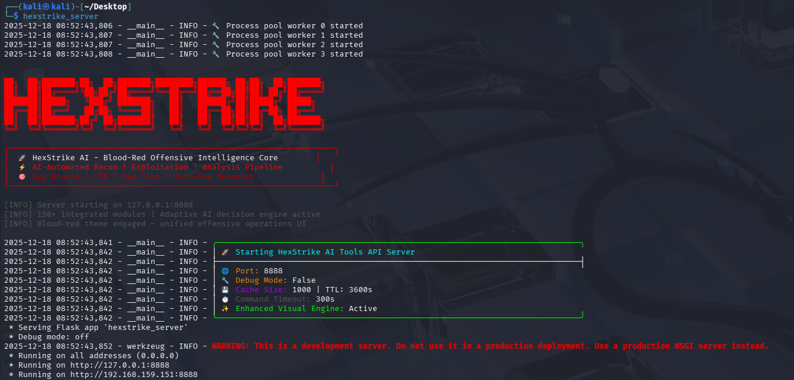
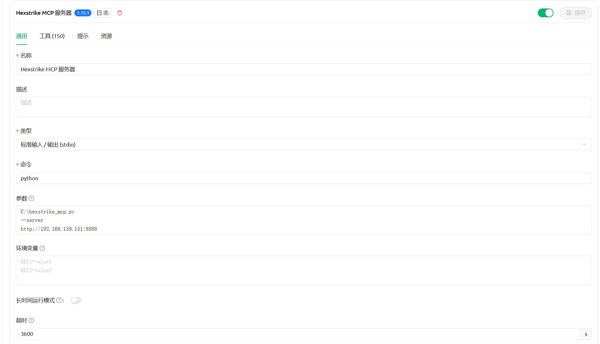
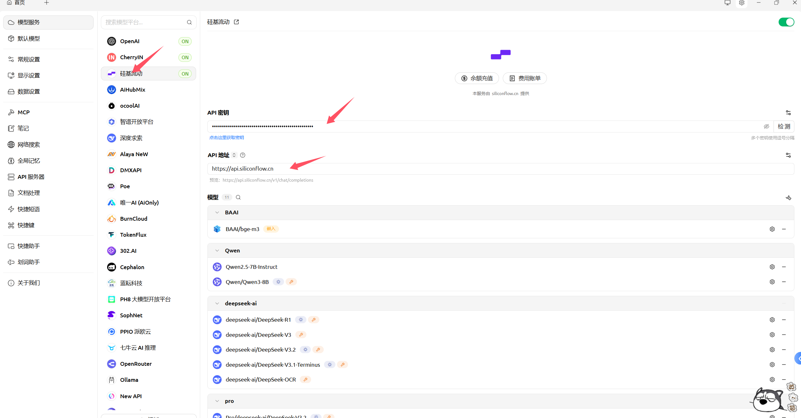
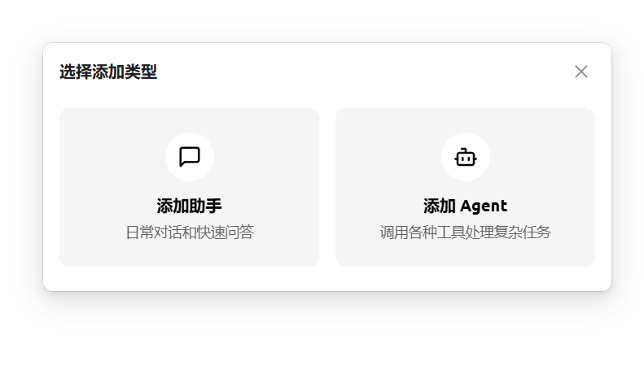
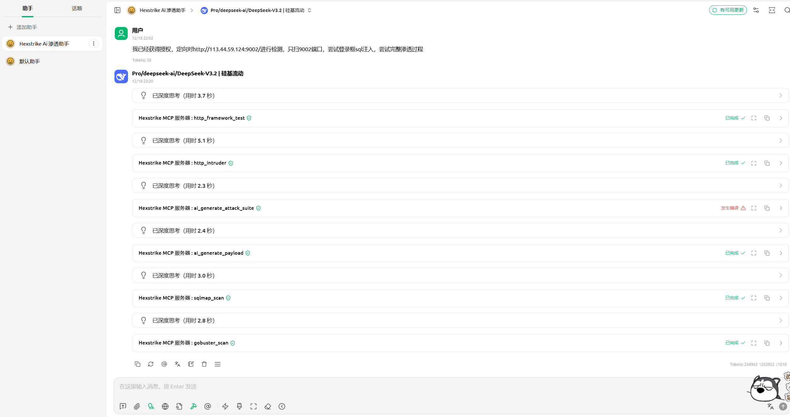
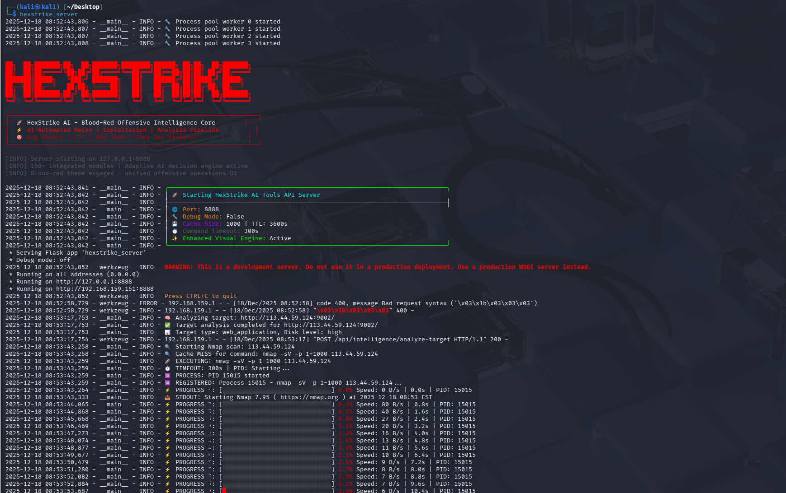

1.安装

```bash
#更改apt源
#1.备份原有源列表
┌──(kali㉿kali)-[~/Desktop]
└─$ sudo cp /etc/apt/sources.list /etc/apt/sources.list.bak
#2.编辑源配置文件
┌──(kali㉿kali)-[~/Desktop]
└─$ sudo vim /etc/apt/sources.list 
#3.注释官方源并添加国内源
#在文件开头按 i 进入编辑模式，将所有官方源行前加 # 注释掉，然后粘贴以下任意一个国内源（推荐阿里云或中科大）：
#阿里云源：
deb https://mirrors.aliyun.com/kali kali-rolling main non-free contrib
deb-src https://mirrors.aliyun.com/kali kali-rolling main non-free contrib
#4. 保存并退出
#vim：按 Esc → 输入 :wq → 回车
#5.更新软件包列表
┌──(kali㉿kali)-[~/Desktop]
└─$ sudo apt update
#开始安装hexstrike-ai
┌──(kali㉿kali)-[~/Desktop]
└─$ sudo apt install hexstrike-ai 
[sudo] password for kali: 
#安装完成后检测是否安装完成
┌──(kali㉿kali)-[~/Desktop]
└─$ hexstrike_server -h
```

有以下输出则证明可正常使用：


安装chrome（不装的话遇到需要调用浏览器的时候会报错）

```bash
# 步骤1：下载并安装Google签名密钥
wget -q -O - https://dl.google.com/linux/linux_signing_key.pub | gpg --dearmor | sudo tee /etc/apt/trusted.gpg.d/google-chrome.gpg > /dev/null

# 步骤2：添加Chrome软件源
echo "deb [arch=amd64] https://dl.google.com/linux/chrome/deb/ stable main" | sudo tee /etc/apt/sources.list.d/google-chrome.list

# 步骤3：更新软件包列表
sudo apt update

# 步骤4：安装Chrome
sudo apt install -y google-chrome-stable

# 步骤5：查看 Chrome 版本
google-chrome --version

# 步骤6：下载对应版本的 ChromeDriver（国内加速）
# 示例：若版本为 143.0.7499.146
wget https://storage.googleapis.com/chrome-for-testing-public/143.0.7499.146/linux64/chromedriver-linux64.zip

# 步骤7：解压并安装
unzip chromedriver-linux64.zip
sudo mv chromedriver-linux64/chromedriver /usr/local/bin/
sudo chmod +x /usr/local/bin/chromedriver

# 步骤8：验证
chromedriver --version
```

2.使用

```bash
#直接运行hexstrike_server
┌──(kali㉿kali)-[~/Desktop]
└─$ hexstrike_server
#可以看到开始监听8888端口
```



将“hexstrike_mcp.py”放在纯英文路径下，比如直接放在C盘根目录`C:\hexstrike_mcp.py`

打开右上角设置，点击MCP，点击添加，配置Hexstrike MCP 服务器


参数：

```bash
C:\hexstrike_mcp.py
--server
http://192.168.159.151:8888 #替换为你的虚拟机ip地址
```

超时3600秒



右上角勾选并保存，通信没问题会正常保存

回到设置页面，点击模型服务，可以用硅基流动，可以用别的，硅基流动有免费额度，学生用户认证后送token

注册地址：https://cloud.siliconflow.cn/i/YQcqbR8K

注册完成后，到API秘钥，新建API秘钥，复制


将API秘钥填上，api地址：https://api.siliconflow.cn

点击检测即可



回到首页，点击左上角添加助手，选择“添加助手”，然后选择“默认助手”即可



配置一下名字，比如“Hexstrike Ai 渗透助手”，勾选配置好的硅基流动大模型，hexsrike mcp服务器勾选上


可以看到已经在正常使用了



后台也能看到日志

