# Day5 前置基础知识-Nginx

## 1. Nginx 功能介绍

在 Web 架构与网络安全领域，Nginx 是使用最广泛的中间件之一。其高性能、高并发特性使其成为企业级应用的 “标配” 组件（百度、阿里、腾讯等均大规模使用）。掌握 Nginx 的基础功能，是理解 Web 服务部署、反向代理配置及后续安全防护（如 WAF 集成、漏洞防护）的关键前提。

### 1.1 Nginx 介绍

Nginx：engine X ，2002年开始开发，2004年开源，2019年3⽉11⽇，Nginx公司被F5 Networks以6.7亿美元收购。

Nginx 是免费的、开源的、⾼性能的HTTP和反向代理服务器、邮件代理服务器、以及TCP/UDP代理服务器解决[C10K问题](https://www.ideawu.net/blog/archives/740.html)（10K Connections）

**Nginx官网：** http://nginx.org/

**Nginx 商业版为 Nginx Plus：** https://www.nginx.com/products/nginx/

**Nginx ⼆次发行版：**

- Tengine：由淘宝⽹发起的Web服务器项⽬。它在Nginx的基础上，针对⼤访问量⽹站的需求，添加了很多⾼级功能和特性。Tengine的性能和稳定性已经在⼤型的⽹站如淘宝⽹，天猫商城等得到了很好的检验。它的最终⽬标是打造⼀个⾼效、稳定、安全、易⽤的Web平台，从2011年12⽉开始，Tengine成为⼀个开源项⽬，官⽹ http://tengine.taobao.org/
- OpenResty：基于 Nginx 与 Lua 语⾔的⾼性能 Web 平台， 章亦春团队开发，官⽹ http://openresty.org/cn/

Nginx的核心设计目标是解决传统 Web 服务器（如 Apache）在高并发场景下的性能瓶颈 ——Apache 采用 “多进程 / 多线程” 模型，每个连接对应一个进程 / 线程，高并发时会占用大量内存和 CPU 资源；而 Nginx 采用 **“异步非阻塞”** 模型，单进程可处理数万并发连接，资源占用极低（即使并发量达 10 万，内存占用通常也仅数百 MB）。

目前 Nginx 的应用场景主要包括：

- **Web 服务器**：直接部署静态资源（HTML、CSS、JS、图片等），替代 Apache 处理静态请求。
- **反向代理服务器**：接收客户端请求，转发到后端业务服务器（如 Tomcat、Node.js），实现负载均衡和业务隔离。
- **负载均衡器**：将高并发请求分发到多个后端服务器，避免单点故障，提升服务可用性。
- **API 网关**：统一管理 API 请求，实现请求过滤、身份验证、流量控制等功能。
- **HTTPS 终端**：集中处理 SSL/TLS 加密解密（减少后端服务器的加密开销），配置 SSL 证书实现 HTTPS 访问。

### 1.2 基础特性

Nginx 的流行源于其独特的技术特性，这些特性不仅决定了其高性能优势，也影响后续的安全配置策略：

| **特性**               | **说明**                                                     | **安全关联**                                                 |
| ---------------------- | ------------------------------------------------------------ | ------------------------------------------------------------ |
| **异步非阻塞 IO 模型** | 基于 epoll（Linux）、kqueue（FreeBSD）等 IO 多路复用技术，单进程可同时处理数千至数万并发连接。 | 低资源占用降低了 “资源耗尽攻击” 的风险，但仍需合理配置连接数上限，避免被恶意请求占满连接表。 |
| **轻量级架构**         | 核心代码简洁，运行时内存占用极低（默认配置下，主进程 + 工作进程总内存通常 < 10MB）。 | 代码量少意味着潜在漏洞更少，降低了被攻击者利用的概率。       |
| **高可靠性**           | 采用 “主进程 + 工作进程” 模型，工作进程崩溃后，主进程会自动重启新的工作进程，确保服务不中断。 | 避免单点故障导致服务下线，提升攻击后的服务自愈能力。         |
| **跨平台支持**         | 可运行于 Linux、FreeBSD、Windows 等多种操作系统（生产环境强烈推荐 Linux）。 | 生产环境优先选择 Linux，利用 Linux 的安全特性（如 SELinux、防火墙）增强整体安全性。 |
| **热部署能力**         | 支持在不停止服务的情况下，更新配置文件 (`nginx -s reload`)、升级版本或更换 SSL 证书。 | 避免配置更新或版本升级时的服务中断，减少 “维护窗口” 带来的安全风险。 |
| **可扩展性**           | 通过模块化设计支持功能扩展，可按需加载官方或第三方模块。     | 可集成第三方安全模块（如 `ngx_waf`）实现 SQL 注入、XSS 等漏洞防护。 |

### 1.3 Web 服务相关的功能

作为 Web 服务器，Nginx 提供了丰富的功能来满足静态资源部署、请求处理及服务优化需求：

1. 静态资源处理

   Nginx 对静态资源（HTML、CSS、JS、图片、视频等）的处理性能远超 Apache，支持：

   - 按文件类型设置缓存策略（如对图片设置较长缓存，对 HTML 设置短期缓存）；
   - 压缩静态资源（gzip/brotli 压缩），减少传输带宽，提升访问速度；
   - 防盗链配置（通过 `valid_referers` 指令限制资源引用来源）。

2. 虚拟主机（Virtual Host）

   支持在同一台服务器上部署多个 Web 站点，通过以下方式区分：

   - **基于域名**：多个域名解析到同一 IP，Nginx 通过 `Host` 请求头判断访问的站点；
   - **基于端口**：同一 IP 的不同端口对应不同站点（如 80 对应站点 A，8080 对应站点 B）；
   - **安全意义**：实现站点隔离，避免一个站点的漏洞影响其他站点（如站点 A 被入侵后，无法直接跨目录访问站点 B 的文件）。

3. 反向代理与负载均衡

   这是 Nginx 最核心的功能之一：

   - **反向代理**：客户端请求先发送到 Nginx，再由 Nginx 转发到后端业务服务器。后端服务器 IP 不暴露，降低被直接攻击的风险。
   - **负载均衡**：通过 `upstream` 模块配置多个后端服务器，实现：
     - 分担后端服务器压力，避免单点过载；
     - 故障自动剔除（健康检查），确保服务可用性；
     - 隐藏后端架构，抵御针对特定后端服务的直接攻击。

4. HTTPS 与 SSL/TLS 配置

   支持配置 SSL 证书，实现 HTTPS 加密传输：

   - 启用 SSL 协议（推荐仅保留 TLSv1.2/TLSv1.3）；
   - 配置证书链（避免浏览器 “证书不信任” 警告）；
   - 启用 HTTP/2（大幅提升并发性能）；
   - 配置 HSTS，强制客户端使用 HTTPS 访问，防止 “降级攻击”。

5. 请求限制与访问控制

   提供多种机制保护 Web 服务免受恶意请求攻击：

   - **连接限制**（`limit_conn_module`）：限制单个 IP 的并发连接数；
   - **请求限制**（`limit_req_module`）：限制单个 IP 的请求频率（防 CC 攻击）；
   - **访问控制**（`allow/deny` 指令）：限制特定 IP 或网段的访问（如仅允许内网访问管理后台）。

## 2. Nginx 安装（Linux 环境）

推荐使用 Linux 环境。主要有两种方式：**Yum 安装**（简单、快捷）和 **编译安装**（灵活、可定制）。

### 2.1 基于 Yum 安装（快速部署）

#### 步骤1：安装

```bash
# 安装
[root@localhost ~]# yum provides nginx
[root@localhost ~]# yum install nginx -y
# 启动
[root@localhost ~]# systemctl start nginx && systemctl enable nginx
# 查看Nginx状态，active即可
[root@localhost ~]# systemctl status nginx
# 关闭防火墙和SELINUX
[root@localhost ~]# systemctl stop firewalld && systemctl disable firewalld
[root@localhost ~]# setenforce 0
[root@localhost ~]# sed -i 's/SELINUX=enforcing/SELINUX=disabled/' /etc/selinux/config
# 测试
[root@localhost ~]# curl -I 127.0.0.1
HTTP/1.1 200 OK
Server: nginx/1.20.1
```

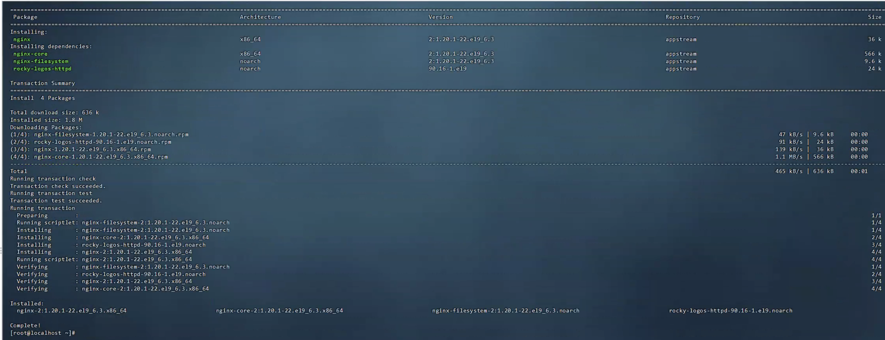

#### 步骤 2：验证与关键目录

浏览器访问虚拟机 IP，看到 "HTTP Server Test Page" 即成功。

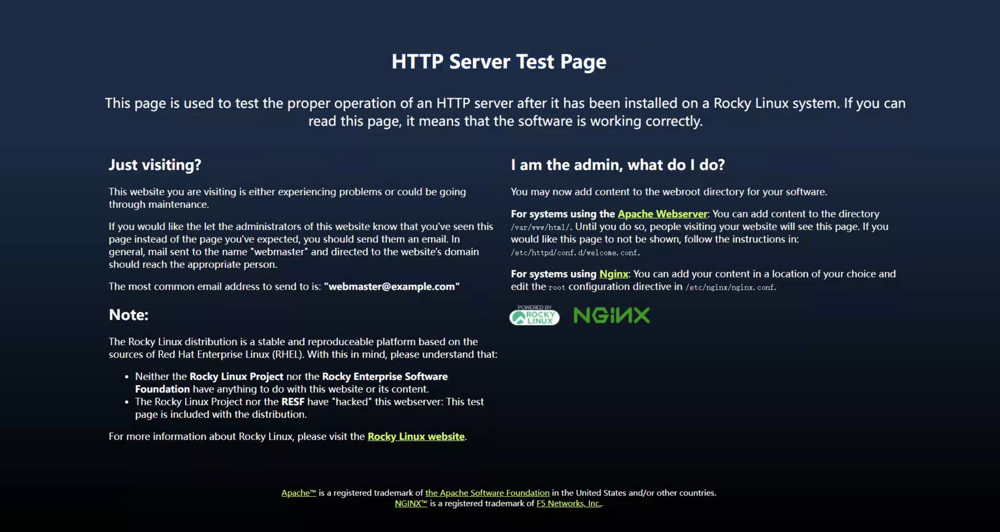

**关键路径：**

- 主配置：`/etc/nginx/nginx.conf`
- 网站根目录：`/usr/share/nginx/html/`
- 日志目录：`/var/log/nginx/`

### 2.2 编译安装（了解即可）

适合需要指定版本或集成第三方模块（如 WAF）的生产环境。

```bash
# 准备编译环境
[root@localhost ~]# yum -y install gcc pcre-devel openssl-devel zlib-devel
# 如果需要编译安装，为避免冲突需要将yum部署的nginx版本先卸载掉！
# 准备源码包
[root@localhost ~]# wget http://nginx.org/download/nginx-1.22.0.tar.gz -P /usr/local/src/
[root@localhost ~]# cd /usr/local/src && tar xzvf nginx-1.22.0.tar.gz
# 编译
[root@localhost ~]# useradd -r -s /sbin/nologin nginx
[root@localhost nginx-1.22.0]# ./configure --prefix=/apps/nginx \
  --user=nginx \
  --group=nginx \
  --with-http_ssl_module \
  --with-http_v2_module \
  --with-http_realip_module \
  --with-http_stub_status_module \
  --with-http_gzip_static_module \
  --with-pcre \
  --with-stream \
  --with-stream_ssl_module \
  --with-stream_realip_module \
  --with-file-aio
[root@localhost nginx-1.22.0]# make -j 2 && make install
# 善后工作
[root@localhost nginx-1.22.0]# chown -R nginx.nginx /apps/nginx
[root@localhost nginx-1.22.0]# ln -s /apps/nginx/sbin/nginx /usr/sbin/
[root@localhost nginx-1.22.0]# nginx -v
# systemd管理
[root@localhost ~]# cat << EOF > /usr/lib/systemd/system/nginx.service
[Unit]
Description=The nginx HTTP and reverse proxy server
Documentation=http://nginx.org/en/docs/
After=network.target remote-fs.target nss-lookup.target
Wants=network-online.target
 
[Service]
Type=forking
PIDFile=/apps/nginx/run/nginx.pid
ExecStart=/apps/nginx/sbin/nginx -c /apps/nginx/conf/nginx.conf
ExecReload=/bin/kill -s HUP $MAINPID
ExecStop=/bin/kill -s TERM $MAINPID
 
[Install]
WantedBy=multi-user.target
EOF
# 更新nginx.pid存储位置
[root@localhost ~]# mkdir /apps/nginx/run/
[root@localhost ~]# vim /apps/nginx/conf/nginx.conf
pid        /apps/nginx/run/nginx.pid;
# 启动
[root@localhost ~]# systemctl start nginx && systemctl enable nginx 
# 关闭防火墙和SELINUX
[root@localhost ~]# curl -I 127.0.0.1
HTTP/1.1 200 OK
Server: nginx/1.22.0

```

## 3. Nginx基础

### 3.1 Nginx 命令

nginx 为 Nginx 服务软件的命令

```
[root@localhost ~]# nginx -h
nginx version: nginx/1.20.1
Usage: nginx [-?hvVtTq] [-s signal] [-p prefix]
             [-e filename] [-c filename] [-g directives]
```

**常用选项**

| 选项 | 说明                     |
| ---- | ------------------------ |
| -v   | 输出版本                 |
| -V   | 编译相关选项             |
| -t   | 测试验证配置文件的正确性 |
| -s   | 发送信号指令给主进程     |

### 3.2 Nginx 架构和进程

Nginx 的高性能与高可靠性，与其独特的 “主从进程” 架构和 “异步非阻塞” 处理模型密切相关。

#### 3.2.1 Nginx 架构

Nginx 采用 **“模块化、事件驱动”** 的架构，核心由三部分组成：

1. **核心模块**：Nginx 启动时必须加载的基础模块，负责进程管理、配置解析、网络事件驱动等。
2. **功能模块**：按需加载的模块，提供具体功能（如 HTTP 服务、负载均衡、SSL 加密等）。
3. **事件驱动模型**：基于 IO 多路复用技术（如 Linux 的 epoll），实现 “一个工作进程处理多个并发连接”。

**架构流程：**

- 启动时，主进程解析配置文件，初始化模块。
- 主进程创建多个工作进程（通常与 CPU 核心数一致）。
- 工作进程通过事件驱动模型，监听并处理客户端连接。
- 进程间通过共享内存或信号进行通信。

#### 3.2.2 Nginx 进程结构

Nginx 启动后，系统中主要存在两类进程：**主进程（Master Process）** 和 **工作进程（Worker Process）**。

##### 3.2.2.1 主进程（Master Process）

主进程是 “管理者”，不直接处理客户端请求。

- **职责**：读取并验证配置文件、创建和管理工作进程、接收管理员信号（如 reload）、维护共享内存。
- **特点**：通常由 `root` 用户运行（因为需要绑定 80/443 等特权端口）。

##### 3.2.2.2 工作进程（Worker Process）

工作进程是 “执行者”，直接处理客户端连接。

- **职责**：监听端口、解析 HTTP 请求、处理业务逻辑（如读取文件或转发请求）、发送响应。
- **特点**：通常由 `nginx` 普通用户运行（**安全隔离**：即使工作进程被攻破，攻击者也无法直接获得 root 权限）。

##### 3.2.2.3 进程结构示例

通过 `ps aux | grep nginx` 可查看进程状态：

```bash
[root@localhost ~]# ps -aux |grep nginx
root         842  0.0  0.0  11292  1604 ?        Ss   Nov27   0:00 nginx: master process /usr/sbin/nginx
nginx        844  0.0  0.1  15560  4932 ?        S    Nov27   0:00 nginx: worker process
nginx        845  0.0  0.1  15560  5060 ?        S    Nov27   0:00 nginx: worker process
nginx        846  0.0  0.1  15560  5060 ?        S    Nov27   0:00 nginx: worker process
nginx        847  0.0  0.1  15560  4932 ?        S    Nov27   0:00 nginx: worker process
```

#### 3.2.3 Nginx 进程间通信

##### 3.2.3.1 信号通信（主进程 → 工作进程）

管理员通过命令向主进程发送信号，主进程再控制工作进程：

| **信号**       | **作用**                                    | **触发命令示例**   |
| -------------- | ------------------------------------------- | ------------------ |
| `TERM` / `INT` | **快速停止**（立即关闭，可能中断请求）      | `nginx -s stop`    |
| `QUIT`         | **优雅停止**（处理完当前请求后关闭）        | `nginx -s quit`    |
| `HUP`          | **热重载**（重新读取配置，不中断服务）      | `nginx -s reload`  |
| `USR1`         | **重读日志**（用于日志切割）                | `nginx -s reopen`  |
| `USR2`         | **平滑升级**（启动新进程，配合 WINCH 使用） | `kill -USR2 <PID>` |

##### 3.2.3.2 共享内存通信（工作进程 ↔ 工作进程）

用于进程间的数据共享，例如：

- **负载均衡状态**：共享后端服务器的健康状态、连接数。
- **限流统计**：`limit_req` 和 `limit_conn` 必须通过共享内存统计全局的请求速率，防止绕过限制。

示例配置（定义 10MB 共享内存）：

```nginx
# 定义名为 "req_limit" 的共享内存，大小10MB，用于请求频率限制
limit_req_zone $binary_remote_addr zone=req_limit:10m rate=10r/s;
```

#### 3.2.4 连接建立和请求处理过程

以 **“客户端访问静态资源”** 为例，流程如下：

1. **TCP 连接建立**：
   - 客户端发送 SYN。
   - Nginx 工作进程（通过 OS 内核）完成三次握手，建立 TCP 连接。
2. **HTTP 请求处理**：
   - **读取**：工作进程读取 HTTP 请求报文。
   - **解析**：提取 Host、URI、User-Agent 等信息。
   - **匹配**：根据 `server_name` 匹配虚拟主机，根据 URI 匹配 `location`。
   - **处理**：定位本地文件（如 `/usr/share/nginx/html/index.html`），读取内容。
3. **发送响应**：
   - 组装 HTTP 响应报文（状态码 200 + Header + Body）。
   - 发送给客户端。
4. **连接维持/关闭**：
   - 若为 `Keep-Alive`，保持连接等待下一次请求；否则关闭连接。

### 3.3 Nginx模块分类

| **模块类型**   | **定义**                             | **示例**                                       |
| -------------- | ------------------------------------ | ---------------------------------------------- |
| **核心模块**   | Nginx 运行必须的基础模块，不可卸载。 | `core`, `event`                                |
| **标准模块**   | 官方开发，编译时默认启用（可禁用）。 | `http`, `proxy`, `upstream`, `ssl`             |
| **第三方模块** | 社区/企业开发，需手动编译集成。      | `ngx_waf` (安全), `ngx_cache_purge` (缓存清理) |

**常见模块类型**

- **核心模块**：是 Nginx 服务器正常运行必不可少的模块，提供错误日志记录、配置文件解析、事件驱动机制、进程管理等核心功能
- **标准 HTTP 模块**： 提供 HTTP 协议解析相关的功能，比如：端口配置、网页编码设置、HTTP 响应头设置 等等
- **可选 HTTP 模块**： 主要用于扩展标准的 HTTP 功能，让 Nginx 能处理一些特殊的服务， 比如：Flash 多媒体传输、解析GeolP 请求、网络传输压缩、安全协议 SSL 支持等
- **邮件服务模块**： 主要用于支持 Nginx 的邮件服务，包括对 POP3 协议、IMAP 协议和 SMTP 协议的支持
- **Stream 服务模块**： 实现反向代理功能包括TCP协议代理
- **第三方模块**： 是为了扩展 Nginx 服务器应用，完成开发者自定义功能，比如: Json 支持、 Lua 支持等

**部分第三方模块官方文档：** http://nginx.org/en/docs/

```bash
# 编译时内置模块
[root@localhost ~]#  nginx -V 2>&1 | tr ' ' '\n' | grep module
# 动态加载模块
/usr/lib64/nginx/modules
```

### 3.4 Nginx相关文件

| 文件                                  | 说明             |
| ------------------------------------- | ---------------- |
| /etc/nginx/nginx.conf                 | 主配置文件       |
| /var/log/nginx/                       | 日志文件目录     |
| /usr/share/nginx/html/                | 默认站点根目录   |
| /usr/lib/systemd/system/nginx.service | Systemd服务文件  |
| /var/run/nginx.pid                    | 主进程ID文件     |
| /usr/share/nginx/modules              | 动态加载模块目录 |
| /etc/nginx/conf.d/                    | 子配置文件目录   |

> **/etc/nginx/nginx.conf 是 Nginx 的主配置文件，是总入口；
>  /etc/nginx/conf.d/ 是业务配置文件目录，供主配置自动加载。**

它们的关系就像：

- **nginx.conf = 总纲领 / 主配置入口**
- **conf.d/ = 专门放各个网站/业务配置的子配置目录**

#### 3.4.1 /etc/nginx/nginx.conf —— 主配置文件（入口文件）

是 **所有配置的根文件**。Nginx 启动时 *必须先加载它*。

```bash
# 使用grep -Ev，扩展正则表达式，反向匹配，去掉空格和注释行的配置文件
[root@localhost ~]# grep -Ev '^$|^#|\s*#' /etc/nginx/nginx.conf
# 全局配置块
## 运行用户
user nginx;
## 工作进程数
worker_processes auto;
## 错误日志
error_log /var/log/nginx/error.log;
## pid文件存放位置
pid /run/nginx.pid;
## 动态加载模块配置
include /usr/share/nginx/modules/*.conf;
# events配置块
events {
    # 设置单个工作进程最大并发连接数
    worker_connections 1024;
}
# http配置块
http {
    ## 日志格式定义
    log_format  main  '$remote_addr - $remote_user [$time_local] "$request" '
                      '$status $body_bytes_sent "$http_referer" '
                      '"$http_user_agent" "$http_x_forwarded_for"';
    ## 访问日志
    access_log  /var/log/nginx/access.log  main;
    ## 启用 sendfile() - 利用操作系统内核的零拷贝技术：即数据拷贝无需切换至用户空间
    sendfile            on;
    ## 启用 TCP_NOPUSH - 优化网络包传输：即数据包填满时发送
    tcp_nopush          on;
    ## 启用  TCP_NODELAY - 减少延迟：即基于keepalive连接，尽快发送小数据包
    tcp_nodelay         on;
    ## keepalive 超时时间
    keepalive_timeout   65;
    ## 设置用于存储MIME类型映射的哈希表最大大小
    types_hash_max_size 4096;
    ## 定义文件扩展名与MIME类型的映射
    include             /etc/nginx/mime.types;
    ## 定义响应包默认MIME类型
    default_type        application/octet-stream;
    ## 加载子配置文件
    include /etc/nginx/conf.d/*.conf;
    # server配置块
    server {
        ## 监听ipv4和ipv6 80端口
        listen       80;
        listen       [::]:80;
        ## 定义虚拟主机的名称-域名
        server_name  _;
        ## 根目录
        root         /usr/share/nginx/html;
        ## 加载默认站点子配置文件
        include /etc/nginx/default.d/*.conf;
        ## 定义错误页
        error_page 404 /404.html;
        # location配置块
        location = /404.html {
        }
        error_page 500 502 503 504 /50x.html;
        location = /50x.html {
        }
    }
}

# 默认配置文件不包括下面两个块
# mail协议相关配置段
mail {
  ...
}
# stream服务器相关配置段
stream {
  ...
}
```

主要作用：

**1.定义 Nginx 的基础结构（骨架）**

例如：

```
events {}
http {}
```

这些不能放在其他地方。

**2. 设置全局参数**

如：

```
worker_processes auto;
error_log /var/log/nginx/error.log;
```

这些影响整个 Nginx。

**3. 在 http {} 中加载其他配置文件**

这是关键——nginx.conf 里有：

```
include /etc/nginx/conf.d/*.conf;
```

这意味着：

> **conf.d 目录中的所有 .conf 文件都会被自动加载进来。**

#### 3.4.2/etc/nginx/conf.d/ —— 业务配置目录（推荐放网站/反代/代理配置）

这个目录是专门存放：

- 网站 server 配置
- 反向代理配置
- HTTPS 配置
- 负载均衡 upstream
- 针对某业务的特殊 rules

比如：

```
/etc/nginx/conf.d/
├── default.conf
├── api.conf
├── blog.conf
└── upstream.conf
```

每个文件都可以独立写一个或多个 server {} 块。

Nginx 在加载 nginx.conf 时，看到 include，自动把这里的文件加载进去。

#### 3.4.3 两者的关系

**① nginx.conf 是父文件**

**② conf.d/*.conf 是子文件**

**③ nginx.conf 通过 include 把 conf.d 加载进来**

结构关系图：

```
nginx.conf
│
├── 全局配置
├── events {}
└── http {}
       │
       ├── 全局 HTTP 设置
       └── include conf.d/*.conf  → 加载子配置
                │
                ├── default.conf → server {}
                ├── api.conf → server {}
                ├── upstream.conf → upstream {}
                └── ssl.conf → server { listen 443; }
```

**为什么要分两个地方写？**

**1. 便于管理（一个网站一个文件）**

比如：

- api 服务写在 api.conf
- blog 服务写在 blog.conf

不会混在一个大文件里。

**2. 企业规范（多人协作不冲突）**

多人一起维护 Nginx 时：

- 你改 myapp.conf
- 别人改 default.conf
- 不会互相覆盖、相互影响。

**3. 升级 Nginx 不会覆盖你的业务配置**

因为业务都放在 /etc/nginx/conf.d/ 下，升级时安全。

**4. Default server 与业务 server 分开**

官方安装会给你一个默认站点配置：

```
server {
    root /usr/share/nginx/html;
    ...
}
```

如果混在 nginx.conf 里，容易改坏。

**总结：**

| 文件/目录                 | 作用                                                         |
| ------------------------- | ------------------------------------------------------------ |
| **/etc/nginx/nginx.conf** | Nginx 的主配置文件，决定整体结构、加载其他配置               |
| **/etc/nginx/conf.d/**    | 存放各种业务/server/upstream 配置，由主配置 include 自动加载 |
| 关系                      | nginx.conf 通过 `include conf.d/*.conf` 把所有业务配置整合进来 |

### 3.5 常用模块及配置示例

**核心与标准 HTTP 模块**

**HTTP 核心配置 (`http module`)**

```nginx
http {                                 # 定义 HTTP 配置块，所有 Web 服务相关配置都写在这里
    include       mime.types;          # 引入文件类型映射表，识别 .html、.jpg 等文件类型
    default_type  application/octet-stream;  # 默认 MIME 类型，当无法识别文件类型时使用
    
    server {                           # 定义一个虚拟主机（网站）
        listen       80;               # 监听端口 80（HTTP 默认端口）
        server_name  www.example.com;  # 绑定域名（浏览器访问此域名时匹配到这个 server 块）
        location / {                   # 定义根路径的访问规则
            root   /usr/share/nginx/html;  # 网站根目录（实际文件所在位置）
            index  index.html;         # 默认访问的首页文件
        }
    }
}
```

**反向代理 (`proxy module`)**

```nginx
location /api/ {                                        # 当访问路径以 /api/ 开头时，进入此配置
    proxy_pass http://192.168.1.100:8080/;              # 将请求转发到后端服务器（如 Tomcat）
    proxy_set_header Host $host;                        # 把原始 Host（域名）传给后端
    proxy_set_header X-Real-IP $remote_addr;            # 把真实客户端 IP 传给后端，用于日志/风控
}
```

**负载均衡 (`upstream module`)**

```nginx
upstream backend_servers {                    # 定义一个后端服务器组名称（可以在 proxy_pass 中引用）
    ip_hash;                                  # 按客户端 IP 分配后端，实现会话保持（同一 IP 固定到同一服务器）
    server 192.168.1.100:8080 weight=3;       # 配置后端服务器，高权重表示接收请求更多
    server 192.168.1.101:8080 weight=2;       # 第二台服务器权重 2
    server 192.168.1.102:8080 backup;         # 备用服务器，只有前两台都不可用时才启用
}
```

**HTTPS 加密 (`ssl module`)**

```nginx
server {
    listen 443 ssl;                                   # 监听 HTTPS 端口 443，并启用 SSL
    server_name www.example.com;                      # HTTPS 对应的域名
    
    ssl_certificate /etc/nginx/cert/site.pem;         # 公钥证书
    ssl_certificate_key /etc/nginx/cert/site.key;     # 私钥文件
    ssl_protocols TLSv1.2 TLSv1.3;                    # 仅启用安全版本的 TLS 协议
}
```

**安全限流 (`limit_req_module`)**

```nginx
limit_req_zone $binary_remote_addr zone=req_limit:10m rate=10r/s;  
# 定义限流区域：
# - 按客户端 IP ($binary_remote_addr) 限流
# - 分配名为 req_limit 的 10MB 内存区域
# - 平均限制为每秒 10 次请求

server {
    location / {
        limit_req zone=req_limit burst=20 nodelay;  
        # 使用上面定义的限流规则
        # burst=20 → 允许瞬时请求高峰 20 个
        # nodelay → 超出立即拒绝，不排队
    }
}
```

**常用第三方模块**

- **`ngx_waf`**：第三方 Web 应用防火墙，可防御 SQL 注入、XSS、目录遍历等攻击。
- **`ngx_http_stub_status_module`**：展示 Nginx 状态信息（active connections 等），常用于监控。

比如使用**长亭雷池 Safeline WAF 提供的 `.so` 动态模块文件** 作为示例。

Nginx 的第三方模块有两种类型：

| 模块类型                            | 特点                    | 加载方式                    |
| ----------------------------------- | ----------------------- | --------------------------- |
| **静态模块（static）**              | 编译进 nginx 可执行文件 | 需要重新编译 nginx          |
| **动态模块（dynamic，`.so` 文件）** | 独立文件，不需重新编译  | 使用 `load_module` 指令加载 |

 **Safeline WAF 提供 `.so` 文件** → 属于 **动态模块**
只需要在 `nginx.conf` 中 `load_module` 即可，无需编译。

假设 Safeline 给了：

```
/etc/nginx/modules/ngx_safeline_waf.so
```

那么你只需要在 nginx.conf 的 **最顶部（任何 block 外）** 加入：

```
load_module /etc/nginx/modules/ngx_safeline_waf.so;
```

注意位置：

- 必须写在 **nginx.conf 最开始**
- 不能写在 http{}, server{}, location{} 内部
- 多个动态模块可以多行 load_module

示例（推荐位置）：

```
# 动态加载第三方模块
load_module /etc/nginx/modules/ngx_safeline_waf.so;
load_module /etc/nginx/modules/ngx_http_stub_status_module.so;

user nginx;
worker_processes auto;
...
```

**状态监控配置示例**

```nginx
location /nginx_status {                  # 访问此路径显示 Nginx 运行状态
    stub_status on;                       # 开启状态页功能
    allow 192.168.1.0/24;                 # 仅允许内网访问，避免泄露敏感信息
    deny all;                             # 拒绝其他 IP 访问
}
```

### 3.6 虚拟主机

基于不同的IP、不同的端口以及不同的域名实现不同的虚拟主机，依赖于核心模块 ngx_http_ core_module 实现

**案例分析**

- 定义 PC 站点，根目录为 `/data/nginx/site01`，直接通过 `x.x.x.x:8001`
- 定义 Mobile 站点，根目录为 `/data/nginx/site02`，通过自定义域名访问
- 定义 Test 站点，根目录为 `/data/nginx/site03`, 仅能通过本地 `127.0.0.1:8003` 访问
- 定义 Test 站点，访问 `127.0.0.1:8003/status`，根目录为 `/data/nginx`

```shell
[root@localhost ~]# mkdir -pv /data/nginx/site0{1..3}/
[root@localhost ~]# mkdir -pv /data/nginx/status
[root@localhost ~]# echo "Running 3 websites" > /data/nginx/status/index.html
[root@localhost ~]# echo "Hello PC Website!" > /data/nginx/site01/index.html
[root@localhost ~]# echo "Hello Moblie Website!" > /data/nginx/site02/index.html
[root@localhost ~]# echo "Hello Local Test Website!" > /data/nginx/site03/index.html
[root@localhost ~]# cat << EOF > /etc/nginx/conf.d/vhost.conf
# PC
server {
    listen  8001;
    location  / {
        root  /data/nginx/site01;
    }
}
# Mobile
server {
    listen 80;
    server_name m.test.com;
    location / {
        root /data/nginx/site02;
    }
}
# Test
server {
    listen 127.0.0.1:8003;
    location / {
        root /data/nginx/site03;
    }
    location /status {
        root /data/nginx;  
    }
}
EOF
# 检查配置文件并重新加载
[root@localhost ~]# nginx -t
nginx: the configuration file /etc/nginx/nginx.conf syntax is ok
nginx: configuration file /etc/nginx/nginx.conf test is successful
[root@localhost ~]# nginx -s reload
# 测试验证
[root@localhost ~]# curl 172.16.175.129:8001
Hello PC Website!
[root@localhost ~]# curl -H 'Hostname: p.test.com' 172.16.175.129
Hello Moblie Website!
[root@localhost ~]# curl 172.16.175.129:8003
curl: (7) Failed to connect to 172.16.175.129 port 8003: Connection refused
# 定义 location 时：文件的绝对路径等于 root+location
[root@localhost ~]# curl -L 127.0.0.1:8003/status
Running 3 websites
```

**Nginx Server 匹配优先级分析**

配置加载顺序

```nginx
http {
    include /etc/nginx/conf.d/*.conf;  # ← 先加载 vhost.conf
    server {                           # ← 后加载主 server 块
        listen 80;
        server_name _;
    }
}
```

**加载顺序**：

1. **vhost.conf** 中的 `server { listen 80; server_name m.test.com; }` 先加载
2. **nginx.conf** 中的 `server { listen 80; server_name _; }` 后加载

**Nginx 匹配规则（关键）**

对于相同 `listen` 端口的 server，Nginx 按以下规则选择：

| 请求 Host 头                | 匹配结果                    | 生效的 Server                      |
| :-------------------------- | :-------------------------- | :--------------------------------- |
| `m.test.com`                | **精确匹配**                | vhost.conf (mobile)                |
| `172.16.175.129` / 其他域名 | **无匹配，使用默认 server** | **vhost.conf (mobile)** ← 意外结果 |

**规则说明**：

- 先精确匹配 `server_name`
- 无匹配时，选择 **第一个** 监听该端口的 server 作为默认
- **不是**选择 `server_name _;` 的那个

通过调整加载顺序，设置默认Server

修改 `/etc/nginx/nginx.conf`，**将 include 移到主 server 块之后**：

```nginx
http {
    server {              # ← 主 server 块先定义，成为真正的默认
        listen 80 default_server;  # ← 显式标记更保险
        server_name _;
        ...
    }
    include /etc/nginx/conf.d/*.conf;  # ← 移到后面
}
```

### 3.7 Location 

Nginx 的 location 指令是配置请求路由的核心机制，其匹配规则基于 ​**​URI**​​ 和​**​修饰符​**​，优先级由匹配类型和顺序共同决定。

#### 3.7.1 匹配类型与语法

```shell
location [ = | ~ | ~* | ^~ ] uri { ... }
```

| 修饰符   | 匹配类型 | 语法示例                 | 说明                                             |
| :------- | :------- | :----------------------- | :----------------------------------------------- |
| =        | 精确匹配 | location = /path         | 仅当 URI 完全等于 /path 时匹配，优先级最高       |
| ^~       | 前缀匹配 | location ^~ /images/     | 匹配以 /images/ 开头的 URI，停止后续正则检查     |
| ~        | 正则匹配 | location ~ \.php$        | 区分大小写，正则表达式匹配，按配置文件顺序匹配   |
| ~*       | 正则匹配 | location ~* \.(jpg,png)$ | 不区分大小写，正则表达式匹配，按配置文件顺序匹配 |
| 无修饰符 | 前缀匹配 | location /static/        | 匹配以 /static/ 开头的 URI，需继续正则检查       |
| /        | 通用匹配 | location /               | 匹配所有请求，优先级最低                         |

**优先级**：`= ^~ ~/~* 无修饰符 /`

#### 3.7.2 案例分析

**官方案例**

```shell
location = / {
    [ configuration A ]
}
location / {
    [ configuration B ]
}
location /documents/ {
    [ configuration C ]
}
location ^~ /images/ {
    [ configuration D ]
}
location ~* \.(gif|jpg|jpeg)$ {
    [ configuration E ]
}
# \: 转义字符
# 实际访问路径：root + 请求的路径
```

**测试验证**

- The "`/`" request will match configuration A
- the "`/index.html`" request will match configuration B
- the "`/documents/document.html`" request will match configuration C
- the "`/images/1.gif`" request will match configuration D
- the "`/documents/1.jpg`" request will match configuration E

### 3.8访问控制

Nginx 的访问控制是保障服务器安全的核心机制，通过多种方式精细化管控请求入口

#### 3.8.1 基于 IP 

**典型场景**

```shell
# 黑名单：默认允许，拒绝特定IP
location /admin {
    deny 192.168.1.100;  # 拒绝单个 IP
    deny 10.0.0.0/8;     # 拒绝网段
    allow all;           # 允许其他 IP
}

# 白名单：默认拒绝，允许可信IP
location /api {
    allow 192.168.1.0/24;  # 允许网段
    allow 172.16.1.1;      # 允许单个 IP
    deny all;              # 拒绝其他
}

```

#### 3.8.2 基于 HTTP 认证

**典型场景**

```shell
# 生成密码文件
## 首次创建
htpasswd -c /etc/nginx/.htpasswd admin
## 追加用户
htpasswd  /etc/nginx/.htpasswd root

# 后台管理
server {
    listen  8001;
    location  / {
        root  /data/nginx/site01;
    }
    location /admin{
        root /data/nginx/site01;  # 假设admin目录在site01下
        auth_basic "Tip: input password!";
        auth_basic_user_file /etc/nginx/.htpasswd;
    }
}

```

**测试认证**

```bash
# 失败测试（不带密码）
curl http://127.0.0.1:8001/admin/  # 应返回 401 Authorization Required

# 成功测试（带密码）
curl -u admin:yourpassword http://127.0.0.1:8001/admin/
```

#### 3.8.3 案例分析

仅能够通过 admin 用户本地访问后台管理，其他所有IP和用户均不允许

```shell
# 准备实验环境
[root@localhost ~]# htpasswd -c /etc/nginx/.htpasswd admin
New password:
Re-type new password:
Adding password for user admin
[root@localhost ~]# mkdir -pv /data/nginx/site04/admin
[root@localhost ~]# echo "site04" > /data/nginx/site04/admin/index.html
[root@localhost ~]# cat << EOF > /etc/nginx/conf.d/site04.conf
server {
    listen  8004;
    # 精细化控制：基于请求属性
    if ($http_user_agent ~* bot) {
        return 403;
    }
    location  /admin {
        root  /data/nginx/site04;
        auth_basic "Tip: input password!";
        auth_basic_user_file /etc/nginx/.htpasswd;
        allow 127.0.0.1;
        deny all;
    }
}
EOF
[root@localhost ~]# nginx -t
nginx: the configuration file /etc/nginx/nginx.conf syntax is ok
nginx: configuration file /etc/nginx/nginx.conf test is successful
[root@localhost ~]# nginx -s reload
# 测试验证
client01 ~ % curl -I 172.16.175.129:8004/admin
HTTP/1.1 403 Forbidden
[root@localhost ~]# curl -u admin:123 http://127.0.0.1:8004/admin/
site04
[root@localhost ~]# curl -I -u root:123 http://127.0.0.1:8004/admin/
HTTP/1.1 401 Unauthorized
## 模拟 bot 访问
[root@localhost ~]# curl -I -u root:123 -H 'User-agent: bot' http://127.0.0.1:8004/admin/
HTTP/1.1 403 Forbidden
```

### 3.9 日志相关（重点）

#### 3.9.1 Nginx 日志默认路径

**Nginx 有两类日志：**

**1）访问日志（access log）**

记录每个请求的详细信息
 默认路径：

```
/var/log/nginx/access.log
```

内容示例：

```
192.168.1.5 - - [28/Nov/2025:21:52:03 +0800] "GET /login HTTP/1.1" 200 532 "-" "Mozilla/5.0"
```

**2）错误日志（error log）**

记录系统错误、配置问题、故障信息
 默认路径：

```
/var/log/nginx/error.log
```

内容示例：

```
2025/11/28 21:53:21 [error] 1423#1423: *10 open() "/var/www/html/admin.php" failed (2: No such file or directory)
```

------

#### 3.9.2 日志路径在哪里配置

在 nginx.conf 里：

**http级别：访问日志格式与文件路径配置**

```nginx
log_format main '$remote_addr - $remote_user [$time_local] "$request" '
                '$status $body_bytes_sent "$http_referer" '
                '"$http_user_agent" "$http_x_forwarded_for"';

access_log /var/log/nginx/access.log main;
```

**error_log 在 http 外写**

```nginx
error_log /var/log/nginx/error.log;
```

可以为不同 server 指定不同日志：

```nginx
server {
    access_log /var/log/nginx/site1.log main;
}
```

------

#### 3.9.3 Nginx 日志与安全有什么关系？

日志是 **运维、安全监控、溯源** 的核心来源。
 它能看到所有访问行为、攻击行为、扫描行为。

**1. 能看到攻击行为**

例如 XSS 尝试：

```
GET /?q=<script>alert(1)</script>
```

SQL注入：

```
GET /login.php?id=1 OR 1=1
```

目录扫描器（dirsearch、Nmap）：

```
"Mozilla/5.0 dirsearch/v0.4"
```

爆破行为（短时间大量 POST）：

```
POST /login  # 1 秒几十次
```

**2. 能检查真实来源 IP**

通过 access.log 看到：

```
X-Forwarded-For
```

用于判断是否被伪造、是否绕过 WAF。

**3. 能定位故障与漏洞**

例如：

```
[crit]  open() "/var/www/html/.git/config" failed
```

说明有人扫描 `.git` 暴露漏洞。

**4. 可用于取证与日志审计**

例如攻击后调查攻击路径。

------

#### 3.9.4 如何查看 Nginx 日志？

**实时查看**

```
tail -f /var/log/nginx/access.log
```

查看错误日志

```
tail -f /var/log/nginx/error.log
```

查看最近 100 行

```
tail -n 100 /var/log/nginx/access.log
```

搜索某个 IP 的记录

```
grep "192.168.1.5" /var/log/nginx/access.log
```

搜索异常状态码（如 404、500）

```
grep " 404 " /var/log/nginx/access.log | tail
grep " 500 " /var/log/nginx/error.log
```

搜索可能的攻击关键字

```
grep -Ei "select|union|sleep|alert|script" /var/log/nginx/access.log
```

查看当天的访问量

```
awk '{print $1}' access.log | wc -l
```

------

#### 3.9.5 完整安全日志分析示例

假设 access.log 出现：

```
223.5.5.5 - - [...] "GET /admin.php HTTP/1.1" 404
223.5.5.5 - - [...] "GET /.env HTTP/1.1" 404
223.5.5.5 - - [...] "GET /phpmyadmin/ HTTP/1.1" 404
```

说明有人**在扫描你的服务器弱点**。

如果出现：

```
POST /login 200  20次/秒
```

说明有人在**暴力破解密码**。

如果错误日志出现：

```
FastCGI sent in stderr: "Primary script unknown" ...
```

说明 PHP 路由错误或被探测漏洞。

------

#### 3.9.6 如何将日志用于安全加固？

**1）因为可以看到攻击 → 可以写规则防护**

如：

```nginx
location / {
    if ($query_string ~* "(select|union|sleep|from)") {
        return 403;
    }
}
```

**2）因为可以看到恶意 IP → 可以加入黑名单**

```
deny 223.5.5.5;
```

**3）因为可以看到爆破行为 → 可以限流**

```
limit_req zone=req_limit burst=20;
```

**4）配合 WAF（如 Safeline）可以自动挡攻击**

访问日志也能验证 WAF 是否生效。

### 3.10 常用变量

常用内置变量

```shell
$remote_addr;
# 存放了客户端的地址，注意是客户端的公网IP
$proxy_add_x_forwarded_for;
# 此变量表示将客户端IP追加请求报文中X-Forwarded-For首部字段，多个IP之间用逗号分隔，如果请求中没有X-Forwarder-For，就使用$remote_addr
$args;
# 变量中存放了URL中的参数
$document_root;
# 保存了针对当前资源的系统根目录
$document_uri;
# 保存了当前请求中不包含参数的URI,注意是不包含请求的指令，比如/img/logo.png
$host;
# 存放了请求的host名称
limit_rate 10240;
echo $limit_rate;
# 如果nginx服务器使用limit_rate配置了显示网络速率，则会显示，如果没有设置，则显示0
$remote_port;
# 客户端请求Nginx服务器时随机打开的端口，这是每个客户端自己的端口
$remote_user;
# 已经经过Auth Basic Module验证的用户名
$request_body_file;
# 做反向代理时发给后端服务器的本地资源的名称
$request_method;
# 请求资源的方式，GET/PUT等等
$request_filename;
# 当前请求的资源文件的磁盘路径，由root或alias指令与URL请求生成的文件绝对路径
# /apps/nginx/html/www/index.html
$request_uri;
# 包含请求参数的原始URI,不包含主机名，相当于:$document_uri?$args
$scheme;
# 请求的协议，例如：http,https,ftp等等
$server_protocol;
# 保存了客户端请求资源使用的协议版本，例如：HTTP/1.0,HTTP/1.1,HTTP/2.0等等
$server_addr;
# 保存了服务器的IP地址
$server_name;
# 请求的服务器的主机名
$server_port;
# 请求的服务器的端口号
$http_<name>
# name为任意请求报文首部字段，表示记录请求报文的首部字段
$http_user_agent;
# 客户端浏览器的详细信息
$http_cookie;
# 客户端的cookie信息
$cookie_<name>
# name为任意请求报文首部字段cookie的key名
```

## 4. Nginx反向代理

### 4.1 Nginx代理服务

- 代理一词往往并不陌生, 该服务我们常常用到如(代理理财、代理租房、代理收货等等)


- 在没有代理模式的情况下，客户端和Nginx服务端，都是客户端直接请求服务端，服务端直接响应客户端。


- 那么在互联网请求里面,客户端往往无法直接向服务端发起请求,那么就需要用到代理服务,来实现客户端和服务通信

### 4.2 Nginx代理服务常见模式

- Nginx作为代理服务,按照应用场景模式进行总结，代理分为正向代理、反向代理

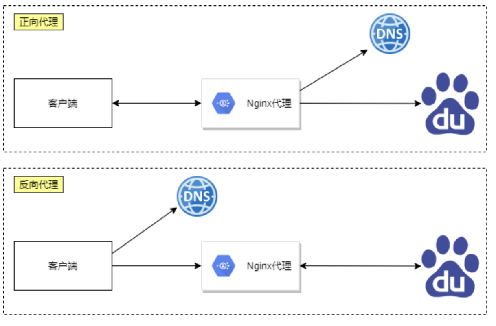

- 正向代理与反向代理的区别

	- 区别在于形式上服务的”对象”不一样
	- 正向代理代理的对象是客户端，为客户端服务
	- 反向代理代理的对象是服务端，为服务端服务

### 4.3 Nginx代理服务支持协议

- Nginx作为代理服务，可支持的代理协议非常的多

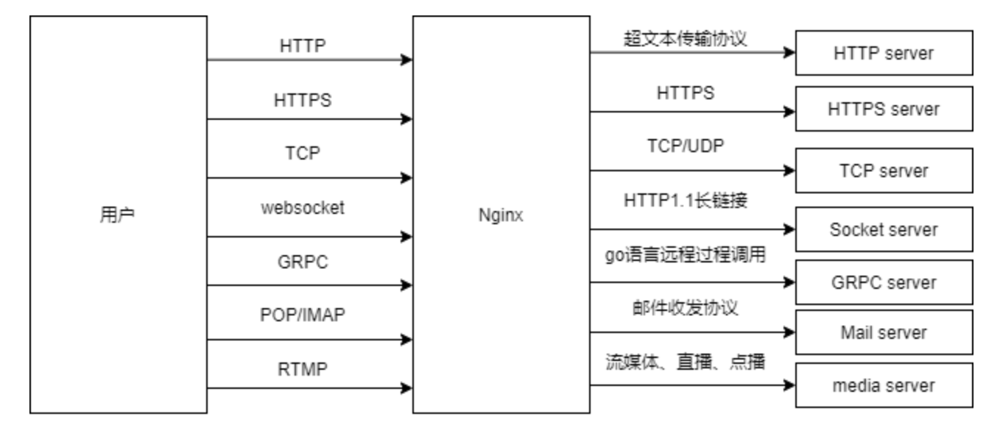

- 如果将Nginx作为反向代理服务，常常会用到如下几种代理协议

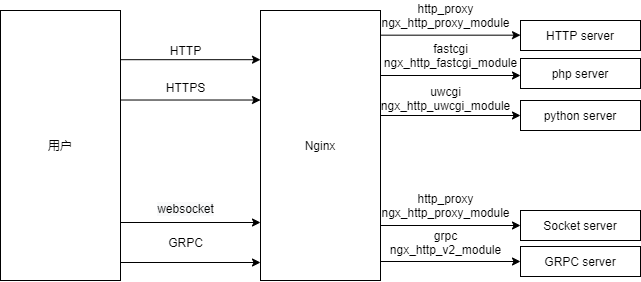

### 4.4 Nginx反向代理配置语法（了解）

- 代理配置语法

```bash
Syntax:    proxy_pass URL;
Default:    —
Context:    location, if in location, limit_except
 
http://localhost:8000/uri/
http://192.168.56.11:8000/uri/
http://unix:/tmp/backend.socket:/uri/
```

- url跳转修改返回Location[不常用]

```bash
Syntax:    proxy_redirect default;
proxy_redirect off;proxy_redirect redirect replacement;
Default:    proxy_redirect default;
Context:    http, server, location
```

- 添加发往后端服务器的请求头信息

```bash
Syntax:    proxy_set_header field value;
Default:    proxy_set_header Host $proxy_host;
            proxy_set_header Connection close;
Context:    http, server, location
 
# 用户请求的时候HOST的值是www.test.com, 那么代理服务会像后端传递请求的还是www.test.com
proxy_set_header Host $http_host;
# 将$remote_addr的值放进变量X-Real-IP中，$remote_addr的值为客户端的ip
proxy_set_header X-Real-IP $remote_addr;
# 客户端通过代理服务访问后端服务, 后端服务通过该变量会记录真实客户端地址
proxy_set_header X-Forwarded-For $proxy_add_x_forwarded_for;
```

- 代理到后端的TCP连接、响应、返回等超时时间

```bash
//nginx代理与后端服务器连接超时时间(代理连接超时)
Syntax: proxy_connect_timeout time;
Default: proxy_connect_timeout 60s;
Context: http, server, location
 
//nginx代理等待后端服务器的响应时间
Syntax:    proxy_read_timeout time;
Default:    proxy_read_timeout 60s;
Context:    http, server, location
 
//后端服务器数据回传给nginx代理超时时间
Syntax: proxy_send_timeout time;
Default: proxy_send_timeout 60s;
Context: http, server, location
```

- proxy_buffer代理缓冲区

```bash
//nignx会把后端返回的内容先放到缓冲区当中，然后再返回给客户端,边收边传, 不是全部接收完再传给客户端
Syntax: proxy_buffering on | off;
Default: proxy_buffering on;
Context: http, server, location
 
//设置nginx代理保存用户头信息的缓冲区大小
Syntax: proxy_buffer_size size;
Default: proxy_buffer_size 4k|8k;
Context: http, server, location
 
//proxy_buffers 缓冲区
Syntax: proxy_buffers number size;
Default: proxy_buffers 8 4k|8k;
Context: http, server, location
```

- 常用优化配置
  - Proxy代理网站常用优化配置如下，将配置写入新文件，调用时使用include引用即可

```bash
[root@Nginx ~]# vim /etc/nginx/proxy_params
proxy_set_header Host $http_host;
proxy_set_header X-Real-IP $remote_addr;
proxy_set_header X-Forwarded-For $proxy_add_x_forwarded_for;
 
proxy_connect_timeout 30;
proxy_send_timeout 60;
proxy_read_timeout 60;
 
proxy_buffering on;
proxy_buffer_size 32k;
proxy_buffers 4 128k;
```

- 重复使用配置
  - 代理配置location时调用方便后续多个Location重复使用

```bash
location / {
    proxy_pass http://127.0.0.1:8080;
    include proxy_params;
}
```

### 4.5 Nginx反向代理场景实践（了解）

- Nginx反向代理配置实例


- web01服务器,配置一个网站，监听在8080

```bash
[root@web01 ~]# cd /etc/nginx/conf.d/
[root@web01 conf.d]# vim web.conf
server {
    listen 8080;
    server_name localhost;

    location / {
        root /code/8080;
        index index.html;
        allow all;
    }
}
[root@web01 conf.d]# nginx -t
nginx: the configuration file /etc/nginx/nginx.conf syntax is ok
nginx: configuration file /etc/nginx/nginx.conf test is successful
[root@web01 conf.d]# systemctl restart nginx
[root@web01 ~]# mkdir -p /code/8080
[root@web01 ~]# echo "listening 8080 ..." > /code/8080/index.html
```

- proxy代理服务,配置监听80端口，使能够通过代理服务器访问到后端的192.168.175.20的8080端口站点内容

```bash
[root@proxy ~]# cd /etc/nginx/conf.d/
[root@proxy conf.d]# vim proxy_web_node1.conf
server {
    listen 80;
    server_name proxy.test.com;

    location / {
        proxy_pass http://192.168.175.20:8080;
    }
}
[root@proxy conf.d]# nginx -t
[root@proxy conf.d]# systemctl restart nginx
```

- 存在的问题，通过抓包可以看到客户端是使用域名对网站进行访问的，但是代理却是使用的IP地址加端口号
- 当访问80端口的时候，没有域名的情况下，默认会去找排在最上面的那个配置文件。
- 所以我们需要解决这个问题，保留住最开始的请求头部信息。

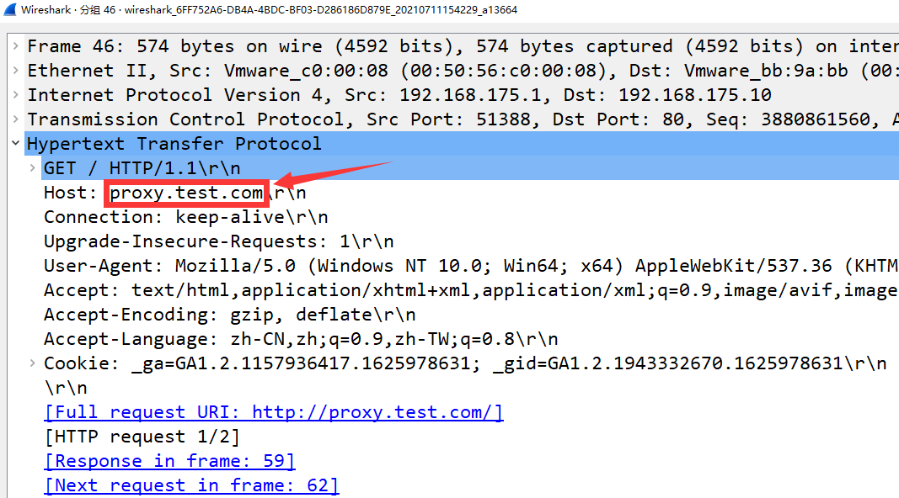

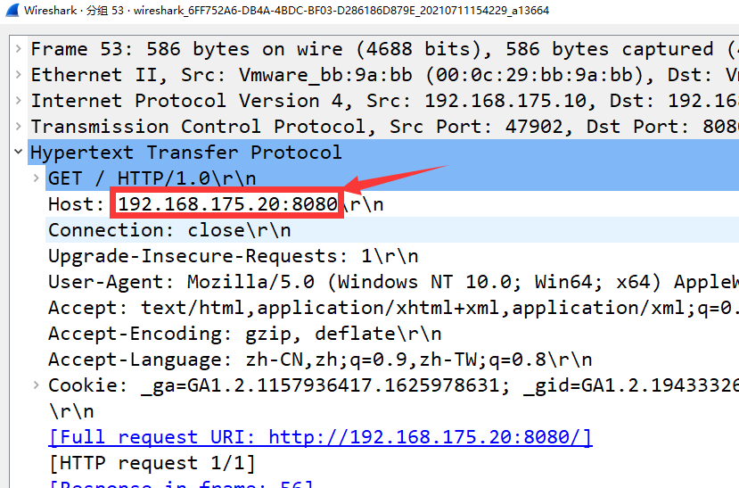

- 修改配置文件，使用`proxy_set_header`模块

```bash
[root@proxy conf.d]# vim proxy_web_node1.conf
server {
    listen 80;
    server_name proxy.test.com;

    location / {
        proxy_pass http://192.168.175.20:8080;
        proxy_set_header Host $http_host;
    }
}
```

- 使用http1.1协议

```bash
server {
    listen 80;
    server_name proxy.test.com;

    location / {
        proxy_pass http://192.168.175.20:8080;
        proxy_set_header Host $http_host;
        proxy_http_version 1.1;
    }
}
```

- 在生产环境中，我们必须要记录客户端的来源IP，如果所有的访问日志，全都来源于代理，那么我们根本不知道都有哪些地区的用户访问了我们什么页面。
  - 还需要使用`proxy_set_header`

```bash
server {
    listen 80;
    server_name proxy.test.com;

    location / {
        proxy_pass http://192.168.175.20:8080;
        proxy_set_header Host $http_host;
        proxy_http_version 1.1;
        proxy_set_header X-Forwarded-For $proxy_add_x_forwarded_for;
    }
}
```

## 5. LNMP 架构概述

LNMP是一套技术的组合，L=Linux、N=Nginx、M=MySQL、P=PHP

### 5.1 如何工作

- 首先 nginx 服务是不能处理动态请求，那么当用户发起动态请求时，nginx 无法处理
- 当用户发起 http 请求，请求会被 nginx 处理，如果是静态资源请求 nginx 则直接返回，如果是动态请求 nginx 则通过 fastcgi 协议转交给后端的 PHP 程序处理


### 5.2 工作流程


1. 用户通过 http 协议发起请求，请求会先抵达 LNM P架构中的nginx
2. nginx 会根据用户的请求进行location规则匹配
3. location 如果匹配到请求是静态，则由 nginx 读取本地直接返回
4. location 如果匹配到请求是动态，则由 nginx 将请求转发给 fastcgi 协议
5. fastcgi 收到请求交给 php-fpm 管理进程，php-fpm 管理进程接收到后会调用具体的工作进程 wrapper
6. wrapper 进程会调用 PHP 程序进行解析，如果只是解析代码，php 直接返回
7. 如果有查询数据库操作，则由 php 连接数据库（用户 密码 ip）发起查询的操作

### 5.3 部署安装


```shell
# 安装 nginx：如果编译安装可以跳过
[root@localhost ~]# yum install nginx -y
# 启动
[root@localhost ~]# systemctl start nginx && systemctl enable nginx
# 查看Nginx状态，active即可
[root@localhost ~]# systemctl status nginx
# 关闭防火墙和SELINUX
[root@localhost ~]# systemctl stop firewalld && systemctl disable firewalld
[root@localhost ~]# setenforce 0
[root@localhost ~]# sed -i 's/SELINUX=enforcing/SELINUX=disabled/' /etc/selinux/config
# 安装 php 全家桶
[root@localhost ~]# yum install php* -y
# 更新 php-fmp listen 配置项
[root@localhost ~]# vim /etc/php-fpm.d/www.conf
......
;listen = /run/php-fpm/www.sock # 注释掉 Unix Socket 方式
listen = 9000 # 改为 TCP 端口方式
user = nginx # 找到user配置，改为nginx
group = nginx# 找到group配置，改为nginx
......
# 启动并设置开机自启
[root@localhost ~]# systemctl enable --now php-fpm
# 安装 marinedb 数据库
[root@localhost ~]# yum install -y mariadb-server mariadb
# 启动数据库服务
[root@localhost ~]# systemctl enable --now mariadb
# 设置数据库 root 用户密码
[root@localhost ~]# mysqladmin password '123456'
[root@localhost ~]# mysql -uroot -p123456 -e "show databases;"
+--------------------+
| Database           |
+--------------------+
| information_schema |
| mysql              |
| performance_schema |
+--------------------+
# 准备测试页面
[root@localhost ~]# mkdir -pv /data/nginx/lnmp
[root@localhost ~]# cat << EOF > /data/nginx/lnmp/index.php
<?php
    phpinfo();
?>
EOF
# 测试 index.php 运行正确
[root@localhost ~]# php /data/nginx/lnmp/index.php 
# 添加 nginx vhost 配置文件：将 php 请求转给 php-fpm 处理
[root@localhost ~]# cat > /etc/nginx/conf.d/php.conf <<'EOF'
server {
    listen 8081;
    server_name php.iproot.cn;
    root /data/nginx/lnmp;
    index index.php index.html;

    location / {
        try_files $uri $uri/ /index.php?$query_string;
    }

    location ~ \.php$ {
        try_files $uri =404;  # 安全：防止恶意请求
        # 配置 fastcgi_pass（PHP-FPM 地址）
        fastcgi_pass 127.0.0.1:9000;
        # 配置 fastcgi_index（默认首页）
        fastcgi_index index.php;
        # 配置 fastcgi_param（传递脚本路径）
        # 注意：使用英文双引号，不是中文引号
        fastcgi_param SCRIPT_FILENAME "$document_root$fastcgi_script_name";
        # 引入默认 fastcgi 参数
        include fastcgi_params;
    }
}
EOF
[root@localhost ~]# nginx -s reload
# 测试验证，最后ip地址替换为自己的虚拟机的ip地址
[root@localhost ~]# curl -I -H 'Host: php.iproot.cn' 192.168.159.148:8081
HTTP/1.1 200 OK
Server: nginx/1.20.1
```

### 5.4 相关配置

fastcgi是 Nginx 与 PHP-FPM 通信的核心配置

#### **5.4.1 配置指令解析**

| 指令            | 作用                                                     | 应设置的值                                           |
| :-------------- | :------------------------------------------------------- | :--------------------------------------------------- |
| `fastcgi_pass`  | **指定 PHP-FPM 的地址** 决定 Nginx 将 PHP 请求发送到何处 | `127.0.0.1:9000`（因为 PHP-FPM 监听 9000 端口）      |
| `fastcgi_index` | **设置默认 PHP 首页** 当访问目录时自动查找的文件         | `index.php`                                          |
| `fastcgi_param` | **传递环境变量** 告诉 PHP-FPM 脚本文件的真实路径         | `SCRIPT_FILENAME $document_root$fastcgi_script_name` |

#### 5.4.2 配置原理详解

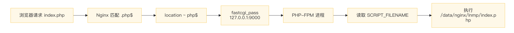

**关键变量解释**

在我们实验的实际环境中：

- `$document_root` = `/data/nginx/lnmp`
- `$fastcgi_script_name` = `/index.php`
- `"$document_root$fastcgi_script_name"` = `/data/nginx/lnmp/index.php`

#### **5.4.4 验证配置是否生效**

```bash
# 方法 1：查看 Nginx 实际加载的配置
nginx -T | grep -A 20 'server_name php.iproot.cn'

# 方法 2：测试访问
curl -I -H 'Host: php.iproot.cn' 192.168.159.148:8081 # 200OK
```

### 5.5 数据库管理应用

为了方便的使用数据库，我们可以安装数据库图形化管理工具 phpmyadmin

#### 5.5.1 安装部署

```shell
# 为数据库管理工具创建虚拟主机
[root@localhost ~]# cat > /etc/nginx/conf.d/phpmyadmin.conf <<'EOF'
server {
    listen 8080;                          # 监听8080 端口
    root /data/nginx/phpmyadmin;          # 统一路径到 /data/nginx/
    index index.php;

    location / {
        try_files $uri $uri/ /index.php?$query_string;
    }

    location ~ \.php$ {
        try_files $uri =404;
        
        fastcgi_pass 127.0.0.1:9000;
        fastcgi_index index.php;
        fastcgi_param SCRIPT_FILENAME "$document_root$fastcgi_script_name";
        include fastcgi_params;
    }
}
EOF
```

**完整部署操作步骤**

```bash
# 2. 创建统一目录结构
mkdir -p /data/nginx/phpmyadmin

# 3. 下载并解压 phpMyAdmin
cd /tmp
wget https://files.phpmyadmin.net/phpMyAdmin/5.1.1/phpMyAdmin-5.1.1-all-languages.zip

# 4. 解压到目标目录
unzip phpMyAdmin-5.1.1-all-languages.zip
mv phpMyAdmin-5.1.1-all-languages/* /data/nginx/phpmyadmin/

# 5. 清理临时文件
rm -rf phpMyAdmin-5.1.1-all-languages.zip phpMyAdmin-5.1.1-all-languages

# 6. 设置 Session 目录权限
mkdir -p /var/lib/php/session
chown nginx:nginx /var/lib/php/session

# 7. 确保 phpMyAdmin 目录权限正确
chown -R nginx:nginx /data/nginx/phpmyadmin

# 8. 测试配置并重载 Nginx
nginx -t
systemctl reload nginx

# 9. 查看端口是否监听成功
ss -tnlp | grep 8080
```

------

**如何访问 phpMyAdmin**

```bash
# 浏览器访问：http://192.168.159.148:8080
# 应该看到 phpMyAdmin 登录页面
```


输入数据库用户名 `root` 和密码 `123456` 就可以进入图形化数据库管理页面了

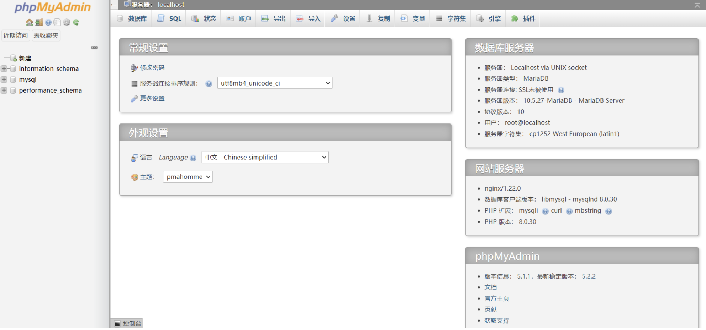

如果出现错误”**Failed to set session cookie. Maybe you are using HTTP instead of HTTPS to access phpMyAdmin**.“

这个错误是 phpMyAdmin 的安全机制阻止在 **HTTP 环境**下设置 Session Cookie。开发测试环境需要修改配置来允许 HTTP 访问。

**解决方法：**

**步骤 1：修复 phpMyAdmin Cookie 错误**

```bash
# 进入 phpMyAdmin 目录
cd /data/nginx/phpmyadmin

# 创建配置文件
cp config.sample.inc.php config.inc.php

# 禁用强制 HTTPS（允许 HTTP 访问）
sed -i "s/\$cfg\['ForceSSL'\] = true;/\$cfg['ForceSSL'] = false;/" config.inc.php

# 设置安全的 blowfish_secret
SECRET=$(openssl rand -base64 32)
sed -i "s/\$cfg\['blowfish_secret'\] = '';/\$cfg['blowfish_secret'] = '$SECRET';/" config.inc.php

# 添加 SameSite 配置（推荐）
echo "\$cfg['CookieSameSite'] = 'Lax';" >> config.inc.php
```

**步骤 2：重启服务使配置生效**

```bash
# 重启 PHP-FPM
systemctl restart php-fpm

# 重启 Nginx
nginx -s reload

# 确认服务正常运行
systemctl is-active nginx php-fpm
```

**步骤 3：验证权限设置**

```bash
# 检查 Session 目录权限
ls -ld /var/lib/php/session
# 应显示：drwxr-xr-x  nginx nginx

# 检查 phpMyAdmin 目录权限
ls -ld /data/nginx/phpmyadmin
# 应显示：drwxr-xr-x  nginx nginx

# 验证 nginx 用户可读取
sudo -u nginx cat /data/nginx/phpmyadmin/index.php
# 应成功输出 PHP 代码

# 验证 nginx 用户可写入 Session
sudo -u nginx touch /var/lib/php/session/test
# 应成功创建文件（记得删除 rm /var/lib/php/session/test）
```

**步骤 4：清除浏览器 Cookie 并访问**

1. **清除旧 Cookie**：浏览器设置 → 清除 Cookie 和站点数据

2. **或使用无痕模式**：直接打开浏览器无痕窗口

3. **访问 phpMyAdmin**：

   ```
   http://192.168.159.148:8080
   ```

### 5.6 博客系统

#### 5.6.1 部署虚拟主机

```bash
# 为博客创建虚拟主机
# 1. 为博客创建 Nginx 配置（监听 80 端口）
[root@localhost ~]# cat > /etc/nginx/conf.d/typecho.conf <<'EOF'
server {
    listen 80 default_server;
    server_name _;        # _ 允许 IP 直接访问
    root /data/nginx/typecho;             # 统一路径到 /data/nginx/
    index index.php index.html;

    location / {
        try_files $uri $uri/ /index.php?$query_string;
    }

    location ~ \.php$ {
        try_files $uri =404;              # 安全：防止恶意请求
        
        fastcgi_pass   127.0.0.1:9000;
        fastcgi_index  index.php;
        fastcgi_param  SCRIPT_FILENAME "$document_root$fastcgi_script_name";
        include        fastcgi_params;
    }
}
EOF
# 2. 测试 Nginx 配置
[root@localhost ~]# nginx -t

# 3. 重载 Nginx（无需 restart，reload 更平滑）
[root@localhost ~]# systemctl reload nginx

# 4. 创建统一目录
[root@localhost ~]# mkdir -p /data/nginx/typecho

# 5. 进入目录
[root@localhost ~]# cd /data/nginx/typecho

# 6. 下载 Typecho 最新版
[root@localhost ~]# wget https://github.com/typecho/typecho/releases/latest/download/typecho.zip

# 7. 解压源码
[root@localhost ~]# unzip typecho.zip

# 8. 设置权限（PHP-FPM 运行用户是 nginx）
[root@localhost ~]# chown -R nginx:nginx /data/nginx/typecho

# 9. 确保静态文件可读
[root@localhost ~]# chmod -R 755 /data/nginx/typecho
```

#### 5.6.2 创建数据库

点击数据库，输入数据库名之后，就可以点击创建

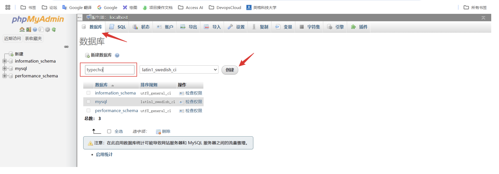

#### 5.6.3 安装博客系统

浏览器访问：

```html
http://192.168.159.148/  #ip记得换成你的虚拟机IP
```

下面就可以开始进入网站安装的部分了，访问博客系统页面

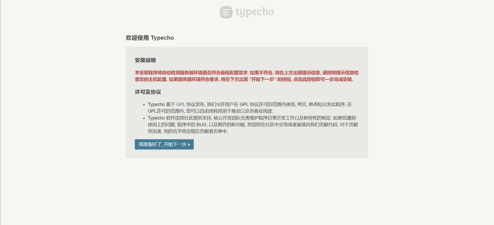

赋予网站根目录下usr/uploads目录权限

```shell
[root@localhost typecho]# chmod a+w usr/uploads/
```

继续下一步，填写数据库密码和网站后台管理员密码

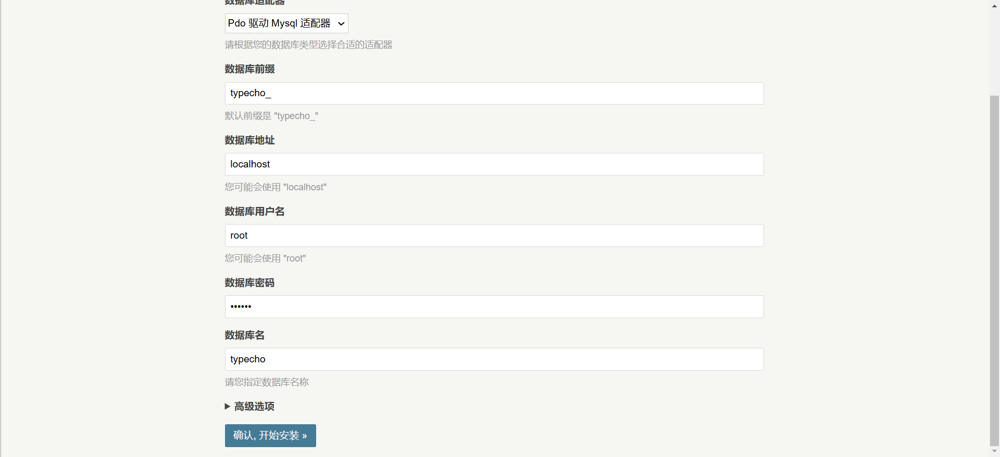

下面是安装成功的页面


### 5.7 切换主题

默认的主题如下，界面比较的简洁，我们可以给这个网站替换主题，也可以借此加深熟悉我们对Linux命令行的熟练程度


第三方主题商店：https://www.typechx.com/

我们尝试更换这个主题


选择模板下载


然后在打开的github仓库中下载ZIP压缩包


将下载好的主题压缩包上传到博客主题的目录`/data/nginx/typecho/usr/themes`

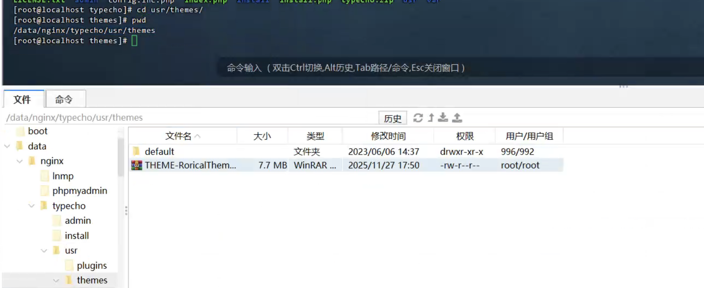

然后解压主题包，并且将名称改为简单一点的

```bash
[root@localhost themes]# unzip THEME-RoricalTheme-main.zip
[root@localhost themes]# ls
THEME-RoricalTheme-main  THEME-RoricalTheme-main.zip  default
[root@localhost themes]# mv THEME-RoricalTheme-main butterfly
[root@localhost themes]# rm -rf THEME-RoricalTheme-main.zip
```

然后登录到博客后台，在设置里更换主题

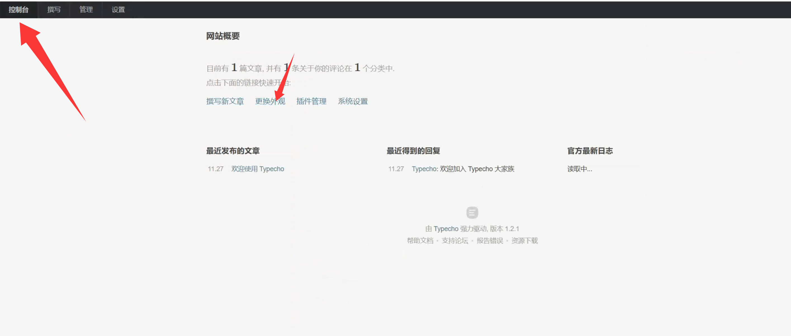

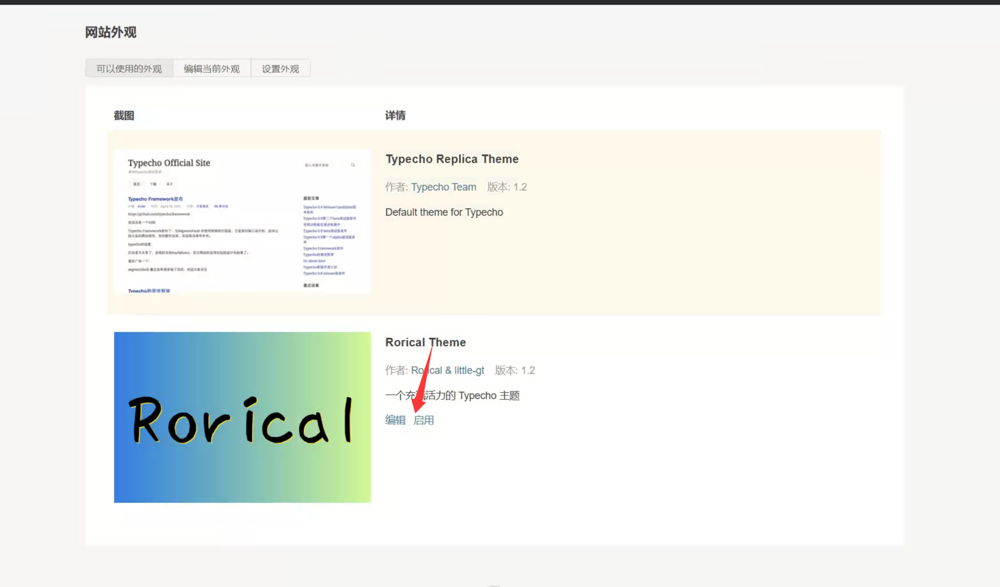

然后回到博客首页刷新一下，就可以看到新的主题已经应用了~


有可能会有一些图片资源的丢失，稍微了解一点前端知识，就可以将其完善好了。也可以自由选择自己喜欢的其他主题。

### 5.8 友情提示

**如果各位同学不是搭建在自己虚拟机上的，是去租用阿里云或者腾讯云，直接搭建，并且购买域名，就可以让自己的网站在互联网上永远在线**

## 6.使用宝塔面板使用LNMP架构安装 Typecho 

### 6.1 安装宝塔面板

1.执行以下命令安装宝塔（CentOS/RockyLinux通用）：

```bash
url=https://download.bt.cn/install/install_panel.sh;if [ -f /usr/bin/curl ];then curl -sSO $url;else wget -O install_panel.sh $url;fi;bash install_panel.sh ssl251104
```

1. 安装完成后，会显示：
   - 面板地址：`http://服务器IP:8888`
   - 用户名和密码（请妥善保存）
2. **开放端口**：如果在在服务器安装，防火墙/安全组中放行 8888、80、443、3306 等端口

------

### 6.2 配置运行环境

登录宝塔面板后，按以下步骤配置：

**安装 LNMP/LAMP 环境**

- 首次登录会提示安装套件，选择 **LNMP**（推荐）
- **PHP**：选择 **7.4 或 8.0**（Typecho 1.2+ 需要 PHP 7.2+）
- **MySQL**：选择 **5.7 或 8.0**
- **Web服务器**：Nginx 
- 点击"一键安装"，等待约10-20分钟完成

### 6.3 安装 Typecho（仅供参考，没试过，报错自己Ai一下~）

**步骤 1：创建网站和数据库**

1. 点击左侧"网站" → "添加站点"
2. 填写域名（如没有域名，先填IP）
3. **勾选"创建数据库"**，选择 MySQL，记录数据库名、用户名和密码
4. 提交后，网站目录为 `/www/wwwroot/你的域名或ip`

**步骤 2：下载 Typecho**

1.进入宝塔"终端"或SSH，执行：

```bash
cd /www/wwwroot/你的域名
wget https://github.com/typecho/typecho/releases/latest/download/typecho.zip
unzip typecho.zip
```

2.将解压后的所有文件移动到网站根目录：

```bash
mv typecho/* ./
rm -rf typecho.zip typecho/
```

**步骤 3：设置权限**

```bash
chmod -R 755 /www/wwwroot/你的域名
chown -R www:www /www/wwwroot/你的域名
```

步骤4：开始安装

浏览器访问：

```html
http://192.168.159.148/  #ip记得换成你的虚拟机IP
```

剩下步骤同上，不多说。

