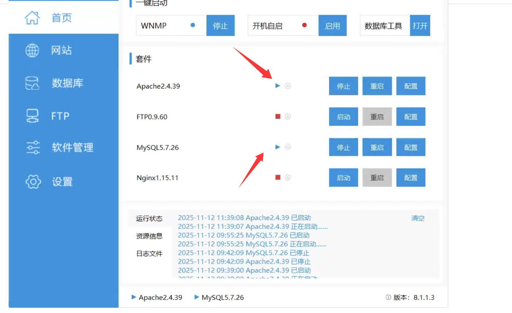
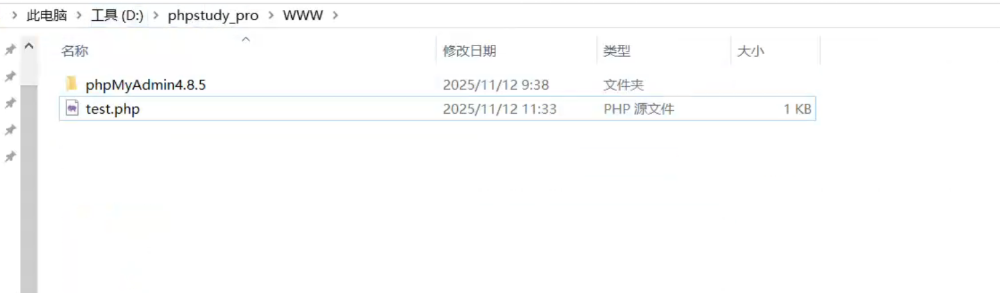
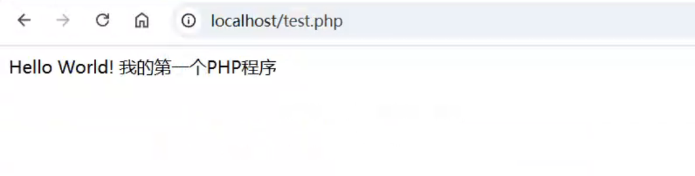
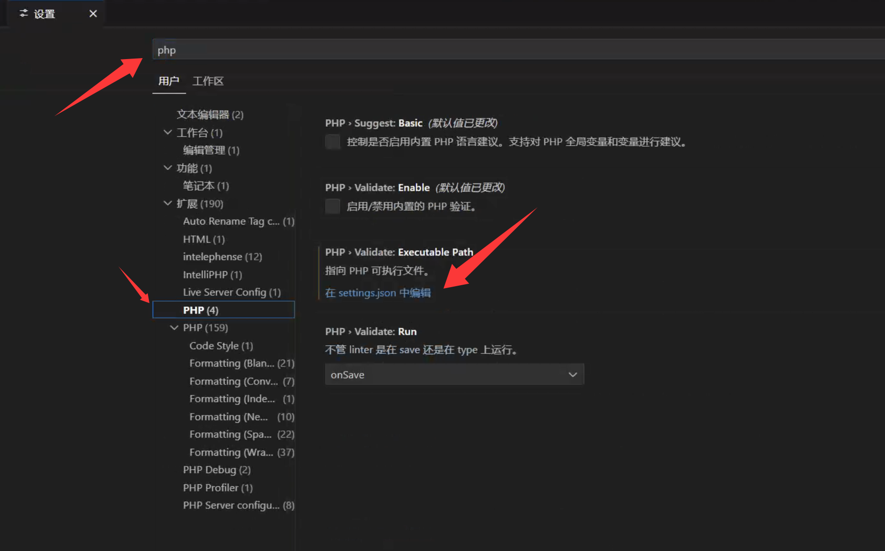
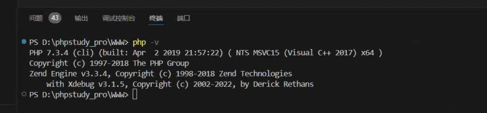

# Day3-环境配置-PHP

## 一、环境方案说明

采用 **phpStudy** 集成环境 + **VS Code** 编辑器方案，实现一键安装、快速上手。

---

## 二、phpStudy 安装配置

### 1. 下载 phpStudy

- 访问 phpStudy 官网https://www.xp.cn/phpstudy
- 下载 **Windows 版本**（最新版即可，支持 PHP 5.2~8.2 多版本切换），**phpStudy v8.1版**

### 2. 安装步骤

**关键：全程以管理员身份运行安装程序**

1. **右键安装包** → 选择"以管理员身份运行"（避免权限问题）
2. **选择安装目录**：
   - **强烈建议**：安装在非系统盘（如 `D:\phpstudy_pro`）
   - **路径要求**：**不要包含中文或空格**
3. **选择组件**：勾选全部组件（Apache/Nginx + MySQL + PHP + phpMyAdmin）
4. **配置端口**：
   - Apache 默认端口：**80**
   - 如果被占用，可改为 **8080** 或其他未被占用的端口
   - MySQL 默认端口：**3306**（一般无需修改）
5. 点击"安装"，等待完成（约 2-5 分钟）

### 3. 启动与基础配置

1. **启动服务**：
   - 安装完成后勾选"立即启动 phpStudy"
   - 或手动打开 phpStudy 面板，点击"启动" Apache 和 MySQL（图标变绿色即成功）

   
   
2. **验证安装**：
   
   - 记住安装时选择的 **WWW 目录**（如 `D:\phpstudy_pro\WWW`）
   - 在该目录下新建 `test.php`，写入：
     ```php
     <?php
     echo 'Hello World! 我的第一个PHP程序';
     ?>
     ```
   
   
   
   - 浏览器访问：**`http://localhost/test.php`**
   - 看到输出内容即表示环境配置成功
   
   

---

## 三、VS Code 配置 PHP 开发环境

### 1. 下载安装 VS Code

- 访问 [https://code.visualstudio.com/](https://code.visualstudio.com/)
- 下载并安装最新版本

### 2. 安装必备扩展

打开 VS Code，点击左侧 **扩展图标**（或按 `Ctrl+Shift+X`），搜索并安装以下扩展：

| 扩展名称             | 作用                             | 是否必需   |
| -------------------- | -------------------------------- | ---------- |
| **PHP Intelephense** | 智能代码补全、语法检查、跳转定义 | ✔️ **必须** |
| **PHP Debug**        | 断点调试支持（配合 Xdebug）      | ✔️ 推荐     |
| **PHP Server**       | 快速启动内置 PHP 服务器预览页面  | 可选       |

**安装方法**：在扩展市场搜索名称 → 点击"安装"即可

### 3. 配置 PHP 解释器路径

**目的**：让 VS Code 识别 phpStudy 中的 PHP

1. 打开 VS Code **设置**（`Ctrl+,`）
2. 搜索框输入：**php**



3. 找到 **"PHP: Executable Path"** → 点击"在 settings.json 中编辑"
4. 添加以下配置（**路径改为你的实际安装的版本路径**）：
   ```json
   {
     "php.validate.executablePath": "D:/phpstudy_pro/Extensions/php/php-7.4.3/php.exe",
     "php.executablePath": "D:/phpstudy_pro/Extensions/php/php-7.4.3/php.exe"
   }
   ```
   - **注意**：Windows 路径使用 **正斜杠 `/`** 或 **双反斜杠 `\\`** 

5. 验证配置：
   - 打开 VS Code 的 **终端**（`Ctrl+` `）
   - 输入 `php -v`，应显示 PHP 版本信息
   
   

### 4.使用 PHP Server 插件测试访问（轻量级）

1. 在 VS Code 中右键 `test.php`
2. 选择 **“PHP Server: Serve project”**
3. 浏览器自动打开 `http://127.0.0.1:3000`

>  优点：无需启动 Apache，适合临时调试小脚本

---

## 四、完整测试流程

### 1. 创建项目文件夹

在 phpStudy 的 **WWW** 目录下新建教学文件夹：
```
D:\phpstudy_pro\WWW\day3\
```

### 2. 用 VS Code 打开项目

- VS Code → **文件** → **打开文件夹** → 选择 `day3`
- 新建 `index.php` 文件

### 3. 编写测试代码

```php
<?php
// 测试 PHP 语法
echo "PHP 运行正常！<br>";

// 测试数组与循环
$students = ['张三', '李四', '王五'];
foreach ($students as $name) {
    echo "学生：$name <br>";
}

// 显示 PHP 配置信息（教学用）
phpinfo();
```

### 4. 运行查看

- 浏览器访问：**`http://localhost/day3/`**
- 应看到学生列表和 PHP 配置信息页面

---

## 五、重点强调

### 必须牢记的规则

1. **所有 PHP 文件必须放在 WWW 目录下**才能通过浏览器访问
2. **文件扩展名必须是 `.php`**，不是 `.txt` 或 `.html`
3. **访问路径**：`http://localhost/文件夹名/文件名.php`
4. **每次修改代码后，直接刷新浏览器即可看到效果**（无需重启服务）

### 小任务

1. 成功安装 phpStudy 并启动服务
2. 安装 VS Code 和 PHP Intelephense 扩展
3. 在 VS Code 中创建 `hello.php`，输出自己的姓名
4. 在浏览器中成功运行并看到结果

---

## 六、常见问题解决

| 问题现象                    | 原因                              | 解决方案                                                  |
| --------------------------- | --------------------------------- | --------------------------------------------------------- |
| phpStudy 启动失败，图标不绿 | 端口 80 被占用                    | 改为 8080 端口，或关闭占用 80 端口的程序（如 Skype、IIS） |
| `php -v` 命令无效           | 环境变量未配置                    | 在 VS Code 中手动指定 `php.executablePath`                |
| 浏览器访问显示 404          | 文件不在 WWW 目录                 | 检查文件路径是否放错位置                                  |
| 中文显示乱码                | 文件编码问题                      | VS Code 右下角将编码改为 **UTF-8**                        |
| VS Code 没有代码提示        | PHP Intelephense 未安装或路径错误 | 重新安装扩展，检查 PHP 路径配置                           |

